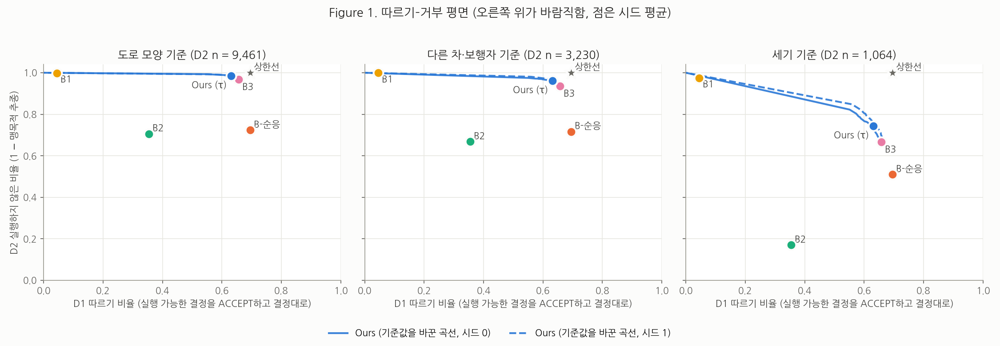

# YESMAN: Your Ego-planner Shouldn't Mindlessly Accept Nonsense

VLM이 틀린 주행 결정을 내릴 때, 그 결정을 받는 planner는 어떻게 행동하는가를 NAVSIM에서 같은 조건으로 측정한 연구이다. 보고서: [docs/report.md](docs/report.md), 연구 계획서: [yesman.md](yesman.md).



*따르기–거부 평면(불가능 기준별). 가로축: 실행할 수 있는 결정을 결정대로 따른 비율. 세로축: 실행할 수 없는 결정을 그대로 실행하지 않은 비율. 오른쪽 위가 바람직하다.*

## 주요 결과 (navtest, 시드 2개 평균)

| 모델 | 실행 가능한 결정 따르기 (D1) | 실행할 수 없는 결정에서 결과 안전 (D2, 합성) | 같은 지표, 실제 VLM 결정 (Gemma 4 12B / 31B / Qwen3-VL 8B) | 주행 점수 (D0 EPDMS) |
| --- | --- | --- | --- | --- |
| B1 (결정을 보지 않음) | 4.5% | 85.7% | 80 / 76 / 78% | 0.845 |
| B2 (결정 조건, 사람 결정만 학습) | 35.4% | 22.1% | 12 / 13 / 14% | 0.879 |
| B-순응 (+ 실행 가능한 바꾼 결정) | **69.5%** | 24.0% | 17 / 14 / 21% | 0.862 |
| B3 (+ 실행할 수 없는 바꾼 결정) | 65.7% | 76.9% | 34 / 30 / 42% | 0.862 |
| Ours (B3 + 판단 head) | 63.2% | **77.2%** | 37 / 36 / 43% | 0.862 |

1. 결정을 더 잘 따르게 학습해도 실행할 수 없는 결정을 더 따르지는 않았고(사전 가설 기각), 안전해지지도 않았다(B2 22% → B-순응 24%).
2. 안전은 실행할 수 없는 결정의 예를 학습에 넣을 때 생기며(약 3배), 판단 head와는 무관하다(B3 ≈ Ours). head는 거부 표시와 근거를 더한다.
3. 합성한 틀린 결정에서 잰 효과는 실제 VLM의 틀린 결정에서 절반 이하로 줄어든다. 실제 VLM의 오답은 그럴싸하지만 움직임 때문에 틀리는 결정(앞차가 감속하는데 속도 유지)이 많다.
4. VLM을 쓰지 않고 만든 그럴싸한 틀린 결정(비슷해 보이는 장면이나 조금 전의 사람 결정)으로 학습하면, 학습에 쓰지 않은 VLM 3개 중 2개에서 결과 안전이 12~13%p 오른다(사후 분석).
5. 경로와 따로 된 판단 head는 그럴싸한 오답에서 DiT의 행동과 어긋난 판단을 낸다. 판단을 DiT가 경로를 내기 직전의 표현에서 읽으면 더 잘 가른다(Gemma 4 31B 오답 AUC 0.67 → 0.80, 사후 분석).

## 저장소 구성

| 경로 | 내용 |
| --- | --- |
| `yesman/` | 패키지: 결정 형식(`decision.py`), L1 라벨러(`l1.py`), L2 실행 가능 판정(`l2.py`), L3 counterfactual(`l3.py`), 목표 경로 합성(`synth.py`), planner(`model.py`), 학습 데이터(`train_data.py`), 채점(`scoring.py`) |
| `scripts/` | 단계별 실행 스크립트 (아래) |
| `data_lists/eval/` | 고정한 평가 세트 D0~D3, D3x(VLM 3개), `SHA256SUMS` |
| `docs/stepNN_*.md` | 단계별 결과와 계획서와 달라진 점 |
| `docs/report.md` | 보고서 |
| `tests/` | L1, 모델 단위 테스트 |

`exp/`(특징, metric cache, 판정 결과, 체크포인트, 평가 결과)와 `third_party/navsim`, `checkpoints/`는 용량 때문에 저장소에 넣지 않았다. 아래 순서로 다시 만든다.

## 재현

평가 세트가 저장소에 있으므로, 평가 세트를 다시 만들지 않고 학습과 평가만 재현할 수도 있다(5단계 이후). 확인: `sha256sum -c data_lists/eval/SHA256SUMS`.

### 0. 환경과 데이터 (1~3단계)

```bash
scripts/setup/install_navsim.sh                 # conda 환경 navsim, NAVSIM 0a380a9, torch 2.7.1+cu128
source scripts/setup/env.sh                     # 작업할 때마다
# LTF 체크포인트: huggingface.co/autonomousvision/navsim_baselines 의 ltf/ltf_seed_0.ckpt → checkpoints/ltf/
scripts/data/download_navsim.sh maps logs_test logs_trainval navtest_keep \
    "testcam $(seq -s' ' 0 31)" "navtrain 1 5 9 13 17 21 25 29"
python $NAVSIM_DEVKIT_ROOT/navsim/planning/script/run_metric_caching.py \
    train_test_split=navtest metric_cache_path=$NAVSIM_EXP_ROOT/metric_cache/navtest worker.threads_per_node=16
python scripts/run_metric_caching_tokens.py --split navtrain --tokens data_lists/navtrain_sensor_tokens.txt \
    --out exp/metric_cache/navtrain_sensor --workers 16
```

### 1. 라벨과 평가 세트 (4~6단계, CPU)

```bash
python scripts/l1_extract.py --split navtrain --workers 16 && python scripts/l1_label.py --split navtrain
python scripts/l1_extract.py --split navtest --workers 16 && python scripts/l1_label.py --split navtest
python scripts/l2_build_bank.py                                     # 경로 모음
python scripts/l3_run.py --split navtest --name navtest_cf          # CF 판정 (평가 세트용)
python scripts/l3_run.py --split navtrain --cache navtrain_sensor --tokens data_lists/navtrain_sensor_tokens.txt \
    --n_cf 4 --skip_original --name navtrain_sensor_cf               # CF 판정 (학습용)
# 회전 CF 다시 판정 (6단계 수정): --only_turn --merge_into exp/l3/<name>.parquet --name <name>_v2
python scripts/l3_build_sets.py --navtest exp/l3/navtest_cf_v2.parquet --navtrain exp/l3/navtrain_sensor_cf_v2.parquet
python scripts/l3_retarget.py --bundle train && python scripts/l3_retarget.py --bundle val   # CF⁺ 목표 일관화 (10단계)
python scripts/l3_synth.py --bundle train && python scripts/l3_synth.py --bundle val         # CF⁺ 목표 합성 (12단계, 최종)
```

### 2. 특징과 VLM 결정 (7, 12단계, GPU)

```bash
python scripts/ltf_features.py --split navtest && python scripts/ltf_features.py --split navtrain
python scripts/ltf_features_check.py
scripts/setup/install_vlm.sh                    # vLLM 0.31 (torch 2.13) 환경, navsim 환경과 따로
python scripts/d3_prepare.py                    # D3 장면 (D0에서 무작위 1,000개)
VLLM_USE_FLASHINFER_SAMPLER=0 /root/vlm/bin/python scripts/vlm_d3.py --name d3 --model <VLM 경로>
python scripts/d3_judge.py --name d3
# D3 확장(VLM 3개 x 3,000장면): scripts/run_step12_vlm.sh, run_step12_vlm31.sh, run_step12_d3x.sh
```

### 3. 학습 (8~12단계, GPU, 모델 하나에 약 5분)

```bash
for s in 0 1; do
  python scripts/train_planner.py --model B1 --steps 20000 --seed $s --name B1_seed$s
  python scripts/train_planner.py --model B2 --steps 20000 --seed $s --name B2_seed$s
  python scripts/train_planner.py --model Bcomply --steps 20000 --seed $s --bundle_suffix _synth --name Bcomply_syn_seed$s
  python scripts/train_planner.py --model B3 --steps 20000 --seed $s --bundle_suffix _synth --neg_to_pos 0.25 --name B3_syn_seed$s
  python scripts/train_planner.py --model Ours --steps 20000 --seed $s --bundle_suffix _synth --neg_to_pos 0.25 --name Ours_syn_seed$s
done
```

### 4. 평가와 그림 (11~13단계)

```bash
r=Ours_syn_seed0                                                    # 모델마다
python scripts/predict_planner.py --run $r                          # D0~D3, 검증 세트 경로
python scripts/follow_eval.py --run $r --sets D0 D1 D2 D3 val       # L1 따르기 판정
python scripts/score_planner.py --run $r                            # D0 공식 EPDMS
python scripts/score_rows.py --table exp/eval/$r/D2.parquet         # D2 결과 안전
python scripts/flag_threshold.py --run $r                           # Ours: 검증 세트로 기준값
python scripts/predict_rule.py --run $r && python scripts/score_rows.py --table exp/eval/$r/D2_rule.parquet   # 규칙 대체
python scripts/analyze_step11.py --final && python scripts/viz_step11.py --final    # 표, Figure 1~3
python scripts/analyze_step12.py --final && python scripts/analyze_step12_d3safety.py --synth   # 실제 VLM 결정
```

## 단계별 기록

| 단계 | 문서 |
| --- | --- |
| 1~3. 설치, 데이터, 채점 도구 확인 | [step01](docs/step01_setup.md), [step02](docs/step02_data.md), [step03](docs/step03_eval_tools.md) |
| 4. L1 결정 라벨러 | [step04](docs/step04_l1.md) |
| 5. 경로 모음과 L2 | [step05](docs/step05_l2.md) |
| 6. counterfactual과 평가 세트 | [step06](docs/step06_cf.md) |
| 7. 특징과 VLM 결정(D3) | [step07](docs/step07_features_vlm.md) |
| 8. 디코더 | [step08](docs/step08_decoder.md) |
| 9. 비교 모델 | [step09](docs/step09_baselines.md) |
| 10. 제안 방법, 언행 불일치 원인 시험 | [step10](docs/step10_ours.md), [step10b](docs/step10b_decoder.md) |
| 11. 평가와 분석 | [step11](docs/step11_eval.md) |
| 12. 추가 실험(B3, VLM 3개, 목표 합성, 넓힌 CF, 물체 정보, 그럴싸한 CF⁻, probe) | [step12](docs/step12_extra.md) |

## 라이선스와 출처

코드는 이 저장소의 것이다. NAVSIM(Apache-2.0)과 LTF 체크포인트(Apache-2.0), nuPlan/OpenScene 데이터, Gemma 4와 Qwen3-VL 모델은 각자의 라이선스를 따른다.
