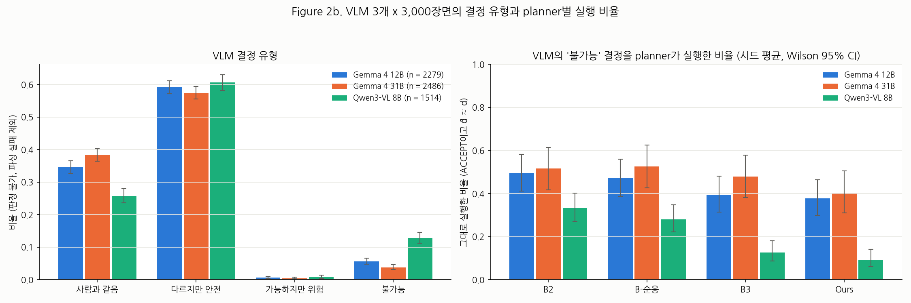
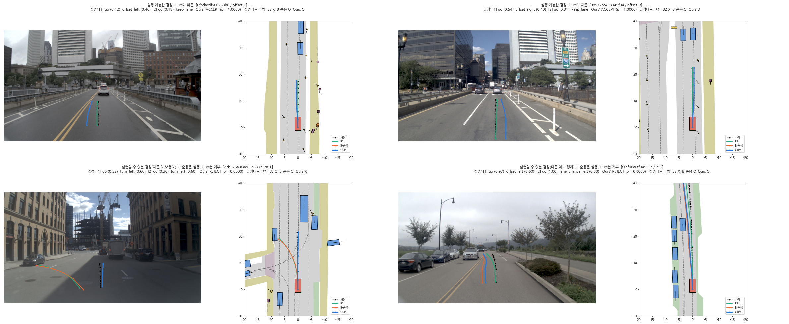
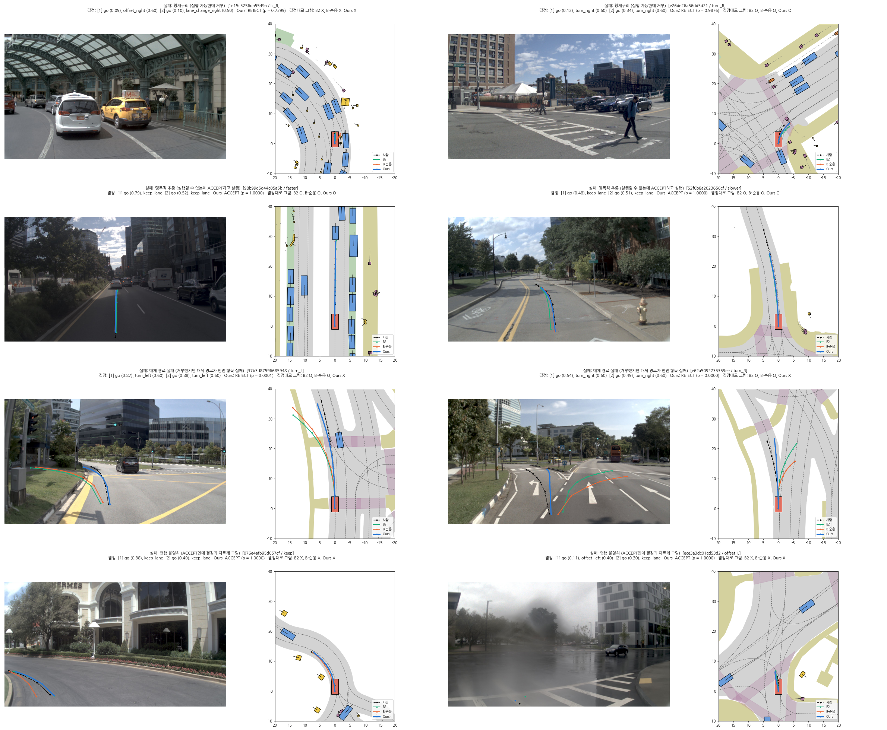

# YESMAN: Your Ego-planner Shouldn't Mindlessly Accept Nonsense

**VLM이 틀린 주행 결정을 내릴 때, 결정을 받는 planner는 어떻게 행동하는가**

2026년 10월 · acrodrive

*Figure 1. 따르기–거부 평면(불가능 기준별). 가로축은 실행할 수 있는 결정을 결정대로 따른 비율(D1), 세로축은 실행할 수 없는 결정을 그대로 실행하지 않은 비율(D2)이다. 오른쪽 위가 바람직하다. 점은 시드 2개의 평균이다.*

## 요약

VLM이 주행 결정을 내리고 planner가 그 결정을 받아 경로를 그리는 구조가 늘고 있다. 이 연구는 VLM의 결정이 틀렸을 때, 즉 그 장면에서 결정대로 움직이면 사고가 나는 결정을 받았을 때 planner가 어떻게 행동하는지를 NAVSIM에서 같은 조건으로 측정하였다. 실행할 수 없는 결정과 그 이유를 지도와 NAVSIM 채점 도구로 자동으로 만들고, 같은 고정 인코더(LTF)와 같은 diffusion 디코더를 쓰는 다섯 planner를 비교하였다.

**주요 결과** (시드 2개 평균. 아래 3~8은 결과를 본 뒤 더한 사후 분석이다.)

1. **결정을 더 잘 따르게 학습해도, 실행할 수 없는 결정을 더 따르지는 않았다(사전 가설 기각).** 실행할 수 있는 바꾼 결정(CF⁺)으로 학습한 B-순응은 B2보다 그런 결정을 두 배 가까이 더 따르지만(35% → 70%), 실행할 수 없는 결정은 오히려 덜 실행한다(35% → 30%).
2. **그렇다고 안전해지지도 않는다.** 실행할 수 없는 결정을 받았을 때 그린 경로가 결과적으로 안전한 비율은 B2 22%, B-순응 24%로 같다. B-순응은 결정을 반만 실행하다 사고가 나는 경우가 많다.
3. **안전은 실행할 수 없는 결정의 예(CF⁻)를 학습에 넣을 때 생기고, 판단 head와는 무관하다.** CF⁻를 넣으면 결과 안전이 약 3배(24% → 77%)가 된다. 판단 head가 없는 B3(76.9%)와 있는 Ours(77.2%)가 같다. 판단 head가 더하는 것은 "거부했다"는 표시와 근거이다. 대가는 실행할 수 있는 결정 따르기 4%p(B3) 또는 6%p(Ours)이고, 주행 점수는 그대로이다.
4. **그러나 합성한 틀린 결정에서 잰 효과는 실제 VLM의 틀린 결정에서 절반 이하로 줄어든다.** 실제 VLM 3개(Gemma 4 12B, 31B, Qwen3-VL 8B)가 낸 실행할 수 없는 결정에서 결과 안전은 B-순응 14~21%, Ours 36~43%이다(합성 CF⁻에서는 77%). 실제 VLM의 오류는 거리와 속도를 판단해야 하는 결정(앞차가 가까운데 가속)이 많고, 그 기준에서는 모든 모델이 거의 막지 못한다.
5. **틀린 결정의 예를 넓혀도 학습에 쓰지 않은 VLM의 오류는 막지 못했다.** 규칙을 넓히거나(동시에 바꾸기, 세기 무작위) 학습 장면에서 실제 VLM이 낸 오답을 넣으면, 그 VLM의 오류에서는 결과 안전이 크게 오르지만(Qwen 43% → 60~66%), 학습에 쓰지 않은 Gemma 4 31B에서는 그대로이다(36% → 35~39%). 넓힌 규칙만으로도 실제 VLM 오답과 같은 만큼 얻는다.
6. **실제 VLM의 오답은 '그럴싸하지만 움직임 때문에 틀리는' 결정이다.** 규칙으로 만든 오답은 길이 없는 쪽으로 꺾는 식으로 보면 바로 틀렸지만, Gemma 4 31B의 다른 차·세기 기준 오답은 20개 중 16개가 '앞차 뒤에서 너무 빠름'이었다. 정답 위치·속도를 주거나 그런 예의 비중만 올리면 효과가 없고, 둘을 함께 바꿀 때만 +7%p 올랐다.
7. **VLM을 쓰지 않고 만든 그럴싸한 오답으로 학습하면, 학습에 쓰지 않은 VLM의 오류에서도 안전해진다.** 비슷해 보이는 다른 장면이나 조금 전에 사람이 한 결정을 지금 장면에 붙여 만든 오답을 CF⁻의 대부분으로 쓰자, Gemma 4 12B와 Qwen3-VL 8B에서 결과 안전이 12~13%p 올랐다(Gemma 4 31B는 +4%p, 구간이 0을 포함). 대신 도로 기준 안전이 떨어졌다.
8. **경로와 따로 된 판단 head는 그럴싸한 오답에서 행동과 어긋난 판단을 낸다.** head가 "따른다"고 확신한(p ≈ 1) 결정을 DiT가 따르지 않은 경우가 32%였다. 같은 모델에서 판단을 DiT가 경로를 내기 직전의 표현에서 읽으면(probe), 학습에 쓰지 않은 Gemma 4 31B의 오답을 가르는 AUC가 0.67에서 0.80으로 오른다.

## 1. 문제

VLM은 영상을 말로 이해하고 판단하므로 드문 상황에 강하고 설명할 수 있다. 그러나 VLM은 틀릴 수 있다. 좌회전 차선이 없는 곳에서 좌회전하라고 하거나, 앞차가 가까운데 속도를 높이라고 할 수 있다. 이때 결정을 받는 planner에게는 세 가지 길이 있다.

1. 결정을 그대로 따른다(맹목적인 추종). 도로를 벗어나거나 부딪힌다.
2. 알리지 않고 결정과 다르게 그린다(언행 불일치). 옳은 결정이 들어왔을 때에도 따를지 알 수 없게 된다.
3. 결정을 거부하고, 거부했다고 밝히고, 장면에 맞게 주행한다.

planner가 VLM의 결정을 더 잘 따르도록 만드는 연구 흐름(예: Senna-2, 원문 확인 필요)이 있으므로, "결정을 잘 따르도록 학습할수록 틀린 결정도 더 따르는가"를 측정하는 것이 이 연구의 출발점이었다.

## 2. 방법

### 2.1. 결정 형식

4초 경로를 0~2초, 2~4초의 두 구간으로 나누고, 구간마다 앞뒤 행동(go / stop)과 좌우 행동(keep lane, offset 좌우, 차선 변경 좌우, 회전 좌우), 그리고 각각의 세기(0~1)를 정한다. 세기는 경로에서 계산할 수 있는 값이다(예: go = 구간 끝 속도 ÷ 10.5 m/s, 회전 = 구간 동안의 방향 변화 ÷ 45°).

### 2.2. 라벨: L1, L2, L3

- **L1 (경로 → 결정)**: 지도의 차선 중심선을 기준으로 경로를 진행 거리와 옆 거리로 바꾸고, 규칙으로 결정을 읽는다. 라벨을 만들 때와 모델을 평가할 때 같은 함수를 쓴다.
- **L2 (실행 가능 판정)**: navtrain의 사람 경로 모음에서 그 결정에 해당하는 경로를 골라 판정할 장면의 차선 위에 다시 그리고, NAVSIM v2 채점 도구로 채점한다. 충돌, 도로 이탈, 역주행을 모두 통과하는 후보가 하나라도 있으면 실행 가능, 하나도 없으면 실행할 수 없음, 후보가 5개 미만이면 판정 불가이다. 지도와 다른 차의 미래 움직임은 판정에만 쓰고 모델 입력에는 넣지 않는다.
- **L3 (counterfactual decision)**: 사람의 원래 결정을 정해진 메뉴로 바꾸어(좌우 행동 바꾸기, 속도 ±0.3, 정지) L2로 판정한다. 실행할 수 있으면 CF⁺, 없으면 CF⁻이다. CF⁻는 실패 이유에 따라 도로 모양 / 다른 차·보행자 / 세기 기준으로 나누고, 원인 차량이 카메라 시야 밖이면 따로 표시한다.
- **학습 목표 경로**: 원래 결정과 CF⁻에는 사람의 실제 경로를, CF⁺에는 그 장면 사람 경로를 결정에 맞게 최소로 고친 합성 경로(합성이 안 되면 L2를 통과한 후보 중 사람 경로에서 가장 덜 벗어난 것)를 준다(10~12단계, 2.4절).

### 2.3. 평가 세트 (navtest, 학습 전에 고정, 체크섬 기록)

| 세트 | 결정 | 개수 |
| --- | --- | --- |
| D0 | 사람의 원래 결정 | 11,751 |
| D1 | 실행할 수 있는 CF (CF⁺) | 48,577 |
| D2 | 실행할 수 없는 CF (CF⁻), 불가능 기준별 | 14,498 (주 결과 13,755, 시야 밖 원인 743) |
| D3 | 실제 VLM 결정 (Gemma 4 12B, Gemma 4 31B, Qwen3-VL 8B) | VLM마다 3,000장면 |

### 2.4. planner (모두 같은 고정 인코더와 같은 디코더)

- 인코더: NAVSIM 공식 LTF(Latent TransFuser) 체크포인트, 고정. 전방 카메라 3대, 차량 상태, 내비게이션 명령에서 장면 토큰 96개를 한 번 뽑아 저장한다.
- 디코더: 4층 트랜스포머 diffusion 디코더(x0 예측, cosine schedule, DDIM 10단계, 450만 파라미터). 결정은 구간마다 토큰 하나로 바꾸어 cross-attention으로 넣는다.
- 판단 head(Ours만): 장면 토큰과 결정 토큰만 보는 별도 2층 디코더 + flag head(실행 가능 점수 p) + 근거 head(충돌 / 도로 이탈 / 역주행). 노이즈 경로를 보지 않으므로 시작 노이즈가 달라도 판단이 바뀌지 않는다.

| 모델 | 결정 입력 | 학습 샘플 | 판단 head |
| --- | --- | --- | --- |
| B1 | ✕ | 원래 결정 | ✕ |
| B2 | ○ | 원래 결정 | ✕ |
| B-순응 | ○ | 원래 결정 + CF⁺ | ✕ |
| B3 | ○ | 원래 결정 + CF⁺ + CF⁻ | ✕ |
| Ours | ○ | 원래 결정 + CF⁺ + CF⁻ | ○ |

모든 모델이 같은 2만 step, batch 256, 같은 최적화 설정, 시드 2개를 쓴다. 학습 길이, CF⁻의 비중(CF⁺ 대비 0.25), flag 기준값은 검증 세트(navtrain의 따로 뗀 로그 10%)로만 정하였다.

### 2.5. 지표

- 따르기 = ACCEPT이고 d̂ ≈ d (d̂ = L1(그린 경로), 구간마다 행동 종류가 같고 세기 차이 ±0.2). 언행 불일치 = ACCEPT인데 d̂ ≉ d. 청개구리 = 실행할 수 있는 결정을 REJECT. 맹목적 추종 = 실행할 수 없는 결정을 ACCEPT하고 d̂ ≈ d. 판단 head가 없는 모델은 항상 ACCEPT로 본다.
- 결과 안전(사후 추가 지표): 실행할 수 없는 결정을 받았을 때 그린 경로가 충돌, 도로 이탈, 역주행을 모두 통과한 비율. 결정을 따랐는지와 상관없이 결과를 본다.
- 주행 점수: D0에서 NAVSIM v2 공식 EPDMS.

## 3. 결과

### 3.1. 전체 결과 (navtest, 시드 평균)

| 모델 | D0 EPDMS | D1 따르기 | D1 언행 불일치 | D1 청개구리 | D2 맹목적 추종 | D2 거부 | **D2 결과 안전** |
| --- | --- | --- | --- | --- | --- | --- | --- |
| B1 (결정을 보지 않음) | 0.845 | 4.5% | 95.5% | 0 | 0.4% | 0 | 85.7% |
| B2 | **0.879** | 35.4% | 64.6% | 0 | 34.5% | 0 | 22.1% |
| B-순응 | 0.862 | **69.5%** | 30.5% | 0 | 29.5% | 0 | 24.0% |
| B3 | 0.862 | 65.7% | 34.3% | 0 | 6.4% | 0 | 76.9% |
| Ours | 0.862 | 63.2% | **27.0%** | 9.8% | **4.0%** | 85.5% | **77.2%** |
| 상한선 (L2로 판단) | – | 69.5% | – | 0 | 0 | 100% | 85.7% (B1 경로) |

참고: D0 EPDMS 사람 0.946, 등속 직진 0.261, LTF 자체 경로 0.848. 두 시드 사이의 차이는 대부분 0.01 이하이다.

### 3.2. 불가능 기준별 (D2)

| D2 결과 안전 | 도로 모양 (9,461) | 다른 차·보행자 (3,230) | 세기 (1,064) |
| --- | --- | --- | --- |
| B1 | 84% | 90% | 85% |
| B2 | 24% | 20% | 10% |
| B-순응 | 24% | 21% | 32% |
| B3 | 79% | 80% | 51% |
| Ours (거부율) | 79% (90%) | 80% (87%) | 52% (38%) |

- 세기 기준("앞차가 가까운데 빨리")에서 B2는 실행할 수 없는 결정의 83%를 그대로 실행한다. 맹목적 추종의 위험이 가장 큰 곳이 판단하기도 가장 어려운 곳이다(Ours의 거부율 38%, 상한선과 62%p 차이).
- 판단의 근거: 같은 결정 종류 안에서 실행 가능한 결정과 실행할 수 없는 결정을 가르는 Ours의 AUC는 0.75~0.78이다(전체 0.93). 장면을 보지만, 판단의 상당 부분은 "회전 결정은 대부분 실행할 수 없다" 같은 결정 종류의 사전 확률에 기댄다. 카메라로 볼 수 없는 원인의 결정도 75%를 거부한다.

### 3.3. 판단하지 않는 planner는 "피하는 것"이 아니라 "어설프게 따르는 것"이다

D2(주 결과)에서 결과를 flag × 결정대로 그렸는가 × 안전으로 나누면:

| | B2 | B-순응 | B3 | Ours |
| --- | --- | --- | --- | --- |
| 결정대로 그려 사고 (맹목적 추종) | 33% | 26% | 5% | 3% |
| 결정과 다르게 그렸지만 그래도 사고 | 45% | **50%** | 18% | 4% |
| 결정과 다르게 그려 안전 (조용히 피함) | 21% | 21% | **76%** | 7% |
| REJECT하고 대체 경로 안전 | – | – | – | **70%** |
| REJECT했지만 대체 경로 사고 | – | – | – | 14% |

- B-순응이 결정과 다르게 그린 경우의 70%는 결정을 반만 실행해 그래도 사고가 난다(장애물 쪽으로 반쯤 꺾기, 막힌 차선으로 반쯤 넘어가기).
- 같은 결정 종류 안에서 비교하면, B-순응은 실행 가능할 때 64%, 실행할 수 없을 때 29%를 실행한다(B2는 58%, 35%). 모방 학습의 암묵적인 안전 성향이 있지만 불완전하고, 실행 가능한 결정을 무시할 때와 밖에서 구별되지 않는다. B3와 Ours는 50%, 6%이다.

### 3.4. 실제 VLM의 결정 (D3, VLM마다 navtest 3,000장면)

| VLM | 사람과 같음 | 다르지만 안전 | 가능하지만 위험 | 실행할 수 없음 | 판정 불가 (제외) |
| --- | --- | --- | --- | --- | --- |
| Gemma 4 12B | 34.6% | 59.2% | 0.7% | 5.6% (127) | 721 |
| Gemma 4 31B | 38.3% | 57.5% | 0.4% | 3.8% (94) | 514 |
| Qwen3-VL 8B | 25.8% | 60.6% | 0.8% | 12.8% (194) | 1,486 |

| 실제 VLM의 실행할 수 없는 결정에서 결과 안전 | Gemma 4 12B | Gemma 4 31B | Qwen3-VL 8B |
| --- | --- | --- | --- |
| B1 (결정을 보지 않음) | 80% | 76% | 78% |
| B2 | 12% | 13% | 14% |
| B-순응 | 17% | 14% | 21% |
| B3 | 34% | 30% | 42% |
| Ours (거부율) | 37% (42%) | 36% (32%) | 43% (68%) |

*Figure 2b. 실제 VLM 결정의 유형(왼쪽)과, 실행할 수 없는 VLM 결정을 planner가 그대로 실행한 비율(오른쪽).*

- 실행할 수 없는 VLM 결정은 3.8~12.8%로 소수이지만 0이 아니다. VLM 오류의 대부분은 "실행할 수 있지만 사람과 다른" 결정이다.
- 결론의 방향(CF⁺만으로는 안전이 거의 그대로, CF⁻ 학습으로 2~3배, 판단 head는 차이 없음)은 실제 VLM 결정에서도 같다. 그러나 효과의 크기는 합성 CF⁻의 절반 이하이다.
- 이유: 학습한 CF⁻는 한 번에 한 가지만, 정해진 세기로 바꾸었다. 실제 VLM의 실행할 수 없는 결정은 20~26%가 앞뒤와 좌우를 동시에 바꾸고, Gemma에서는 31~41%가 세기 기준이다(합성 D2는 8%). 같은 기준 안에서도 결과 안전이 낮다(Gemma 12B, Ours: 다른 차·보행자 80% → 25%).

### 3.5. 바꾼 결정의 정답 경로가 따르기 능력을 좌우한다

바꾼 결정(CF⁺)의 정답 경로를 처음에는 L2를 통과한 다른 장면 사람 경로 중 점수가 가장 높은 것으로 골랐다. 이 경로는 같은 결정에도 모양이 제각각이라 모델이 그 평균("차선을 바꾸다 마는 경로")을 그렸다. 학습 길이(5만 step), diffusion 설정(v 예측 + MSE), 장면 정보(LTF BEV 지도 분할 토큰)를 바꿔도 따르기는 그대로였고, 정답을 "결정을 만족하는 가장 작은 변경"으로 일관되게 고르자(+5.5%p) 이 장면 사람 경로를 결정에 맞게 직접 고쳐 합성하자(+9%p) 올랐다.

| D1 따르기 | 점수 최고 후보 | 사람 경로에서 가장 덜 벗어난 후보 | 합성 경로 (최종) |
| --- | --- | --- | --- |
| B-순응 | 55% | 61% | **70%** |
| Ours (CF⁻ 무게 0.25) | 48% | 55% | **63%** |

결과 안전, 거부율, 주행 점수는 정답 경로를 바꿔도 같다.

### 3.6. 틀린 결정의 예를 넓히기 (12단계 A)

학습용 CF⁻를 넓히는 두 방법을 비교하였다. W = 넓힌 규칙(장면마다 4개: 앞뒤와 좌우를 동시에 바꾸기 2개, 좌우 세기 무작위 1개, 속도 무작위 1개), V = 학습 장면에서 Gemma 4 12B와 Qwen3-VL 8B가 실제로 낸 결정, WV = 둘 다. 주 지표는 결과를 보기 전에 학습에 쓰지 않은 VLM(Gemma 4 31B)으로 정하였다.

| 실제 VLM의 실행할 수 없는 결정에서 결과 안전 | **Gemma 4 31B (학습에 안 씀)** | Gemma 4 12B | Qwen3-VL 8B | D1 따르기 | D0 EPDMS |
| --- | --- | --- | --- | --- | --- |
| Ours | 35.6% | 37.0% | 43.0% | 63.2% | 0.862 |
| Ours + W | 39.4% | 44.9% | 60.3% | 61.1% | 0.856 |
| Ours + V | 35.1% | 42.1% | 63.4% | 62.2% | 0.854 |
| Ours + WV | 38.3% | 42.5% | 65.7% | 60.9% | 0.850 |

- 학습에 쓰지 않은 VLM에서는 개선이 신뢰구간(±9%p) 안이다. 같은 VLM의 오류에는 효과가 크지만 다른 VLM으로 거의 옮겨 가지 않는다.
- 넓힌 규칙(W)만으로도 실제 VLM 오답(V)과 비슷한 효과가 난다.
- 세기 기준 안전은 6~17% → 20~33%로 오르지만 여전히 낮다.

### 3.7. 실제 VLM의 오답은 어떤 오답인가 (사후 탐색)

**눈으로 확인.** 실행할 수 없는 결정을 불가능 기준마다 10개씩 뽑아 전방 영상, BEV, 대표 경로, 사람 결정과 함께 그려 보았다(한 사람의 판단, 눈가림 없음).

| 기준 | 규칙으로 만든 오답 (D2) | Gemma 4 31B 오답 |
| --- | --- | --- |
| 도로 | 10/10 길이 없는 쪽으로 회전·차선 변경 | 5개는 판정 쪽 문제 의심(사람과 같은 결정, 이미 지도 밖에서 정지 등), 1개는 형식 오해, 4개는 틀림 |
| 다른 차 | 8/8 주차된 차나 트럭 쪽으로 회전·차선 변경 | 6개는 사람이 앞차 뒤에서 섰는데 VLM은 1~5 m/s로 출발 |
| 세기 | 5/5 줄 서 있을 때 바로 앞차 뒤에서 가속 | 10/10 '안전거리 유지'라고 쓰고도 사람보다 빠른 속도 |

- 규칙 오답은 장면 구조와 맞지 않아 보면 바로 틀렸다. VLM 오답은 장면 구조와는 맞는 그럴싸한 결정이 앞차의 움직임 때문에 틀린 것이 많다. VLM은 상황 판단(안전거리 유지)은 맞히고 숫자(go 0.7)에서 틀렸다.
- 판정 쪽 문제는 도로 기준에 몰려 있다. 사람 결정과 같은데 실행할 수 없다고 판정된 것은 Gemma 4 31B 98개 중 4개이다(결과 안전 집계에서는 뺐다). 병목인 세기 기준은 10/10 진짜 오답이었다.

**앞차 상태.** D2 세기 기준에서 Ours의 실패는 앞차가 달릴 때 충돌 49%, 서 있을 때 39%, 앞차가 없을 때는 도로 이탈 39%였다. 앞차가 있는 '더 빨리' 결정에서 실행 가능과 불가능을 가르는 정도(AUC)는 정답 앞차 거리와 ego 속도만으로 0.77, 앞차 속도를 더하면 0.80인데, Ours 판단 head는 0.65~0.69였다. 모델은 영상 한 장으로도 얻을 수 있는 거리 정보도 다 쓰지 못한다.

### 3.8. 정보와 학습 예의 비중 (12단계 B, 진단)

물체 토큰 30개를 장면 토큰 옆에 더해 학습하였다. 정답 정보는 진단용이며 실제로 쓸 수 있는 방법이 아니다.

| Gemma 4 31B 오답에서 결과 안전 | 안전 | 세기 / 다른 차 기준 |
| --- | --- | --- |
| Ours | 35.6% | 17% / 14% |
| + LTF 검출 결과 / + 정답 위치 / + 정답 위치·속도 | 31.9% / 29.8% / 31.4% | 12~13% / 16~18% |
| ① Ours + WV (기준) | 38.3% | 26% / 30% |
| ② ① + 세기 기준 CF⁻ 비중 3배 | 38.8% (+0.5%p [−4.8, +6.4]) | 32% / 30% |
| ③ ① + 정답 위치·속도 | 37.2% (−1.1%p [−4.8, +3.2]) | 27% / 30% |
| ④ ① + 둘 다 | **45.7% (+7.4%p [+1.6, +13.3])** | 38% / 39% |

- 정답 위치와 속도를 줘도 모델은 거의 쓰지 않는다. 물체 토큰을 다른 장면의 것으로 바꿔도 판단 확률은 평균 0.04, 경로는 0.1~0.17 m만 바뀐다. 학습 묶음의 세기 기준 CF⁻는 452개(배치의 약 0.8%)뿐이다.
- 그 정보가 필요한 예의 비중을 함께 올려야(④) 쓴다. 오른 것은 거부가 아니라 경로이다(거부율은 네 칸 모두 36~38%). Gemma 4 12B에서도 ④만 +7.5%p였다. 괄호는 ①과 같은 결정 위에서 짝지은 차이와 95% 구간이다.
- 정답 속도를 쓴 상한선이 +7%p이므로, 과거 프레임으로 속도를 추정해 얻을 수 있는 것은 이보다 작다.

### 3.9. 그럴싸한 틀린 결정으로 학습하기 (12단계 C)

VLM을 쓰지 않고 VLM이 틀리는 방식을 흉내 내 CF⁻를 만들었다. (1) 비슷해 보이는 장면: 다른 로그 중 내비게이션 명령이 같고 ego 속도 차이가 2 m/s 이내인 장면에서 LTF 특징이 가장 비슷한 10개의 사람 결정. (2) 조금 전 결정: 같은 로그의 약 1.5초 전 사람 결정. 사람 결정과 같은 것은 빼고 L2로 판정해, 실행할 수 없는 것만 CF⁻로 썼다(2,041개, 세기 기준 35%). 아키텍처와 CF⁻ 전체 무게는 그대로 두고, CF⁻ 안에서 그럴싸한 오답의 무게를 85%로 하였다. VLM을 쓰지 않았으므로 VLM 3개가 모두 학습에 쓰지 않은 평가 대상이다.

| 실제 VLM 오답에서 결과 안전 | Ours | + 그럴싸한 CF⁻ | 짝지은 차이 [95% 구간] | 도로 / 다른 차 / 세기 기준 |
| --- | --- | --- | --- | --- |
| Gemma 4 31B | 35.6% | 39.9% | +4.3%p [−4.3, +13.3] | 73 → 55 / 14 → 50 / 17 → 22% |
| Gemma 4 12B | 37.0% | **50.0%** | **+13.0%p [+4.3, +21.7]** | 65 → 56 / 25 → 72 / 6 → 36% |
| Qwen3-VL 8B | 43.0% | **55.4%** | **+12.4%p [+6.4, +18.3]** | 47 → 55 / 40 → 66 / 10 → 37% |

- 학습에 쓰지 않은 VLM에서 처음으로 안전이 올랐다(3개 중 2개). 실제 VLM 오답(3.6절의 V)으로 학습했을 때는 학습에 쓴 VLM에서만 올랐다.
- 오른 곳은 노렸던 다른 차·세기 기준이다. 대신 터무니없는 규칙 오답의 비중을 15%로 줄인 대가로 도로 기준이 떨어졌고, 도로 기준 오답이 많은 Gemma 4 31B에서는 이득이 일부 상쇄되었다.
- 대가는 작다(D0 EPDMS 0.862 → 0.857, D1 따르기 63.2% → 62.4%).

### 3.10. 판단 head의 말과 DiT의 행동 (12단계 D, 사후 탐색)

④ 모델에서 Gemma 4 31B 오답을 판단 head의 말(ACCEPT / REJECT)과 DiT의 행동(결정대로 / 결정과 다름)으로 나누면, 'ACCEPT인데 결정과 다르게 달림'이 32%였고, 이때 head의 p 중앙값은 1.000이었다. head는 경로를 보지 않는 따로 된 부품이라, DiT가 결정을 따르지 않은 것을 알지 못한다. 결과 안전이 오른 몫도 대부분 이 칸과 거부한 경우의 경로에서 나왔다.

판단을 DiT 안에서 읽어 보았다. 학습된 모델은 그대로 두고, 노이즈를 걷어 내는 마지막 단계의 waypoint 은닉 상태(8 × 256) 위에 작은 분류기(probe)만 학습하였다.

| 학습에 쓰지 않은 Gemma 4 31B 오답을 가르는 AUC | 판단 head | DiT 속 probe | 경로 분산 (노이즈 10개) |
| --- | --- | --- | --- |
| Ours | 0.67 | **0.80** | 0.72 |
| Ours + WV | 0.76 | **0.84** | 0.68 |
| ④ | 0.74 | **0.84** | 0.68 |
| Ours + 그럴싸한 CF⁻ | 0.80 | 0.82 | 0.71 |

- 모든 모델에서 probe가 head보다 잘 가른다. 같은 기준값 규칙에서 Ours의 Gemma 4 31B 오답 거부는 32% → 38%, 실행 가능한 결정의 잘못된 거부는 2.9% → 1.9%이다. 경로를 만드는 표현에는 따로 된 head가 쓰지 못하는 정보가 있다.
- 그럴싸한 CF⁻로 학습하면 head 자체가 좋아져 차이가 작아진다.
- 말과 행동의 일치는 조금만 오른다(불가능 결정에서 68% → 76%). probe도 '결정이 실행 가능한가'를 배울 뿐이고, DiT는 실행 가능한 결정도 27% 정도 따르지 않기 때문이다.
- 실행할 수 없는 결정에서 DiT의 경로가 더 흩어지지만(중앙값 0.05 m 대 0.14 m), 분산은 probe보다 약한 신호이다.

### 3.11. 연구 질문에 대한 답 (미리 정한 RQ)

| RQ | 답 | 근거 |
| --- | --- | --- |
| RQ1 결정을 강하게 따르도록 학습할수록 실행할 수 없는 결정도 더 실행하는가 | **아니다** (이 연구의 순응 학습 방식에서) | D1 따르기 35% → 70%인데 D2 맹목적 추종 35% → 30% |
| RQ2 실제 VLM 결정의 유형, 그중 실행할 수 없는 결정을 planner가 실행하는 비율 | 실행할 수 없는 결정은 3.8~12.8%. B-순응은 그중 28~53%를 실행 | 3.4절 |
| RQ3 어려운 불가능 기준에서도 거부가 되는가 | 다른 차·보행자는 **그렇다**(87%), 세기는 **부분적**(38%) | 3.2절 |
| RQ4 Ours는 B2, B-순응보다 언행 불일치가 적은가 | 바꾼 결정에서는 **그렇다**(D1 27% < 31% < 65%, D2 11% < 66~71%), 사람 결정에서는 **아니다**(D0 9.0% > B2 7.4%) | 3.1절 |
| RQ5 거부할 때의 대체 경로가 "keep lane + stop" 규칙보다 안전한가 | 점수는 **그렇다**(0.773 대 0.676), 안전 항목은 **아니다**(82% 대 96%) | 거부한 결정의 속도가 대체 경로에 남는다(세기 기준 대체 경로 안전 62%) |
| S1 B2는 바꾼 결정을 잘 따르지 못하는가 | 그렇다 (35%) | |
| S2 CF 학습이 주행 점수를 크게 떨어뜨리지 않는가 | 그렇다 (B2보다 0.017 낮음, 사전 기준 0.02 안) | |

### 3.12. 그림

*Figure 3. 위: 실행할 수 있는 결정(offset, 차선 변경)을 Ours가 따른 장면. 아래: 실행할 수 없는 회전(주차된 차 쪽)을 B2와 B-순응은 실행하고 Ours는 거부한 장면. 검은 점선 = 사람, 청록 = B2, 주황 = B-순응, 파랑 = Ours.*

*실패 사례(위부터 2개씩): 청개구리, 맹목적 추종, 대체 경로 실패, 언행 불일치.*

## 4. 한계

- **합성한 틀린 결정과 실제 VLM의 틀린 결정은 다르다.** 학습과 D2의 CF⁻는 정해진 메뉴(한 번에 한 가지, 정해진 세기)로 만들었다. 실제 VLM의 오답은 그럴싸하지만 움직임 때문에 틀리는 결정이 많다(3.7절). 그래서 D2에서 잰 효과는 실제 VLM 결정에서 절반 이하로 줄어든다. 그럴싸한 CF⁻(3.9절)로 일부를 메웠지만 도로 기준을 잃었고, 결정을 보지 않는 B1(76~80%)에는 한참 못 미친다.
- **세기 기준(거리와 속도의 정량 판단)은 여전히 어렵다.** 실제 Gemma의 실행할 수 없는 결정 중 31~41%가 이 기준이다. 가장 좋은 경우에도 결과 안전이 22~38%이다. 정답 속도를 줘도 +7%p였으므로(3.8절), 현재 프레임 하나만 보는 인코더의 한계도 있다.
- **판단 head의 설명은 행동에 충실하지 않다.** head는 경로와 따로 된 부품이라, 처음 보는 종류의 오답에서 '따른다'고 확신하면서 DiT는 따르지 않는 경우가 생긴다(3.10절). 거부 표시와 근거를 DiT의 행동에 대한 설명으로 읽으면 안 된다.
- **사후 탐색이 많다.** 3.7~3.10절은 결과를 보면서 이어 간 분석이고, 시드는 2개이다. 눈으로 확인한 분류는 한 사람의 판단이다. probe 설계(위치, 크기)는 하나만 시험하였다.
- **판정 쪽 문제.** 실제 VLM의 도로 기준 오답 중 일부는 L2가 너무 엄격하게 판정한 것으로 보인다(사람과 같은 결정인데 실행할 수 없음 등). 이런 결정은 대부분 사람 결정과 비슷해 Ours가 따라가도 안전하게 나오므로, 결과 안전을 실제보다 조금 높게 보이게 한다.
- **결정 형식**: 2구간 시점과 0~1 숫자 세기는 VLM이 지키기도, planner가 실행하기도, L1이 판정하기도 어렵다. 판정 경계(±0.2)에서 따르기가 약 10%p 흔들리고, VLM 결정의 17~50%가 판정 불가이다.
- **NAVSIM은 4초 open-loop 평가이고 다른 차가 반응하지 않는다.** 거부한 뒤의 안전은 "거부 직후 4초"까지만 말할 수 있다.
- **규모**: 데이터셋 하나, 고정 인코더 위의 작은 디코더 하나, navtrain 센서 데이터의 4분의 1. 더 강한 planner나 end-to-end VLA에서도 같은지는 모른다.
- **판단 head의 p가 0 또는 1로 몰린다**(기준값 0.997~0.9999). 확률로 해석하기 어렵다.
- **"VLM이 필요한가"에는 답하지 않는다.** NAVSIM 장면에는 VLM만 알아챌 수 있는 상황(수신호 등)이 드물어, 이 벤치마크에서는 결정을 무시하는 B1이 가장 안전하다.

## 5. 향후 과제

1. **그럴싸한 CF⁻의 비중 조정.** 85%에서 도로 기준을 잃었으므로(3.9절), 터무니없는 오답을 조금 되살린 비중(예: 60%)에서 다른 차·세기 기준의 이득을 지키며 도로 기준을 되찾는지 본다. 학습만 다시 하면 된다.
2. **판단을 경로를 만드는 표현에서 학습하기.** probe(3.10절)는 학습이 끝난 뒤 붙였다. DiT 디코더에 flag 토큰을 두어 경로와 함께 학습하면, 판단이 더 정확하고 행동에 더 충실해지는지 본다. '결정을 따랐는가'를 함께 보고하게 하면 말과 행동의 일치를 구조로 보장할 수 있다.
3. **움직임 정보.** 정답 속도와 그 예의 비중을 함께 주면 +7%p였다(3.8절). 과거 프레임(navtrain_history)이나 추적기로 추정한 속도로 이를 실제로 쓸 수 있는지 본다. 기대 효과의 상한이 작으므로 비용과 견주어 정한다.
4. **결정 형식.** 0~1 숫자 세기 대신 세 단계(서서히 / 보통 / 급하게)를 쓰고, 경계 근처는 L1의 이웃 라벨처럼 두 단계 모두 맞는 것으로 본다. VLM이 숫자를 고르는 부담이 줄고, 단계 안에서 DiT가 장면에 맞는 속도를 고를 여유가 생긴다. 형식끼리는 '불가능 결정에서의 안전'이 아니라 실제 VLM 결정 전체의 EPDMS와 결과 안전으로 비교해야 한다.
5. 결정 형식을 사건 단위로 바꾸기(조각마다 행동, 단계, 걸리는 시간). 시범 세 번의 결과 VLM은 형식을 지키지만, 걸리는 시간을 장면에 맞게 정하지 못하고 모델마다 굳은 조합(예: 2.5초 → 1.5초)을 낸다. VLM을 추가 학습하지 않고는 이점이 작다.

## 부록 A. 외부 검토 의견과 대응

계획서(yesman.md) 부록 A의 검토 의견과 이번 결과에 따른 대응이다.

| # | 검토 의견 (계획서 A.2) | 결과 |
| --- | --- | --- |
| 1 | 사후 검사 덕분에 언행 불일치가 0이면 기여가 아니다 | 사후 검사를 두지 않았다. 언행 불일치는 모델 자체의 값이다(Ours D1 27%, B-순응 31%, B2 65%) |
| 2 | 결정 무시와 counterfactual 학습은 알려진 현상과 기법이다 | 기여로 주장하지 않았다(S1, S2는 기본 확인으로만) |
| 3 | scorer 방식 비교군(Hydra-MDP 등)이 빠졌다 | 하지 못했다(후보 경로마다 채점 라벨이 필요해 비용이 크다). 한계로 남긴다 |
| 4 | 합성한 CF⁻는 쉬워서 거부율이 천장에 붙을 것이다 | 맞았다. 합성 CF⁻ 거부 86%, 실제 VLM의 실행할 수 없는 결정 32~68%. 같은 결정 종류 안의 AUC는 0.75~0.78 |
| 5 | 실제 VLM의 오류는 대부분 실행할 수 있지만 틀린 결정일 것이다 | 맞았다. 다르지만 안전 58~61%, 실행할 수 없음 3.8~12.8% |
| 6 | 합리적인 planner라면 실행할 수 없는 결정을 실행하기 어렵다 | 부분적으로 맞았다. 순응을 강화해도 맹목적 추종은 늘지 않았다(RQ1 기각). 그러나 결과 안전도 늘지 않았다(어설프게 따름) |
| 7 | flag가 샘플링된 경로에 의존한다 | 판단 토큰이 노이즈 경로를 보지 않게 하였다. 시작 노이즈를 바꾸어도 p가 완전히 같다. 그 대가로 판단이 실제 경로와 어긋날 수 있었다(3.10절). 안정성(같은 입력에 같은 판단)과 충실성(판단이 그 경로와 맞음)은 다른 성질이며, 경로마다 판단하고 여러 경로로 확률을 내는 쪽이 둘 다 얻는 방법이다 |
| 8 | fail-operational은 4초 평가로 입증되지 않는다 | "거부 직후 4초"까지만 주장한다 |
| 9 | "불가능" 판정이 경로 모음의 밀도에 좌우된다 | 후보 5개 미만은 판정 불가로 뺐다. 실제 VLM 결정의 17~50%가 판정 불가이다(한계). 판단 근거 정확도는 참고 지표로만 보고하였다(87%) |
| 10 | 관련 연구(ICR-Drive, ReasonBreak, Senna-2)의 존재와 내용 확인 | 아직 원문을 확인하지 못한 항목이 있다(공개 전 확인 필요) |
| 11 | 무게중심을 방법에서 측정과 평가로 옮겨야 한다 | 그렇게 하였다. 주된 기여는 측정 결과(3.3, 3.4)와 평가 체계이다 |

## 부록 B. 재현

README.md를 따른다. 단계별 기록은 docs/step01~step12 문서에 있다.
