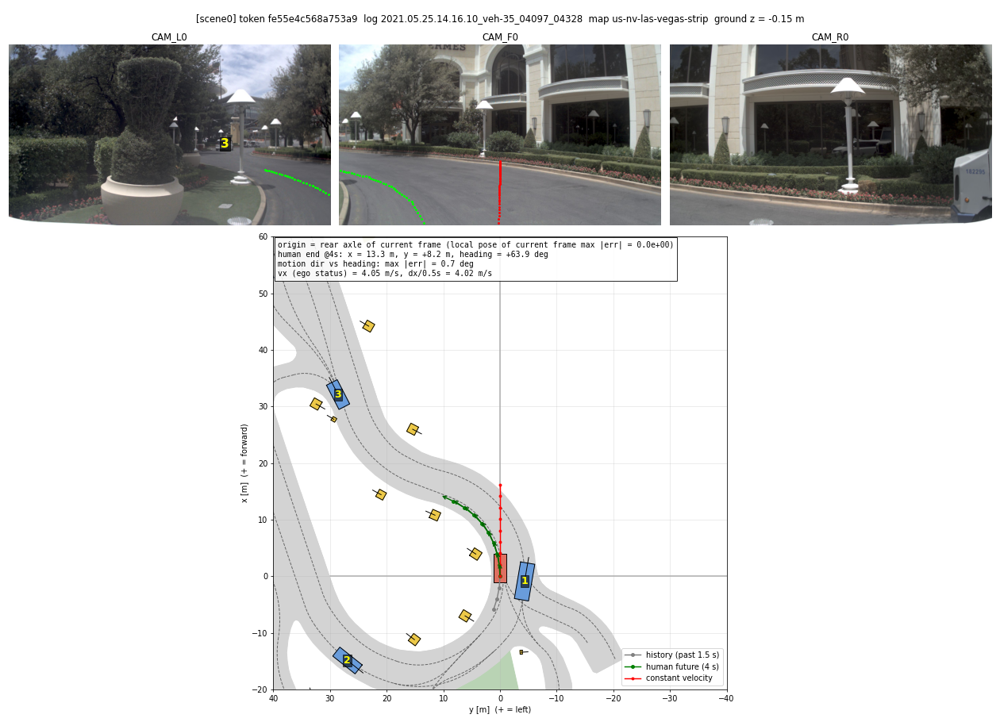
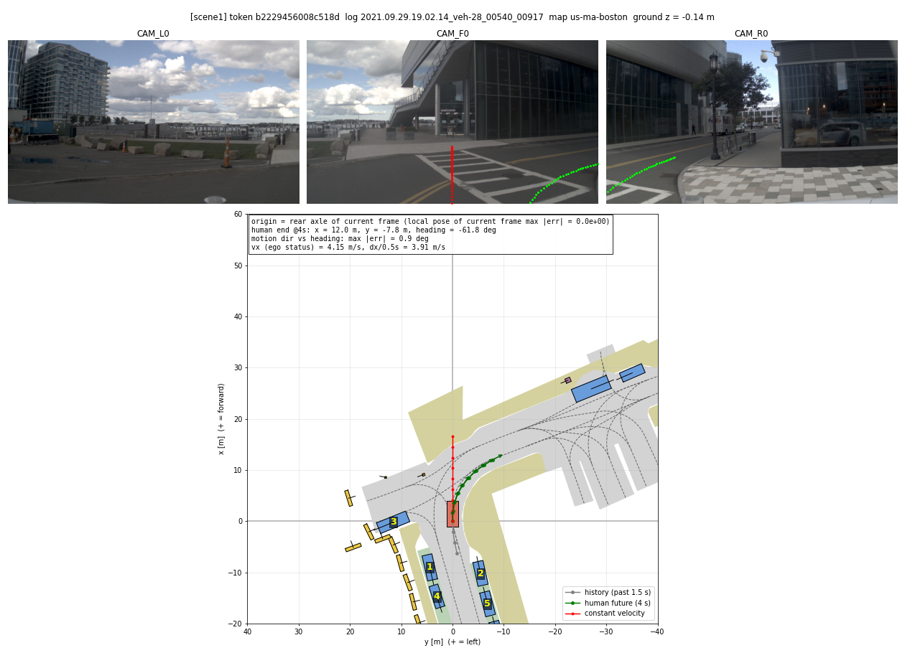
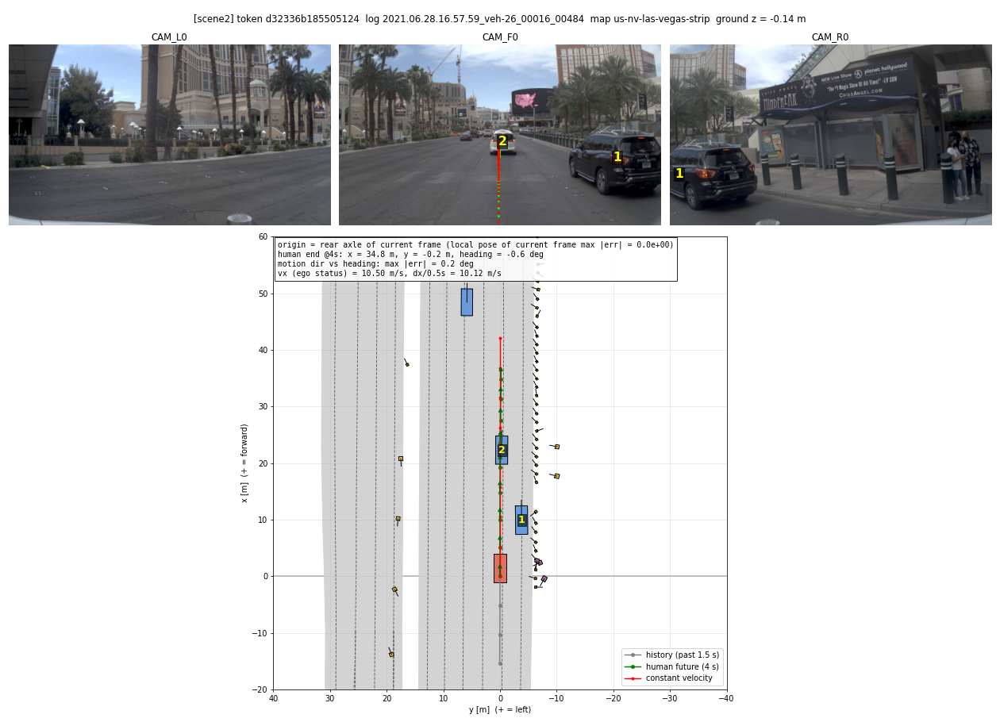

# 3단계. 데이터와 채점 도구 확인 결과 (2026-10-06)

yesman.md 11절 3단계의 결과와 계획서와 달라진 점을 정리한 것이다.

## 끝났다는 기준 확인

| 기준 | 결과 |
| --- | --- |
| 좌표계(원점, 축 방향, 각도 부호)를 그림으로 확인하였다 | 통과. `scripts/viz_scene.py`로 좌회전, 우회전, 직진 장면을 그렸다(`docs/figs/step03/`). 1,000장면에서 수치로도 확인하였다. 아래 "좌표계" 참고 |
| 사람 경로는 높은 점수를 받고, 등속 경로는 그보다 낮은 점수를 받는다 | 통과. navtest 12,146장면 전체에서 EPDMS가 사람 0.945, 등속 0.259이다. 장면별로 보면 사람이 더 높은 장면이 91.8%이다 |

## 코드 버전

- NAVSIM: main 브랜치 커밋 `0a380a9` (2025-10-27)이다. 2026-10-06에 `git fetch`로 확인했을 때 origin/main의 최신 커밋이다. 1단계와 같은 코드이다.
- 이 커밋에는 human filter 버그 수정(Issue #151, `359c7f7`)이 들어 있다. 따라서 계획서 14절이 말하는 필터링 수정 전의 옛 구현(EPDMS\*)이 아니다.
- navtest 채점은 `run_pdm_score_one_stage.py`로 한다(EPDMS, 교통은 non-reactive). `run_pdm_score.py`는 navhard처럼 2단계(two-stage) 장면이 있는 split에서 쓴다.

## 좌표계

NAVSIM의 경로와 물체는 모두 ego 좌표계로 주어진다. 3단계에서 확인한 내용은 다음과 같다.

| 항목 | 내용 | 확인 방법 |
| --- | --- | --- |
| 원점 | 현재 프레임(history 4프레임 중 마지막)의 ego 뒤차축 | 현재 프레임 pose를 ego 좌표계로 바꾸면 (0, 0, 0)이다(1,000장면, 오차 0). 채점 도구(metric cache)의 `ego_state.rear_axle`이 로그의 현재 프레임 pose와 정확히 같다(300장면, 오차 0) |
| 축 | x 앞, y 왼쪽, z 위 | 그림: 좌회전 경로는 y > 0, 우회전 경로는 y < 0이다. BEV에서 y < 0인 차량이 CAM_F0의 오른쪽과 CAM_R0에 보인다. 미래 경로를 카메라에 투영하면 도로를 따라간다 |
| 각도 | heading은 x축에서 y축 쪽으로 잰다(위에서 보아 반시계). 좌회전하면 커진다 | 좌회전 장면 끝 heading +63.9°, 우회전 −61.8°이다. 0.5초마다 움직인 방향 atan2(dy, dx)와 heading의 차이는 중앙값 0.25°, 99% 1.91°이다(움직인 구간 6,616개) |
| 속도 | `ego_velocity[0]`은 앞 방향 속도(m/s)이다 | 첫 0.5초에 움직인 거리로 구한 속도와 비교하였다. 부호는 795장면 모두 같고, 차이의 중앙값은 0.27 m/s이다 |
| 경로 형식 | 0.5초 간격 8점(4초), 각 점은 (x, y, heading). 현재 위치(0, 0, 0)는 들어 있지 않다 | `scene.get_future_trajectory(8)` |
| 카메라 | 로그의 `lidar2ego`가 단위 행렬이다. 따라서 lidar 좌표계와 ego 좌표계는 같다. 카메라는 `sensor2lidar_rotation/translation`과 intrinsics로 투영한다. 지면은 원점보다 약 0.15 m 아래이다(가까운 물체 박스 바닥의 중앙값) | 경로와 차량 중심을 핀홀 모델로 투영하였다(왜곡 보정 없음). 영상 가운데 부분에서는 잘 맞는다 |

그림 (위: 전방 3캠에 사람 미래 경로(초록)와 등속 경로(빨강), 가까운 차량 번호를 투영. 아래: BEV, 가로축 y는 왼쪽이 +)

- 좌회전: 
- 우회전: 
- 직진: 

## 채점 결과 (navtest 전체, `logs/step03/summary_scores.md`)

| 경로 | 장면 수 | 실패 | EPDMS | NC | DAC | DDC | TLC | EP | TTC | LK | HC | EC |
| --- | --- | --- | --- | --- | --- | --- | --- | --- | --- | --- | --- | --- |
| 사람 | 12146 | 0 | 0.945 | 1.000 | 1.000 | 0.998 | 1.000 | 0.874 | 1.000 | 1.000 | 0.981 | 0.901 |
| 등속 | 12146 | 0 | 0.259 | 0.681 | 0.578 | 0.842 | 0.981 | 0.777 | 0.669 | 0.827 | 0.979 | 0.553 |

- 장면별 EPDMS를 비교하면 사람이 더 높은 장면이 91.8%, 같은 장면이 2.7%, 더 낮은 장면이 5.5%이다.
- EC(two-frame extended comfort)는 바로 앞 프레임(0.5초 전)도 navtest에 있어야 계산된다. 계산된 장면은 82.7%이고, 나머지 장면에서는 EC의 가중치를 0으로 둔다(공식 구현).
- **사람 점수에 대한 주의**: human penalty filter는 사람 경로가 0점을 받은 항목을 모든 경로에서 1로 바꾼다. 그래서 사람 경로는 NC, DAC, TTC, LK가 항상 1이 된다. 필터를 끄고 사람 경로를 채점하면, 항목 값이 1보다 작은 장면의 비율은 다음과 같다(300장면). NC 0%, DAC 0%, DDC 0.3%, TLC 1.7%, TTC 0%, LK 11.3%.

## 직접 채점 경로 (5단계 L2용)

- `scripts/score_trajectories.py`는 공식 설정 파일을 hydra compose로 읽는다. 그다음 `navsim.evaluate.pdm_score.pdm_score()`를 직접 불러 경로를 채점한다.
- navtest 300장면에서 사람 경로와 등속 경로를 채점하였다. 장면별 8개 항목(NC, DAC, DDC, TLC, EP, TTC, LK, HC)이 공식 CSV와 모두 같다(최대 차이 1.1e-16). 5단계의 L2는 이 방식으로 후보 경로를 채점한다.
- 계산 시간: 경로 하나를 시뮬레이션하고 채점하는 데 CPU 약 0.1초가 든다. 이 시간은 300장면 × 3회 채점에 든 CPU 시간(user 128초)으로 잰 것이다. human filter를 켜면 사람 경로도 한 번 더 시뮬레이션한다. 실제 걸린 시간은 metric cache를 읽는 시간(네트워크 볼륨)이 더 크다.

## 자원 측정 (5단계 CPU 규모 결정용)

pod: RunPod CPU pod이다. 컨테이너 제한은 16 vCPU, 메모리 32 GB이다(`/sys/fs/cgroup`). 호스트를 다른 사용자와 같이 쓰므로(load average 약 64) 시간은 참고값이다. 메모리는 `scripts/tools/memwatch.sh`로 cgroup 전체의 anon 메모리를 1초마다 재어 최대값을 구하였다.

| 작업 | 장면 수 | worker | 걸린 시간 | 최대 메모리 |
| --- | --- | --- | --- | --- |
| metric cache (navtest) | 12,146 | 16 | 43분 (로그 읽기 2.5분 + 캐싱 40.6분, 약 5장면/초) | 19.0 GB (아래 참고) |
| 공식 채점, 사람 | 12,146 | 16 | 19분 | 15.1 GB |
| 공식 채점, 등속 | 12,146 | 16 | 19분 | 15.4 GB |

- metric cache를 만드는 동안 시각화와 64장면 시험 채점(worker 4개)도 같이 돌렸다. 따라서 19 GB에는 다른 작업의 메모리가 섞여 있다. worker 1개만 쓴 시험(64장면)에서는 최대 4.0 GB였다(시작할 때 1.0 GB).
- metric cache 파일은 장면당 평균 310 KB(중앙값 251 KB, 최대 1.4 MB)이고, navtest 전체는 약 3.8 GB이다. 다만 MooseFS는 디렉터리마다 약 2 MB의 크기를 보고하여 `du --apparent-size`는 16 GB로 나온다(장면마다 디렉터리가 하나씩 있다). 볼륨 사용량(`du -sh /workspace`)은 2단계가 끝났을 때 62 GB에서 77 GB로 늘었다. RunPod이 볼륨 한도를 이 디렉터리 크기 기준으로 세는지는 확인하지 못했다. 볼륨은 150 GB로 늘렸다(아래).
- 5단계 추정: L2에 쓸 학습 장면(23,388장면)의 metric cache를 같은 pod에서 만들면 약 80분, 파일 약 7 GB(du 기준으로는 약 30 GB)가 든다. 후보 경로 채점은 경로 하나에 CPU 약 0.1초이다. 장면 23,388개 × 결정 몇 개 × 후보 수십 개이면 수십만~수백만 회이므로, 16 vCPU에서 수 시간이 걸린다. 따라서 **16 vCPU, 32 GB pod로 충분하다**고 본다. 16 worker를 쓸 때 메모리는 15 GB 정도이므로 여유가 있다. 후보 수가 정해지면(5단계) 다시 계산한다. `PDMScorer.score_proposals`는 한 장면의 후보 여러 개를 한 번에 채점할 수 있으므로, 이를 쓰면 더 빨라질 수 있다.

## 계획서와 달라진 점, 남은 일

- **v1 PDMS는 쓰지 않는다 (2026-10-06 결정)**: 계획서 9.2와 14절은 기존 논문과 비교하려고 v1 PDMS도 함께 보고한다고 하였다. 그러나 현재 main 코드는 v1의 comfort(C) 항목과 human filter가 없는 v1 방식의 점수를 계산하지 않는다. v1을 쓰려면 v1.1 브랜치의 채점 도구와 별도의 metric cache가 필요하다. 이 연구의 목표는 같은 조건에서 방법끼리 비교하는 것이므로(10절) v2 EPDMS만 쓴다. 디코더가 제대로 동작하는지는 LTF 체크포인트를 v2로 채점한 점수와 비교하여 확인한다.
- **L2의 human filter는 5단계에서 정한다**: 공식 EPDMS는 human filter를 켠다. L2에서도 이 필터를 켜면, 사람이 위반한 항목은 모든 후보에서 통과로 처리된다. 지도 라벨 오류를 걸러 주므로 켜는 쪽이 나아 보인다. 사람이 안전 항목(NC, DAC, DDC)을 위반하는 장면은 1% 미만이므로 영향은 작다. 5단계에서 결과를 보고 확정한다.
- **네트워크 볼륨을 80 GB에서 150 GB로 늘렸다 (2026-10-06)**: 3단계가 끝났을 때 `du` 기준 사용량이 77 GB였다. 앞으로 학습 장면 metric cache, Gemma 4 가중치(약 24 GB), 특징, 체크포인트가 더 생긴다.
- **metric cache 위치**: `exp/metric_cache/navtest/` (git 제외). 5단계에서 학습 장면의 cache를 만들 때는 `exp/metric_cache/navtrain_sensor/`처럼 따로 둔다.
- **CPU pod 사양**: 2단계의 pod(4코어, 8 GB)와 달리, 이번 pod는 16 vCPU, 32 GB이다.

## 만든 파일

| 파일 | 하는 일 |
| --- | --- |
| `scripts/viz_scene.py` | 장면을 전방 3캠과 BEV로 그리고, 좌표계를 수치로 확인한다 |
| `scripts/run_score_navtest.sh` | 공식 v2 채점(navtest, one-stage)으로 agent 하나를 채점한다 |
| `scripts/summarize_scores.py` | 공식 채점 CSV의 항목별 평균을 표로 낸다 |
| `scripts/score_trajectories.py` | `pdm_score()`를 직접 불러 채점하고, 공식 결과와 같은지 확인한다(L2의 바탕) |
| `scripts/tools/memwatch.sh` | 명령을 돌리면서 걸린 시간과 컨테이너의 최대 메모리를 잰다 |
| `logs/step03/` (git 제외) | 실행 로그와 점수 표 |
| `exp/step03/` (git 제외) | 공식 채점 CSV(장면별), 직접 채점 CSV, 그림 원본 |
