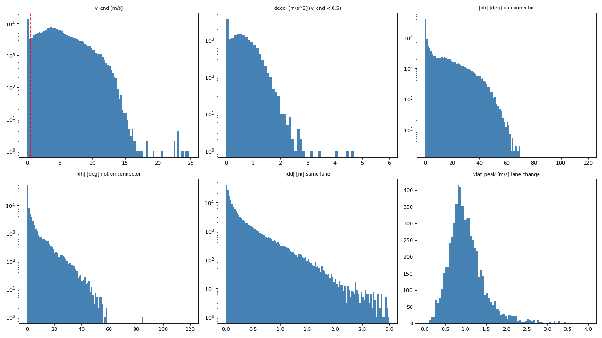
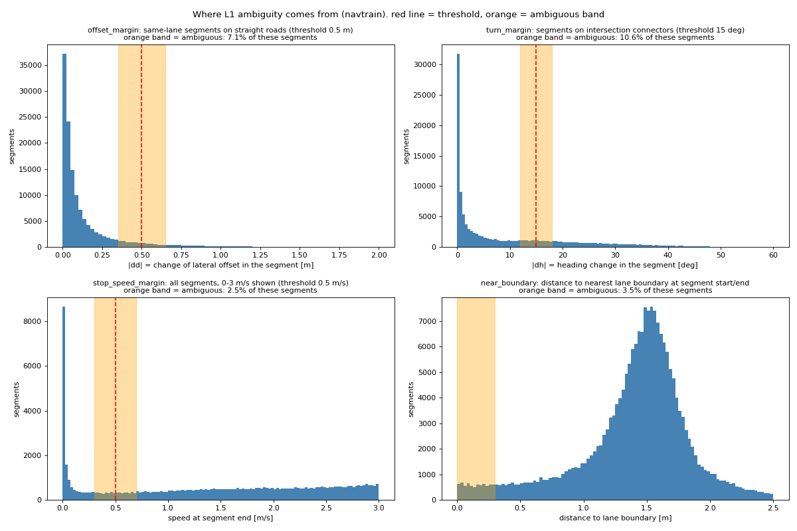
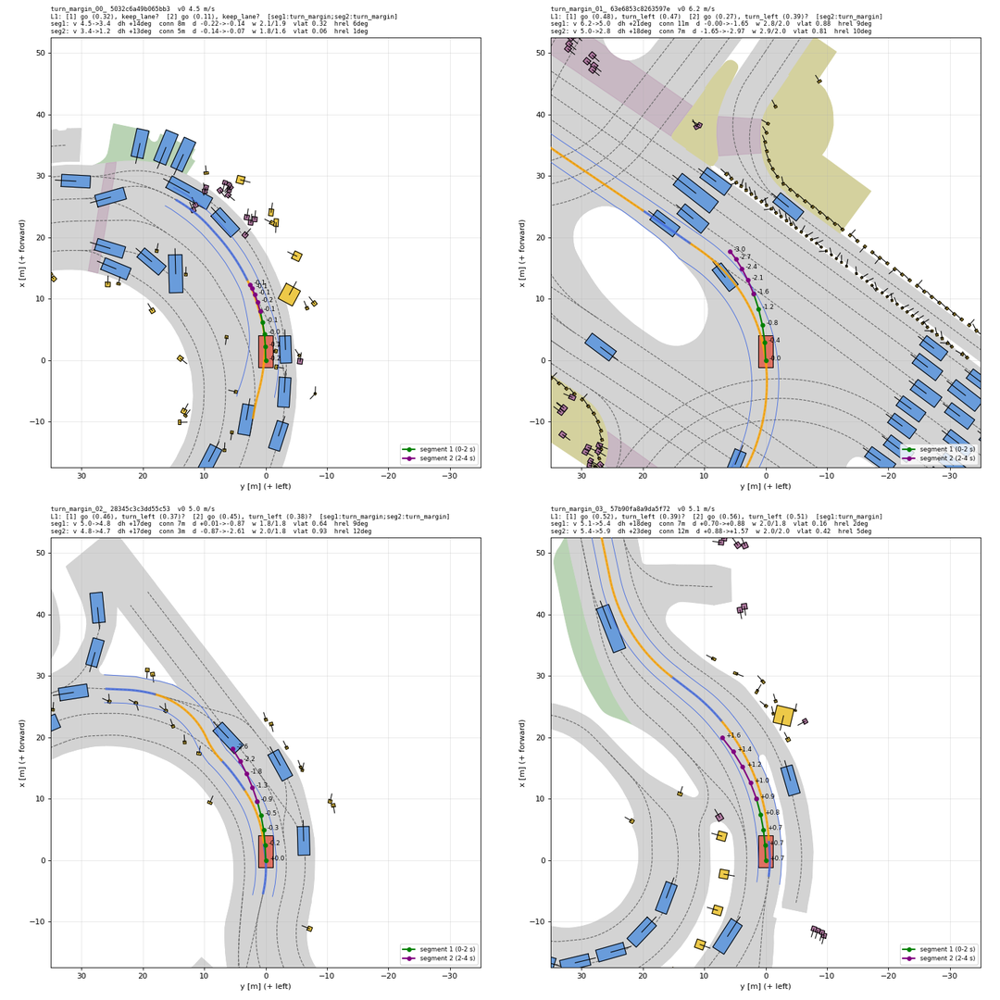
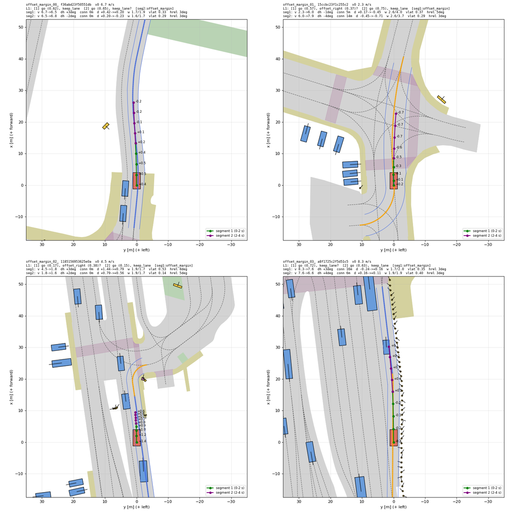
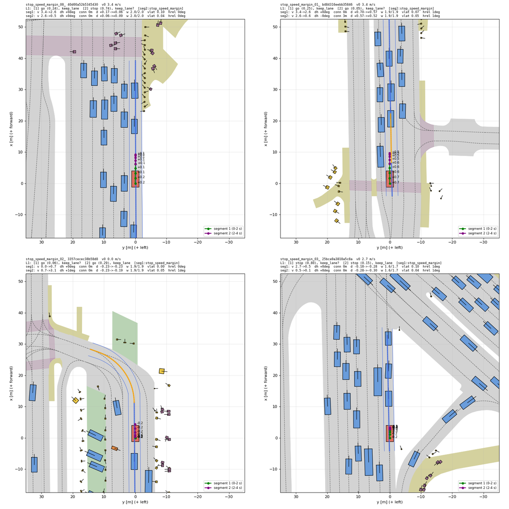
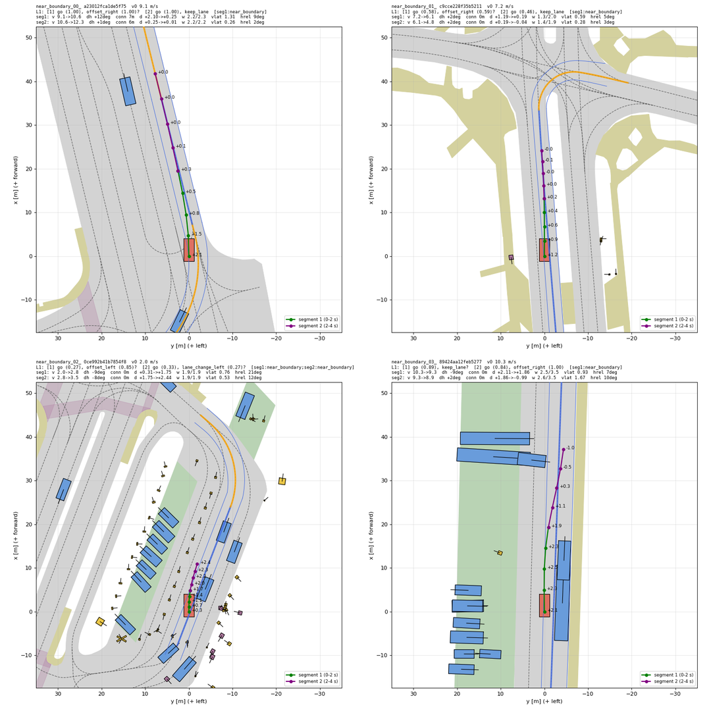
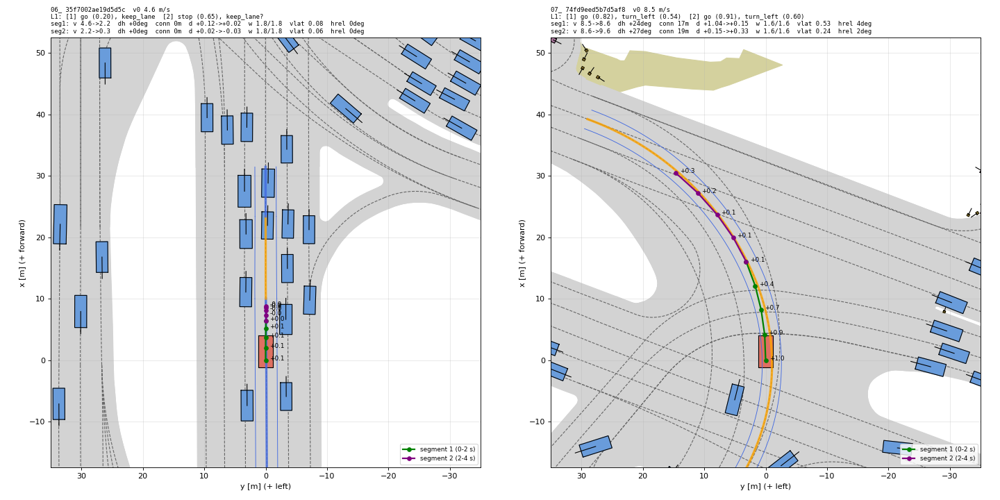
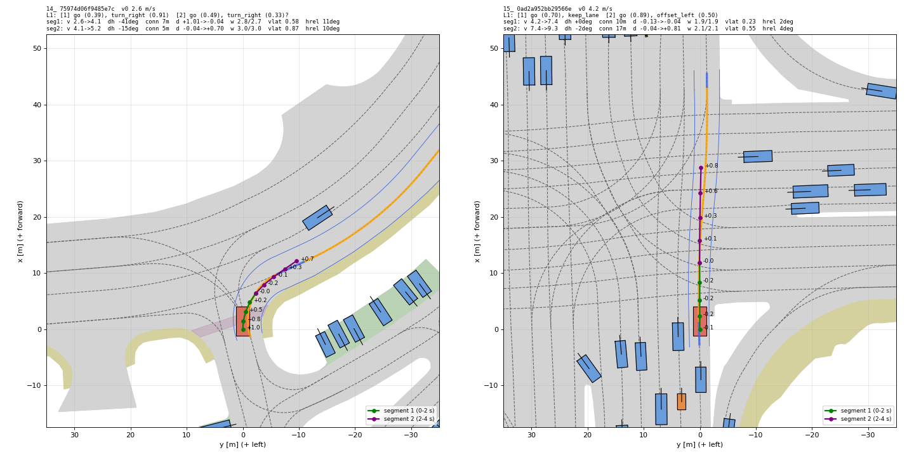
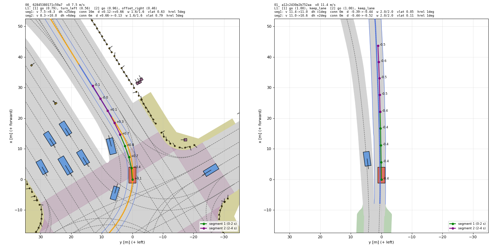

# 4단계. L1 결정 라벨러 결과 (2026-10-06)

yesman.md 11절 4단계의 결과와 계획서와 달라진 점을 정리한 것이다.

## 끝났다는 기준 확인

| 기준 | 결과 |
| --- | --- |
| 직접 만든 경로(직진, 정지, 좌측 offset, 차선 변경, 좌회전)에서 기대한 결정이 나온다 | 통과. `tests/test_l1.py` 13개 모두 통과. 실제 navtest 지도 위에 차선 중심선 좌표(s, d)로 경로를 만들어 시험한다. 직진, 정지, offset 좌/우, 차선 변경 좌/우, 교차로 좌회전, 굽은 도로 keep lane(옆 거리 0, ±0.4 m), 좌회전 경로를 좌우로 뒤집은 경우, 보조 함수 |
| 굽은 도로에서 차선을 따라 주행한 사람 경로가 keep lane으로 판정된다 | 통과. navtrain에서 연결 차선 없이 차선 방향이 4초 동안 20° 이상 바뀐 장면 중 차선을 따라간 2,006장면의 87.1%가 두 구간 모두 keep lane이다(구간 단위 92.9%). 곧은 도로의 같은 비율은 93.1%이다. 아래 "굽은 도로" 참고 |
| 무작위 샘플 20개를 그려 눈으로 확인했을 때 결정이 맞다 | 통과. 최종 버전에서 navtrain 무작위 20장면(seed 1)을 그려 확인하였다. 20개 모두 맞다. 그중 1개(교차로 직진 중 왼쪽으로 0.85 m 붙음 → offset left)는 경계에 가깝다. 중간 버전(seed 0)의 20장면도 확인하였다 |
| 14절의 L1 관련 기준값을 모두 정하였다 | 통과. `yesman/l1_thresholds.yaml`. 아래 표 |

## L1의 구조 (`yesman/l1.py`, `yesman/decision.py`)

- 결정 형식(`Decision`)은 구간 2개(0~2초, 2~4초)로 이루어진다. 구간마다 앞뒤 행동(go/stop)과 세기, 좌우 행동(7가지)과 세기, 그리고 애매함 표시가 있다. L3, M2, VLM 파싱도 이 형식을 쓴다. `same_decision()`은 d̂ ≈ d를 판정한다. 행동 종류가 같고 세기 차이가 ±0.2 이내이면 같다고 본다(14절 추천값 그대로).
- L1은 두 단계로 나뉜다. 그래서 기준값을 바꿀 때 지도를 다시 읽지 않아도 된다.
  1. `extract_features()`: 지도를 써서 경로를 차선 중심선 좌표계로 바꾸고, 구간별 값을 계산한다.
  2. `classify()`: 기준값으로 행동과 세기를 정한다.
- 라벨을 만들 때와 평가할 때 같은 함수(`l1()`, `l1_from_scene()`)를 쓴다. 입력은 경로(ego 좌표계 8점), 현재 속도, 현재 전역 pose, 지도이다. 모델 입력이 아니므로 지도를 써도 된다.

### 기준 차선열

1. 출발점을 포함하고 방향이 ego와 60° 안으로 맞는 차선과 교차로 연결 차선을 찾는다. 출발점이 차선 다각형 밖이어도 1 m 안이면 포함한다.
2. 그 차선에서 이어지는 차선을 따라, 경로가 지나간 거리 + 15 m 길이의 차선열을 갈래마다 만든다. 출발점이 차선의 시작점보다 뒤에 있으면 앞 차선에서 시작하는 차선열도 만든다.
3. 차선열마다 비용을 계산하여 가장 작은 것을 기준으로 쓴다. 비용 = 옆 거리 평균 + 0.05 m/° × 방향 차이 평균 + 차선열 끝을 넘은 점 하나마다 2 m.
4. 경로의 각 점을 기준 중심선에 투영하여 진행 거리 s와 옆 거리 d(왼쪽 +)를 구한다. 차선 반폭은 투영점에서 그 차선의 왼쪽, 오른쪽 경계선까지의 거리이다.

경로를 보고 차선열을 고르므로, 좌회전한 경로는 좌회전 연결 차선이 기준이 된다. 차선을 바꾼 경로는 출발 차선과 도착 차선 중 어느 쪽이 기준이 되어도 차선 번호의 변화가 같으므로 라벨이 같다.

### 판정 규칙 (구간마다)

| 행동 | 규칙 | 세기 |
| --- | --- | --- |
| stop | 구간 끝 속도 < 0.5 m/s | 구간 평균 감속도(시작 속도 − 끝 속도) / 2초 / 1.4 m/s² |
| go | 그 외 | 구간 끝 속도 / 10.5 m/s |
| turn left/right | 구간이 교차로 연결 차선을 지나고, 경로 방향이 15° 이상 바뀜 | \|방향 변화\| / 45° |
| lane change left/right | 구간 시작과 끝의 차선 번호가 다름 (기준 차선 = 0, 왼쪽으로 한 차선 폭마다 +1) | 0.5초마다 잰 옆 이동 속도의 최대값 / 2.0 m/s |
| offset left/right | 같은 차선 안에서 옆 거리가 0.5 m 이상 바뀜 (굽은 구간에서는 1.0 m) | \|옆 거리 변화\| / 1.7 m |
| keep lane | 그 외 | 0 |

- 좌우 행동은 위 표의 순서(turn → lane change → offset → keep lane)대로 먼저 해당하는 것으로 정한다. 세기는 0~1로 자른다.
- 구간 끝 속도는 마지막 두 0.5초 평균 속도에서 선형 외삽한 값이다(1.5 v_last − 0.5 v_prev, 0 이상). 0.5초 평균을 그대로 쓰면, 구간 끝에 막 멈춘 경로도 끝 속도가 0보다 크게 나온다(단위 테스트로 발견). 구간 1의 시작 속도는 ego status의 현재 속도이고, 구간 2의 시작 속도는 구간 1의 끝 속도이다.
- 차선 변경은 옆 차선이 실제로 있는지 보지 않고 기하만으로 판정한다. 그래야 "왼쪽에 도로가 없는데 차선 변경"을 그대로 따라간 모델 경로도 lane change로 잡혀서, 맹목적 추종을 측정할 수 있다.
- 애매함 표시(구간 단위): 값이 기준값 경계의 margin 안에 있으면 표시하고, `Decision.reason`에 이유(`seg1:offset_margin` 등)를 남긴다. 대상은 끝 속도 0.5±0.2 m/s, 회전 15±3°, offset 기준±0.15 m, 그리고 구간 시작이나 끝이 차선 경계에서 0.3 m 안인 경우이다. 또 경로 방향이 차선 방향과 30° 이상 어긋나거나(차선 밖 주행), 차선열 끝을 넘은 경우에도 표시한다. 출발 차선을 찾지 못하면 결정 전체가 invalid이다.

## 기준값 (`yesman/l1_thresholds.yaml`)

navtrain 103,158장면(206,316구간)의 사람 경로 분포로 정하였다(`scripts/l1_thresholds_analysis.py`, `logs/step04/thresholds_analysis.log`). 세기의 기준값은 계획서 14절대로 상위 95% 값(p95)을 쓴다.

| 기준값 | 값 | 근거 |
| --- | --- | --- |
| 구간 수 | 2 (0~2초, 2~4초) | 14절 추천값 |
| v_stop | 0.5 m/s | 끝 속도 분포가 0 근처에 몰려 있고(0.1 m/s 미만 5.7%), 0.1~0.5 m/s는 2.6%뿐이다 |
| v_max | 10.5 m/s | go 구간 끝 속도의 p95 (10.42) |
| a_max | 1.4 m/s² | 움직이다 멈춘 구간 평균 감속도의 p95 (1.39) |
| turn_min | 15° | 계획서 예시는 30°이다. 그러나 회전 하나가 2초 구간 두 개에 나뉘므로(예: 62° 우회전 = 34° + 28°) 구간당 30°는 너무 크다. 연결 차선 위 구간의 \|방향 변화\|는 5° 아래에 몰리고(직진), 그 위로 넓게 퍼진다 |
| turn_max | 45° | 회전 구간 \|방향 변화\|의 p95 (44.9°) |
| offset_min | 0.5 m | 분포에 골짜기가 없어 계획서 예시값을 쓴다. 곧은 구간에서 p94.4이다 |
| offset_min_curve, curve_deg | 1.0 m, 5° | 구간 동안 차선 중심선 방향이 5° 이상 바뀌면 굽은 구간이다. 굽은 구간에서 곧은 구간과 같은 백분위수(p94.4)의 값이 0.96 m이다 |
| offset_max | 1.7 m | offset 구간 \|옆 거리 변화\|의 p95 (1.73) |
| vlat_max | 2.0 m/s | 차선 변경 구간 최대 옆 이동 속도의 p95 (1.95) |
| d̂ ≈ d | 행동 종류가 같고 세기 차이 ±0.2 이내 | 14절 추천값 |
| 애매함 margin | 0.2 m/s, 3°, 0.15 m, 차선 경계 0.3 m, 방향 30° | 판단으로 정함 |

분포 그림: 

## 결정 분포

navtrain (`logs/step04/l1_label_navtrain.md`): 103,288장면 중 valid 103,158장면(99.9%). 애매함 표시가 하나도 없는 장면은 75,916장면(valid의 73.6%)이다.

| 좌우 행동 | 구간 1 | 구간 2 |
| --- | --- | --- |
| keep lane | 72.6% | 76.2% |
| turn left | 12.6% | 11.2% |
| turn right | 5.5% | 5.4% |
| offset left / right | 3.4% / 3.8% | 2.9% / 2.9% |
| lane change left / right | 1.0% / 1.2% | 0.7% / 0.7% |

| 앞뒤 행동 | 구간 1 | 구간 2 |
| --- | --- | --- |
| go | 95.1% (세기 중앙값 0.41) | 88.2% (0.45) |
| stop | 4.9% (세기 중앙값 0.49) | 11.8% (0.26) |

- navtest(`logs/step04/l1_label_navtest.md`)도 비슷하다. 12,146장면 중 valid 12,136장면(99.9%)이다. 구간 1의 좌우 행동은 keep 73.8%, turn left 11.3%, turn right 5.7%, offset 7.2%, lane change 2.0%이다.
- 좌회전이 우회전보다 2배 많다. 미국에서는 우회전이 짧고 급해서 한 구간 안에 끝나는 경우가 많고, 좌회전은 큰 호를 그리며 두 구간에 걸친다. 싱가포르(좌측 통행)도 섞여 있다.
- 애매함은 offset과 차선 변경에 많다(그 행동 구간의 40~50%). offset은 0.5 m 근처에 분포가 몰려 있기 때문이다. 차선 변경은 구간 경계(2초)에서 차선 경계선 위에 있는 경우가 많기 때문이다. 이유별로 보면 차선 경계 근처 4,098구간, 차선 밖 방향 238구간, 차선열 끝 3구간이다(이 셋 외에는 기준값 margin에 걸린 경우이다).
- 출발 차선을 찾지 못한 장면(invalid)은 navtrain 130장면, navtest 10장면이다(주차장 등).

## 애매함은 어디서 나오는가 (`scripts/l1_ambiguity_viz.py`)

애매함이 표시된 장면은 navtrain valid의 26.4%(27,242장면)이다. 이유별로 나누면 다음과 같다. 한 장면에 이유가 여럿일 수 있다.

| 이유 | 규칙 | 구간 수 | 장면 비율 |
| --- | --- | --- | --- |
| offset_margin | 같은 차선 안 옆 거리 변화가 offset 기준 ±0.15 m 안 | 11,478 | 10.6% |
| turn_margin | 연결 차선 위 방향 변화가 15° ± 3° 안 | 11,363 | 9.8% |
| stop_speed_margin | 구간 끝 속도가 0.5 ± 0.2 m/s 안 | 5,257 | 4.9% |
| near_boundary | 구간 시작이나 끝에 차선 경계선 0.3 m 안 | 4,098 | 3.3% |
| off_lane_heading, beyond_chain | 차선 방향과 30° 이상 어긋남, 차선열 끝을 넘음 | 241 | 0.2% |

- **기준값 근처(offset, turn, stop. 장면의 약 23%)**: 라벨이 틀렸다는 뜻이 아니다. 값이 기준선 가까이 있어 조금만 달라져도 라벨이 바뀐다는 경고이다. offset과 turn의 기준값은 분포의 골짜기가 아니라 완만한 꼬리 위에 있다. 그래서 고정 폭의 띠에 구간의 7~11%가 들어간다. 그 결과 규칙 4개 × 구간 2개가 쌓여 장면의 26%가 된다. 이 비율은 margin 폭에 거의 비례하므로, margin을 정하는 방식에 따라 크게 달라진다.
  - turn_margin 예시: 4개 중 3개는 회전의 시작이나 끝이 2초 구간에 걸려 17~21°가 된 분명한 좌회전이다. 로터리의 완만한 연결 차선(14°, 13°) 1개만 정말 애매하다. 
  - offset_margin 예시: 차선 안에서 0.4~0.6 m 정도 자연스럽게 흔들린 경우이다. 
  - stop_speed_margin 예시: 끝 속도 0.3~0.7 m/s로 거의 멈춘 서행이다. 
- **구조적으로 애매함(near_boundary 등. 약 3.5%)**: 출발할 때 두 차선 사이에 걸쳐 있거나, 차선 변경 도중 구간 경계에서 경계선 위에 있다. 어느 차선을 기준으로 볼지가 정말 불분명하다. 

## 굽은 도로 (`scripts/l1_curved_check.py`, `logs/step04/curved_road_check.md`)

처음 버전(offset 기준 0.5 m 하나)에서는 굽은 도로 장면의 53%만 keep lane이었다. 사람은 굽은 길에서 코너 안쪽으로 가로질러 달리므로 옆 거리가 0.5~1 m 바뀌기 때문이다. 곧은 구간에서 0.5 m 이상 옆으로 움직이는 비율은 5.6%이고, 굽은 구간에서는 17~25%였다. 그래서 차선 중심선이 굽은 구간에서는 같은 백분위수의 값(1.0 m)을 기준으로 쓴다. 굽은 정도는 경로가 아니라 차선 중심선의 방향 변화로 잰다. 경로의 방향 변화는 offset 동작 자체로도 생기기 때문이다.

| 4초 동안 차선 방향 변화 | 장면 | 차선을 바꾼 장면 | 차선을 따라간 장면 | 두 구간 모두 keep lane | 애매함 표시 제외 |
| --- | --- | --- | --- | --- | --- |
| 20° 이상 | 2,133 | 127 | 2,006 | 87.1% | 91.7% |
| 30° 이상 | 1,236 | 63 | 1,173 | 84.6% | 89.5% |
| 45° 이상 | 565 | 17 | 548 | 84.3% | 88.6% |
| (비교) 곧은 도로, 2° 미만 | 23,562 | | | 93.1% | |

남은 keep 아닌 장면을 그려 보면 두 종류이다. 하나는 연결 차선이 아니라 일반 차선으로 그려진 90° 꺾인 길에서 모서리를 1~1.6 m 가로지른 경우이다(아래 "알려진 한계"). 다른 하나는 굽은 길에서 실제로 차선 경계 쪽으로 붙은 경우이다.

## 시간과 자원

- navtrain 전체(1,192개 로그, 103,288장면) 특징 추출: 16 worker로 24분, 최대 메모리 12.8 GB. navtest(12,146장면)는 약 2분이다. 출력은 `exp/l1/{navtrain,navtest}_features.parquet`(git 제외)이다. 사람 경로(8×3)와 점별 값(s, d, 반폭, 차선 방향)도 함께 저장하므로 5단계 경로 모음에 그대로 쓸 수 있다.
- 라벨: `exp/l1/{navtrain,navtest}_labels.parquet`. 특징 표에서 기준값만 적용하므로 1~2분 걸린다.
- 지도는 도시 4개를 모두 올려도 프로세스당 약 0.23 GB이다. 도시 지도를 처음 읽을 때 약 10초가 걸리고, 그다음 경로 하나는 수 ms~수십 ms이다.

## 계획서와 달라진 점

- **turn 기준**: 계획서 예시 30° 대신 구간당 15°를 쓴다(위 기준값 표).
- **offset 기준을 도로 모양에 따라 둘로 나눈다**: 곧은 구간 0.5 m, 굽은 구간(차선 방향 변화 5° 이상) 1.0 m. 계획서 6.1.2의 "굽은 도로에서 차선을 따라 주행한 경로는 keep lane"을 지키기 위해서이다.
- **lane change 정의를 구체화하였다**: 계획서는 "구간이 끝날 때 옆 차선에 있으면"이다. 이를 "구간 시작과 끝의 차선 번호가 다르면"으로 바꾸었다. 그래서 구간 1에서 차선을 바꾼 뒤 구간 2에서 새 차선을 따라가면, 구간 2는 keep lane이다. 차선 번호는 옆 차선이 실제로 있는지와 무관하게 차선 폭으로 센다.
- **구간 끝 속도를 외삽으로 구한다**(위 판정 규칙).
- **애매함을 어떻게 쓸지는 정하지 않았다**: 계획서는 출발 차선이 없는 경우에만 "학습과 평가에서 제외"를 명시하고, 경계에 걸친 경우는 "표시"만 하라고 한다. 애매함 표시가 있는 장면은 26%이다. 모두 빼면 데이터가 크게 준다. 5~6단계에서 다음 중 하나로 정한다. (a) 모두 뺀다. (b) 애매한 구간에서는 d̂ ≈ d 판정 때 양쪽 라벨을 모두 허용한다. (c) 원래 결정(D0)에서만 빼고 CF는 만든다.
- 결정 형식, 세기 계산식, d̂ ≈ d 기준은 계획서 6.1.1과 14절의 초안을 그대로 따른다.

## 알려진 한계

- **일반 차선으로 그려진 90° 꺾인 길**: 지도가 연결 차선이 아니라 일반 차선으로 그린 급한 커브는 방향이 90° 바뀌어도 keep lane이다(계획서 규칙대로). VLM은 이것을 "turn left"라고 할 수 있다. 또 사람이 모서리를 크게 가로지르면 offset으로 판정된다. D3(VLM 결정)를 분석할 때 이 경우를 따로 본다.
- **기준 차선열을 경로로 고른다**: 교차로에서 직진 연결 차선과 좌회전 연결 차선이 처음 4초 동안 거의 겹치면, 직진한 경로에 좌회전 연결 차선이 골라질 수 있다. 방향 차이 비용을 넣어 줄였다. 이때도 경로가 그 연결 차선을 크게 벗어나지 않으므로 라벨은 대부분 같다.
- **애매함이 많다**: offset과 차선 변경 구간의 40~50%가 애매함이다. 연속적인 행동을 범주로 나눌 때 생기는 한계이다(계획서 13.4 "행동의 경계가 애매하다").

## 만든 파일

| 파일 | 하는 일 |
| --- | --- |
| `yesman/decision.py` | 결정 형식(`Decision`, `Segment`)과 d̂ ≈ d 판정 |
| `yesman/l1.py` | L1 (특징 추출 + 분류) |
| `yesman/l1_thresholds.yaml` | L1 기준값 |
| `yesman/data.py` | NAVSIM 장면 로더 도우미 |
| `tests/test_l1.py` | 단위 테스트 (`pytest -q tests/test_l1.py`) |
| `scripts/l1_extract.py` | split 전체의 L1 특징 추출 (병렬) |
| `scripts/l1_thresholds_analysis.py` | 특징 분포 표와 그림 (기준값 근거) |
| `scripts/l1_label.py` | 기준값 적용, 결정 분포 표 |
| `scripts/l1_curved_check.py` | 굽은 도로 keep lane 확인 |
| `scripts/viz_l1.py` | L1 결과 BEV 그림 (기준 차선열, 옆 거리, 구간별 결정) |
| `scripts/l1_ambiguity_viz.py` | 애매함 규칙별 분포 그림과 이유별 예시 장면 |
| `scripts/setup/env.sh` | `PYTHONPATH`에 저장소 루트를 추가 (`import yesman`) |

그림 예시 (위 제목: L1 결정과 구간별 값. 파란 선 = 기준 차선열, 주황 = 연결 차선, 점 옆 숫자 = 옆 거리 d)

- 정지 / 교차로 좌회전: 
- 우회전 / 교차로 직진 중 offset: 
- 좌회전 후 차선 복귀 / 고속 직진: 
