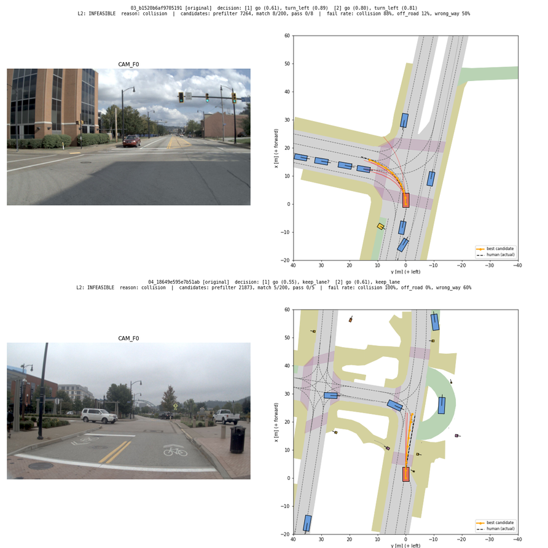
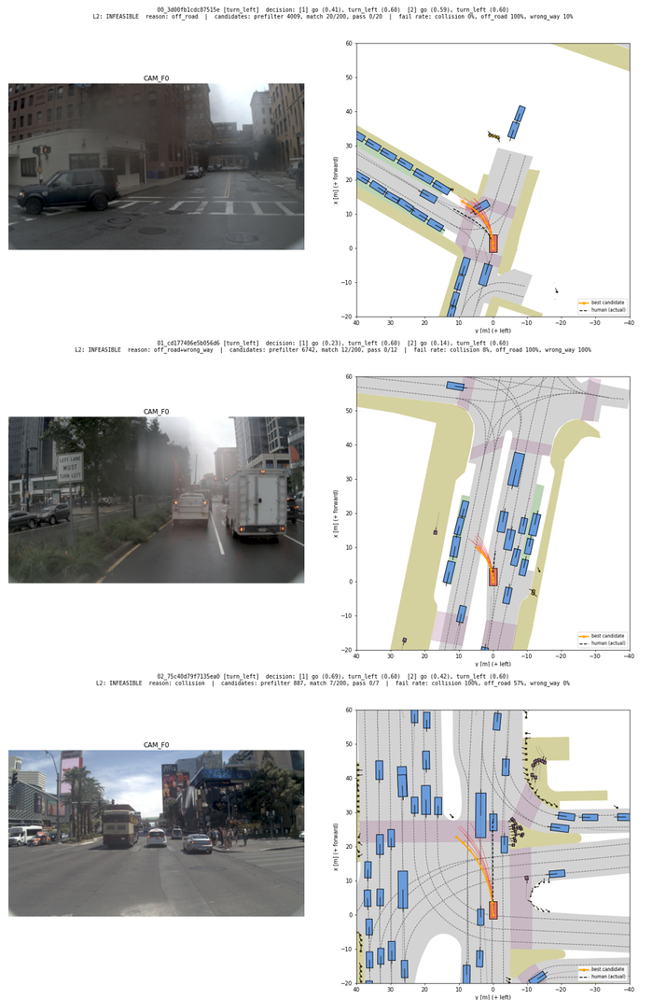
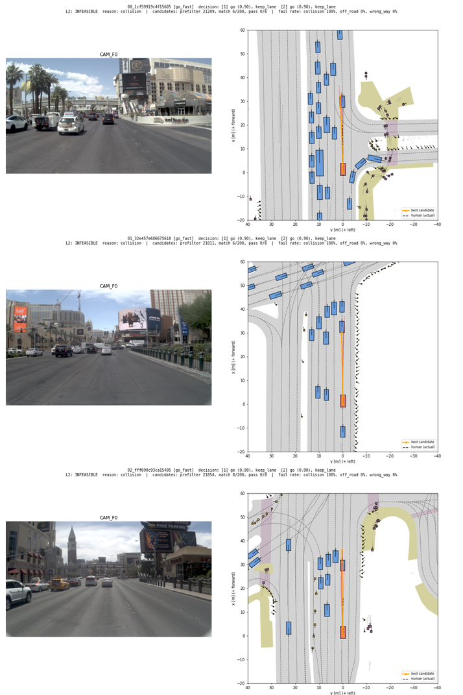
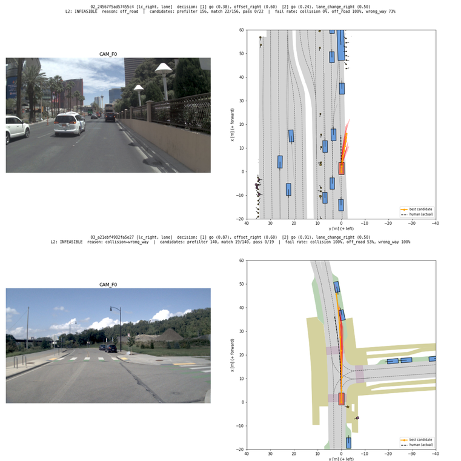

# 5단계. 경로 모음과 L2 실행 가능 판정 (2026-10-06~)

yesman.md 11절 5단계의 결과와 계획서와 달라진 점을 정리한 것이다.

## 결과를 보기 전에 확정한 사항 (2026-10-06, 구현 시작 전)

계획서 14절이 "결과를 보기 전에 확정한다"고 한 항목과 L2의 판정 규칙이다. 사용자와 합의하였다. 결과를 본 뒤에는 바꾸지 않는다. 바꿔야 하면 바꾼 이유와 바꾸기 전 기준의 결과를 함께 기록한다.

| 항목 | 결정 | 이유 |
| --- | --- | --- |
| human penalty filter | 켠다 | 공식 EPDMS와 같다. 사람도 위반한 항목(지도 라벨 오류 등)은 후보에게도 문제 삼지 않는다 |
| 후보의 통과 조건 | NC = 1, DAC = 1, DDC = 1 (filter 적용 후). 모두 만점이어야 통과 | NC 0.5는 정적 물체(콘, 벽 등)와의 내 탓 충돌이므로 물리적으로 실패이다. DDC 0.5는 역주행 2~6 m이다 |
| TLC (신호 준수) | 판정에 넣지 않고 값만 기록한다 | 물리적 불가능이 아니라 규칙 위반이다(14절) |
| 5단계 통과 기준 | navtest에서 사람의 원래 결정 중 "가능" 비율 95% 이상. 분모에서 구조적 애매함 장면과 판정 불가 장면을 뺀다 | 14절 예시값 |
| 판정 불가 기준 | 결정과 맞는 후보가 5개 미만 | 14절 예시값 |
| 후보 조건 | (1) 출발 속도 차이 ±2 m/s. (2) 후보 경로를 판정할 장면에 옮겨 놓고 L1을 다시 돌렸을 때 d̂ ≈ d | (2)는 계획서에 명시되지 않은 부분이다. 경로 모음의 라벨은 원래 장면의 차선 기준이다. 곧은 길의 "keep lane" 경로를 굽은 길에 놓으면 도로를 벗어나므로, 결정 탓이 아니라 도로 모양 탓으로 "불가능"이 될 수 있다 |
| 같은 로그의 경로 | 후보에서 뺀다 | 그 장면의 사람 경로 자신이 후보이면 human filter 때문에 항상 통과한다. 그러면 위의 통과 기준이 저절로 만족된다. 같은 로그의 이웃 프레임도 거의 같은 경로이다 |
| d̂ ≈ d | 행동 종류가 같고 세기 차이 ±0.2 이내. 기준값 근처 구간은 기준선 너머 이웃 라벨도 인정한다(4단계 결정) | 14절, 4단계 |
| L1 구조적 애매함 | 판정 대상에서 뺀다(near_boundary, off_lane_heading, beyond_chain) | 4단계 결정 |

## 끝났다는 기준 확인

| 기준 | 결과 |
| --- | --- |
| navtest 장면에서 사람의 원래 결정은 대부분 "가능"으로 판정된다 (사전 기준 95% 이상) | 통과. 99.31% (가능 10,872 / 불가능 75. 판정 불가 804는 사전 결정대로 분모에서 뺌). `logs/step05/original_breakdown.md` |
| "불가능"으로 판정된 샘플 30개를 그려 보았을 때 실제로 실행할 수 없어 보인다 | 통과. 시험용 결정(아래)에서 불가능으로 판정된 교차로 좌회전 15개, 빠르게 가기 15개를 그려 확인하였다. 30개 모두 실행할 수 없어 보인다. 좌회전 1개만 경계에 가깝다 |
| "판정 불가" 비율을 보고하였다 | 사람의 원래 결정 6.8% (804 / 11,751). 시험용 결정은 아래 표 |

## 구현 (`yesman/scoring.py`, `yesman/l2.py`)

- **여러 경로를 한 번에 채점** (`BatchScorer`): 공식 `pdm_score()`는 경로 하나마다 시뮬레이션한다. 여기서는 [PDM-Closed 기준 경로, 후보 1..N]을 한 번에 시뮬레이션하고 채점한다. navtest 50장면 × 경로 6개(300개)에서 NC, DAC, DDC, TLC, TTC, LK, HC가 공식 결과와 모두 같다(차이 0, `scripts/l2_check_batch_scoring.py`). EP는 함께 채점한 경로에 따라 정규화가 바뀌므로 비교하지 않는다(판정에 쓰지 않음). 속도는 장면당 경로 6개에 0.1초이고, 하나씩 채점하면 0.3초이다.
- **경로 모음** (`scripts/l2_build_bank.py` → `exp/l2/path_bank.parquet`): navtrain 1,192개 로그의 103,158개 사람 경로이다. 경로는 ego 좌표계 8×3이고, 출발 속도와 원래 장면에서의 L1 라벨을 함께 둔다.
- **판정** (`L2.judge`):
  1. 1차 거르기: 출발 속도 ±2 m/s, 다른 로그, 원래 라벨이 결정과 맞음(행동 종류만, 이웃 라벨 허용).
  2. 그중 무작위 최대 200개를 판정할 장면에 옮겨 놓고 L1을 다시 돌린다. d̂ ≈ d이고 구조적 애매함이 없는 것만 후보로 남긴다. 5개 미만이면 판정 불가이다.
  3. 후보 중 무작위 최대 50개를 채점한다.
  4. 무작위 시드는 장면과 결정마다 고정(crc32)하여 재현할 수 있다.
- **L1 보완**: 구간마다 기준선 너머의 이웃 라벨(`alt_lon`, `alt_lat`)과 구조적 애매함(`structural`)을 기록하고, `same_decision`이 이웃 라벨을 허용한다(4단계 결정). 라벨 자체는 바뀌지 않았다(navtrain 103,158장면에서 확인).
- **시간과 자원**: 판정 하나에 중앙값 1.2초(p95 2.2초)가 걸린다. 도시 지도를 처음 읽을 때만 10~15초이다. navtest 11,751장면은 16 worker로 24분, 최대 메모리 12.4 GB이다.

## 사람의 원래 결정 (navtest)

| 좌우 행동 | 장면 | 가능 | 불가능 | 판정 불가 |
| --- | --- | --- | --- | --- |
| keep lane | 7,884 | 93.9% | 0.5% | 5.6% |
| turn | 2,718 | 93.6% | 0.8% | 5.6% |
| offset | 955 | 81.0% | 0.5% | 18.4% |
| lane change | 194 | 78.9% | 4.6% | 16.5% |

- **판정 불가의 원인**: 1차 조건을 만족하는 경로는 많다(중앙값 16,871개). 그러나 무작위로 고른 200개를 옮겨 놓고 L1을 다시 돌리면 0~4개만 결정과 맞는다. 세기 ±0.2에 더해 이 장면의 도로 모양까지 맞아야 하기 때문이다. 정지가 들어간 결정은 판정 불가가 0.5%뿐이다.
- **불가능 75개(0.6%)는 L2의 오판정이다**(사람은 실제로 해냈다). 근거는 도로 이탈 51, 역주행 16, 충돌 7이다. 12개를 그려 보면, 공간이 빠듯해서 정확한 경로가 필요한데 결정과 맞는 후보가 5~19개뿐인 경우이다. 예: 싱가포르의 좁은 진입로를 지도 가장자리를 따라 서행, 차량이 줄 선 좁은 길로 좌회전, 트럭 옆을 중앙선 쪽으로 붙어 지나감. 복잡한 교차로에서 L1 라벨의 뜻이 기준 차선열에 따라 달라지는 경우도 1개 있다. 

## 시험용 결정 (navtest 2,000장면, `scripts/l2_run.py --decisions probe`)

"불가능" 샘플을 얻으려고 6단계 counterfactual의 맛보기로 결정을 일부러 바꾸었다. 시험 결정의 정의는 `scripts/l2_run.py`의 `probes()`에 있다.

| 시험 결정 | 가능 | 불가능 | 판정 불가 | 불가능의 근거 |
| --- | --- | --- | --- | --- |
| go_fast (두 구간 go 0.9) | 26.6% | 7.3% | 66.1% | 충돌 136, 도로 이탈 10 |
| turn_left (두 구간 좌회전 0.6) | 24.0% | 18.5% | 57.5% | 도로 이탈·역주행 중심 (도로 이탈+역주행 135, 충돌 76, 도로 이탈 72 등) |
| lc_left (구간 1 왼쪽 차선 변경 0.5) | 0.6% | 0% | 99.4% | |
| lc_right | 1.0% | 0% | 99.0% | |

- 불가능 판정은 그림으로 볼 때 맞다. 좌회전 불가능은 직진 차로에서 좌회전하여 중앙분리대나 반대 차로로 들어가거나, 왼쪽 차로의 차량과 부딪히는 경우이다. go_fast 불가능은 앞차가 가까운데 빠르게 가서 추돌하는 경우(계획서 7.3의 세기 기준 예)이다.  
- **판정 불가가 너무 많다 (6단계에 영향)**. 원인은 세 가지이다.
  1. **교차로가 없는 곳의 좌회전은 100% 판정 불가이다.** L1은 연결 차선 위에서만 turn을 인정한다. 그래서 좌회전 경로를 교차로 없는 장면에 옮기면 L1이 turn으로 읽지 못하고 후보가 0개가 된다. 계획서의 "도로 모양 기준" 불가능의 대표 예(왼쪽에 길이 없는데 좌회전)를 이 방식으로는 판정할 수 없다. 사전 결정 5번(옮긴 뒤 L1 재판정)의 부작용이다.
  2. **차선 변경은 98%가 후보 0개이다.** 경로를 ego 좌표 그대로 옮기므로, 원래 장면과 판정할 장면의 도로 모양이 비슷해야 결정이 유지된다. 예를 들어 오른쪽으로 굽은 길에서 "왼쪽 차선 변경"이었던 경로를 곧은 길에 놓으면 오른쪽으로 흐르는 경로가 된다(실제 사례를 추적하여 확인). 차선 변경처럼 드문 행동은 도로 모양까지 맞는 경로가 거의 없다. 시험 결정의 모양(구간 1 안에서 세기 0.5로 차선 변경 완료)이 사람의 차선 변경(보통 4초 이상)과 달라서 더 줄어든 면도 있다.
  3. **go 0.9는 느린 장면에서 판정 불가가 많다.** 2초 안에 9.5 m/s에 도달한 사람 경로가 거의 없기 때문이다. 계획서가 의도한 동작이다("드문 행동이 후보 부족 때문에 불가능으로 잘못 판정되지 않도록").
- 1과 2는 6단계에서 CF⁻ 중 "도로 모양 기준"을 만드는 데 직접 걸린다. 6단계로 넘어가기 전에 후보를 옮기는 방식을 정해야 한다(아래 "6단계 전에 정할 것").

## 후보를 옮기는 방식 변경 (B)과 L1 확장 (2026-10-06, 사용자 결정)

위 시험의 판정 불가 문제를 사용자와 논의하여 다음 두 가지를 바꾸었다. 사전 결정 사항(통과 조건, 통과 기준, 판정 불가 기준, 옮긴 뒤 L1 재판정)은 그대로이다.

1. **B: 차선 기준으로 옮기기** (`yesman/l1.py`의 `lane_reference`, `embed_on_lane`)
   - 결정에 turn이 없으면(keep / offset / lane change), 후보 경로를 원래 차선 기준의 (진행 거리, 옆 거리, 차선 대비 방향) 시간표로 읽는다. 그다음 판정할 장면의 기준 차선 위에 다시 그린다. 기준 차선은 출발 차선에서 앞 40 m 동안 가장 곧게 이어지는 차선열이다.
   - 출발 옆 거리는 이 장면의 ego 위치에 맞추고, 그 뒤의 변화량은 원래 경로 그대로 쓴다. 속도와 옆 이동 모양은 사람 경로 그대로이고, 도로 모양만 이 장면에 맞춰진다.
   - turn이 있는 결정은 지금처럼 ego 좌표 그대로 옮긴다(교차로 모양이 중요하다).
   - 확인: navtest의 곧은 길과 굽은 길 장면에서, 사람 경로 자신의 시간표를 같은 장면에 다시 그리면 원래 경로가 그대로 나온다(위치 차이 0.000 m, 방향 0.3° 이내).
   - 한계: 후보는 "사람이 실제로 달린 경로 그대로"가 아니라 사람의 속도와 옆 이동을 이 도로 모양에 맞춘 경로이다(계획서 7.2/7.3의 "사람이 실제로 운전한 경로"에서 조금 벗어남).
2. **L1 확장: 교차로 밖 회전** (`turn_offlane_deg` = 30°)
   - 연결 차선을 지나지 않는 구간에서, 구간 끝 경로 방향이 차선 방향과 30° 이상 틀어지면 turn이다. 세기 = |차선 대비 방향| / 45°.
   - 30°는 교차로 회전이 아닌 사람 구간의 p99.95이다. 굽은 길에서는 p99가 16°이므로 굽은 도로 keep lane 기준(4단계)은 그대로이다.
   - 처음에는 교차로 안에도 적용했다. 그러자 기준 차선열이 잘못 골라진 장면(좌회전 전용 차로에서 직진, 로터리 출구)이 turn으로 바뀌어, 교차로 밖으로 범위를 좁혔다(그림 8장면 확인).
   - 바뀐 사람 라벨은 navtrain 87구간(0.04%)이다. 모두 같은 방향의 turn으로 바뀌었다(왼쪽 이동 → turn left 등). 단위 테스트 13개는 그대로 통과한다.
3. **시험 결정 수정**: 차선 변경 시험을 "구간 1 offset(0.6) → 구간 2 차선 변경(0.5)"으로 바꾸었다. 첫 버전("구간 1 안에 차선 변경 0.5 완료")은 차선 중앙에서 출발하면 물리적으로 맞지 않았다. 구간 1 안에 차선 변경이 끝나는 사람 경로는 출발 옆 거리 중앙값이 2.2~2.4 m로, 이미 차선을 넘어가는 중이었다. 차선 중앙에서 시작하는 사람의 차선 변경은 이 모양이 가장 흔하다(navtrain 147개).

### 결과 비교 (navtest, 같은 새 L1, `logs/step05/lane_vs_ego.md`)

| | ego 좌표 그대로 | **차선 기준 (B, 채택)** |
| --- | --- | --- |
| 사람 결정: 가능 / 불가능 / 판정 불가 | 92.1 / 0.7 / 7.2% | **97.0 / 0.7 / 2.2%** |
| 사람 결정: 가능 비율 (판정 불가 제외, 사전 기준 95%) | 99.25% | **99.27% (통과)** |
| 시험 lc_left: 가능 / 불가능 / 판정 불가 | 10.4 / 13.0 / 76.7% | **31.4 / 14.5 / 54.2%** |
| 시험 lc_right | 7.0 / 10.2 / 82.8% | **26.2 / 18.4 / 55.4%** |
| 시험 go_fast | 26.6 / 7.3 / 66.1% | **37.6 / 11.0 / 51.4%** |
| 시험 turn_left (두 방식 모두 ego 좌표) | 23.8 / 26.0 / 50.3% | 같음 |

- 첫 버전 L1과 첫 버전 시험 결정으로 돌린 결과는 `exp/l2/navtest_*_v1.parquet`에 남겼다(위 "끝났다는 기준 확인"의 99.31%).
- **B로 새로 나온 차선 변경 불가능 10개를 그려 확인하였다. 10개 모두 맞다.** 도로 모양 기준은 맨 오른쪽 차로에서 오른쪽으로 차선 변경하여 벽, 연석, 자전거 도로로 나가는 경우, 차로가 하나뿐인 경우, 반대 차로나 이중 황색선 쪽으로 나가는 경우이다. 다른 차 기준은 옆 차로의 차와 부딪히는 경우이다. 
- **교차로 밖 좌회전은 여전히 97.7%가 판정 불가이다.** L1 확장으로 이제 turn으로 읽히기는 한다. 그러나 사람의 좌회전 경로를 곧은 길에 놓으면 L1은 "구간 1 offset/차선 변경 → 구간 2 turn"으로 읽는다. 시험 결정("두 구간 모두 turn 0.6")과 모양이 다르다. 교훈: CF 결정은 L1이 실제 경로를 읽는 모양과 맞아야 한다. 6단계의 CF 생성에 반영한다.

## 6단계로 넘어가기 전 결정 (2026-10-06, 사용자)

- 5단계는 B + L1 확장으로 확정한다(사전 기준 통과).
- D2의 불가능 기준별 최소 샘플은 300개이다(14절 예시값). 기준마다 가능한 만큼 만든다. 300개면 비율의 95% 신뢰구간이 최대 ±5.7%p이다.
- CF⁺와 CF⁻는 모두 저장하고, 학습 때 섞는 비율은 9~10단계에서 정한다(1:1에서 시작).
- 검증 세트: navtrain 학습 장면의 10%를 로그 단위로 떼어 만든다(제안. 사용자 확인 대기). flag 기준값 p를 정하는 데 쓴다. navtest로 튜닝하지 않기 위해서이다.
- 평가 세트(D0~D2)는 만들어 저장하되 "검토 대기"로 두고, 사용자가 확인한 뒤 고정한다.
