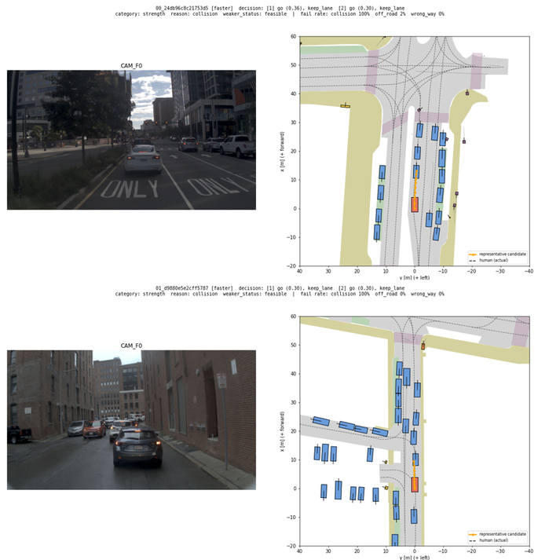
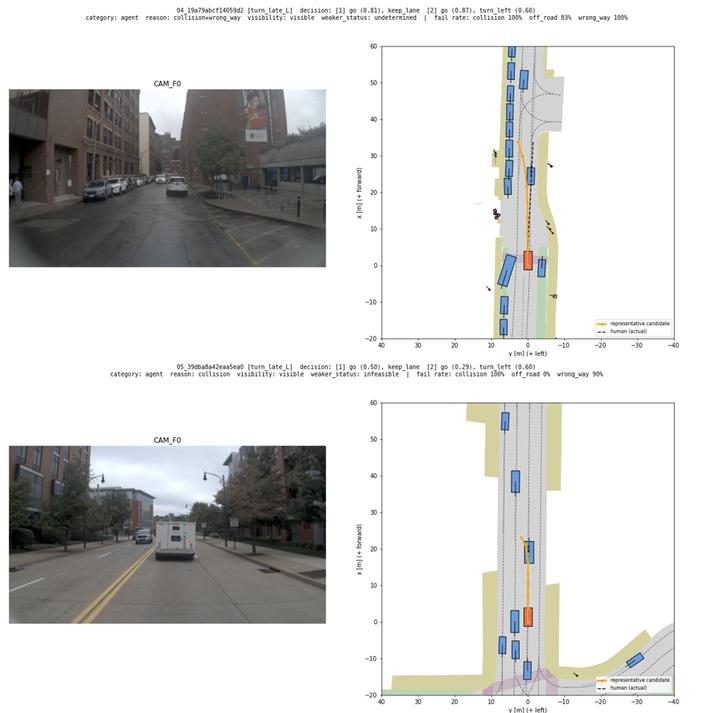
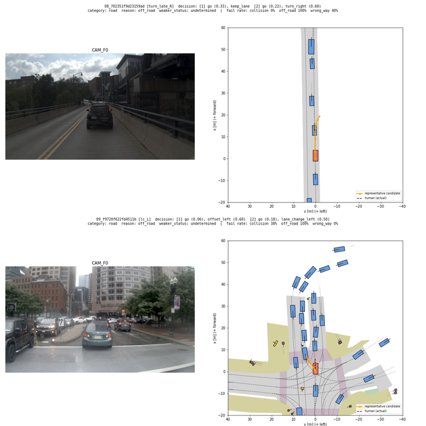
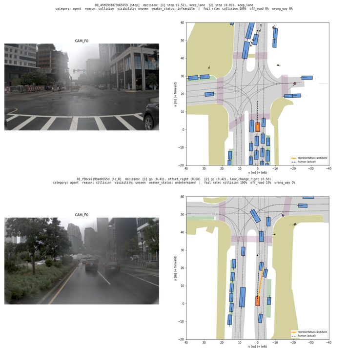
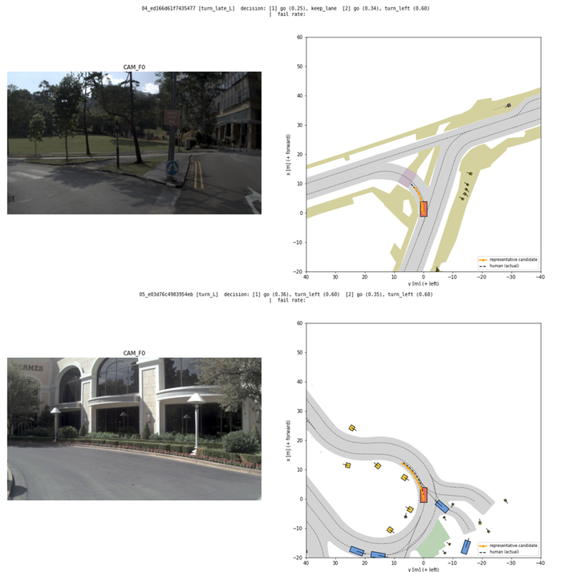

# 6단계. counterfactual decision 생성, 불가능 기준 분류, 평가 세트 (2026-10-06~)

yesman.md 11절 6단계의 결과와 계획서와 달라진 점을 정리한 것이다. 5단계에서 정한 L2(차선 기준으로 옮기기 B, L1 교차로 밖 회전)를 쓴다.

## 사전 결정 (2026-10-06, 사용자)

- D2의 불가능 기준별 최소 샘플은 300개이다(14절 예시값). 기준마다 가능한 만큼 만든다.
- CF⁺와 CF⁻는 모두 저장한다. 학습 때 섞는 비율은 9~10단계에서 정한다(1:1에서 시작).
- 검증 세트: navtrain 센서 로그 304개 중 10%(30개)를 로그 단위로 떼어 만든다(`data_lists/navtrain_sensor_val_logs.txt`, 시드 0). flag 기준값 p를 정하는 데 쓰고, navtest로는 튜닝하지 않는다. (2026-10-07 평가 세트와 함께 확정)
- 평가 세트(D0~D2)는 만들어 저장하되 "검토 대기"로 두고, 사용자가 확인한 뒤 고정한다.

## CF 만드는 방법 (`yesman/l3.py`)

5단계의 교훈은 "CF 결정의 모양이 L1이 실제 경로를 읽는 모양과 맞아야 한다"였다. 그래서 CF 메뉴는 차선 중앙(출발 옆 거리 0.8 m 미만)에서 출발한 navtrain 사람 경로에서 가장 흔한 (구간 1, 구간 2) 조합과 세기 중앙값으로 만든다.

| 사람 경로의 모양 (navtrain) | 가장 흔한 조합 (세기 중앙값) |
| --- | --- |
| 교차로 좌회전 (10,804) | [turn, turn] 5,117 (0.57, 0.55), [keep, turn] 2,567 (–, 0.49), [turn, keep] 2,397 |
| 교차로 우회전 (6,246) | [turn, turn] 2,344 (0.63, 0.73), [keep, turn] 2,008 (–, 0.65) |
| 교차로 밖 좌회전 (22) | [keep, turn] 11 (–, 0.73) |
| offset (666, 593) | [offset, keep] (0.38), [keep, offset] (–, 0.46) |
| 차선 변경 | [offset, lane change] (0.59, 0.47) |
| 앞뒤 | [go, go] 73,578, [go, stop] 7,046 (0.13, 0.44), [stop, stop] 4,266 (0.51, 0.0) |

장면마다 만드는 CF (원래 결정과 d̂ ≈ d인 것은 빼므로 보통 11~12개). 계획서 7.3의 "행동 종류 바꾸기, 세기 바꾸기, 한 구간만 바꾸기"에 해당한다.

| 이름 | 결정 |
| --- | --- |
| keep | 좌우 [keep, keep], 앞뒤는 원래대로 |
| offset_L/R | 좌우 [offset 0.4, keep] |
| lc_L/R | 좌우 [offset 0.6, lane change 0.5] |
| turn_L/R | 좌우 [turn 0.6, turn 0.6] |
| turn_late_L/R | 좌우 [keep, turn 0.6] (한 구간만 바꾸기) |
| faster | 앞뒤 go 세기 +0.3 (stop 구간은 go 0.3), 좌우는 원래대로 |
| slower | 앞뒤 go 세기 −0.3 (세기 0.45 이상인 go 구간만) |
| stop | 앞뒤 [stop s, stop 0], s = 지금 속도에서 2초 안에 멈추는 평균 감속도 / a_max (최대 1) |

## 불가능 기준 분류 (계획서 7.3의 순서)

1. **세기 기준(strength)**: CF에서 원래 결정과 다른 행동의 세기를 0.3 낮춘 결정(`weaker`)이 L2로 "가능"이면 해당한다. 앞뒤 세기를 바꾼 경우는 원래 세기 쪽으로 0.3 되돌린다.
2. **다른 차·보행자 기준(agent)**: 1이 아니고, 채점한 후보 중 충돌로 떨어진 비율이 50% 이상이며 도로 이탈, 역주행 비율 이상이면 해당한다.
3. **도로 모양 기준(road)**: 그 외이다(주로 도로 이탈, 역주행).
- **보이지 않는 원인**: 다른 차·보행자 기준에서, 대표 후보(떨어진 후보 중 최고)가 처음 부딪히는 물체가 현재 시점에 전방 3캠 시야 밖에 있거나 아직 없으면 `unseen`으로 표시한다. 3캠 시야는 카메라 위치(뒤차축 앞 1.65 m) 기준 방위각 ±87°이다(로그의 카메라 파라미터: L0 23~87°, F0 −32~32°, R0 −87~−24°). 가림은 고려하지 않는다. 부딪힘은 계획 경로(시뮬레이션 전)로 다시 찾으므로, 찾지 못하면 `unknown`이다. `unseen`은 D2의 주 결과에서 빼고 따로 보고한다.

## 계산 설정

- L2 설정은 5단계와 같다(후보 최대 200개 재라벨, 최대 50개 채점, 판정 불가 < 5개). 단, 결정에 맞는 후보가 50개 모이면 재라벨을 멈춘다(시간 단축. 후보를 무작위 순서로 보므로 고르는 분포는 같다). 평가 세트와 학습 세트에 같은 설정을 쓴다.
- 평가 세트(navtest): 구조적 애매함이 없는 장면 전부(11,751장면), CF 메뉴 전부, 원래 결정도 L2로 판정한다.
- 학습 세트(navtrain 센서 장면): 시간 때문에 장면마다 CF 4개를 무작위로 고른다(시드 고정). 원래 결정은 사람이 실제로 한 결정이므로 L2로 판정하지 않는다.
- 학습 장면의 metric cache: `scripts/run_metric_caching_tokens.py`로 센서 장면 23,388개만 만든다(`exp/metric_cache/navtrain_sensor`).

## 회전 CF 수정 (2026-10-07, 사용자 결정)

첫 판정 결과(`exp/l3/navtest_cf.parquet`, `navtrain_sensor_cf.parquet`)를 그려 보니 회전 CF의 후보 경로가 어색했다. 두 가지를 고치고, 회전이 들어간 판정(회전 CF 4종 + 회전이 있는 원래 결정)만 다시 돌렸다(`--only_turn --merge_into`). 결과는 `*_v2.parquet`이다.

1. **교차로 회전도 차선 기준으로 옮긴다** (`yesman/l1.py`의 `turn_reference`): 출발 차선에서 결정 방향으로 도는 연결 차선열(연결 차선을 지나고, 앞 60 m 동안 45° 이상 도는 차선열)이 있으면, 회전 후보를 그 위에 차선 기준으로 다시 그린다. 그러면 다른 교차로의 회전 반경과 모양이 아니라 이 교차로 모양을 따라 돈다. 다시 그린 후보 중 결정과 맞는 것이 5개 미만이면(교차로가 멀어 4초 안에 돌 수 없는 경우 등) ego 좌표 그대로 옮긴 후보로 판정한다.
2. **교차로 밖 turn CF의 "가능"은 판정 불가로 바꾼다** (`scripts/l3_run.py`의 `judge`): 회전 차선열 없이 판정한 turn CF가 "가능"이면, 4초 안에 길을 벗어나지 않았을 뿐 그 뒤에 실행할 수 있는지는 알 수 없다(계획서 13.4의 4초 한계). 예: 곧은 길에서 마지막 1초에 중앙선 쪽으로 꺾기 시작하는 경로, 아주 느린 속도로 방향만 트는 경로. "불가능"은 4초 안에 이미 길을 벗어난 것이므로 그대로 둔다.

| navtest 회전 CF (가능 / 불가능 / 판정 불가) | 수정 전 | 수정 후 |
| --- | --- | --- |
| turn_L | 21.2 / 25.7 / 53.1% | 8.0 / 25.5 / 66.5% |
| turn_R | 20.3 / 23.9 / 55.8% | 4.7 / 23.8 / 71.5% |
| turn_late_L | 41.2 / 15.2 / 43.6% | 11.7 / 15.1 / 73.2% |
| turn_late_R | 40.4 / 15.3 / 44.2% | 8.1 / 15.1 / 76.8% |
| 사람의 원래 결정 (가능 비율, 판정 불가 제외) | 99.27% | 99.33% |

- 줄어든 "가능"은 대부분 2번 규칙(교차로 밖 회전)에서 왔다. 불가능 수는 거의 같다.
- 수정 뒤 회전 CF⁺의 목표 경로 8개를 그려 보니, 이 교차로의 연결 차선 곡선을 따라간다(아래 그림). 느린 장면은 4초 동안 움직임이 짧아 회전 시작 부분만 보인다. 1개는 우회전 결정에서 후보가 약간 왼쪽 앞으로 가서 어색하다(남은 한계).

## 결과

### 끝났다는 기준 확인

| 기준 | 결과 |
| --- | --- |
| CF⁺와 CF⁻의 개수, 불가능 기준별 개수, 판단 근거의 분포를 표로 정리하였다 | 통과. 아래 표와 `logs/step06/l3_stats.md` |
| 불가능 기준마다 평가에 충분한 샘플이 있다 (사전 기준 300개 이상) | 통과. D2 주 결과 기준: 도로 모양 9,461, 다른 차·보행자 3,230, 세기 1,064 |
| 불가능 기준마다 샘플 10개씩을 눈으로 확인하였다 | 통과. 최종 D2에서 기준마다 10개(+ 보이지 않는 원인 4개)를 그려 확인하였다. 모두 맞다. 경계에 가까운 것은 도로 모양 2개이다 |
| 평가 세트를 파일로 저장하였으며, 이후에는 바꾸지 않는다 | **저장 완료, 고정은 사용자 확인 대기** (`data_lists/eval/`, 사전 결정) |

### 평가 세트 (navtest, `data_lists/eval/`)

| 세트 | 개수 | 내용 |
| --- | --- | --- |
| D0 | 11,751 | 원래 결정 (구조적 애매함이 없는 장면 전부). L2 가능 11,500, 불가능 77, 판정 불가 174 |
| D1 | 48,577 | CF⁺ + 목표 경로 |
| D2 | 14,498 | CF⁻ (주 결과 13,755 + 보이지 않는 원인 743) |

| D2 불가능 기준 | CF⁻ | 보이지 않는 원인 | 원인 차량 못 찾음 | 주 결과 |
| --- | --- | --- | --- | --- |
| 도로 모양 (road) | 9,461 | – | – | 9,461 |
| 다른 차·보행자 (agent) | 3,973 | 743 | 212 | 3,230 |
| 세기 (strength) | 1,064 | – | – | 1,064 |

- 결정 종류별로 보면, 도로 모양은 회전(turn_L/R, turn_late_L/R 6,321)과 차선 변경(2,886)이 대부분이다. 다른 차·보행자도 회전(2,808)과 차선 변경(969)이 많다. 세기는 faster(924)가 대부분이다.
- 판단 근거(대표 후보가 떨어진 항목): 도로 이탈 5,077, 도로 이탈+역주행 3,660, 충돌 2,882, 역주행 1,038, 둘 이상 겹침 1,841.
- 판정 불가는 CF 판정의 약 45%이다. 회전, 차선 변경, stop CF에 많다. 계획서의 의도대로 "후보가 부족한 결정은 불가능으로 판정하지 않는다"의 결과이다.

### 확인한 그림

- 세기 기준: 대부분 앞차 바로 뒤에 서 있는데 "go 0.3으로 출발"하라는 경우이다. 추돌하고, 세기를 낮춘 결정(정지 유지)은 가능하다(계획서 7.3의 예). 
- 다른 차·보행자 기준: 주차된 차, 보행자, 옆 차로의 차 쪽으로 회전하거나 차선을 바꾸는 경우이다. 
- 도로 모양 기준: 다리 위 1차로에서 우회전, 1차로 길에서 오른쪽 차선 변경, 교차로를 지난 뒤 늦게 회전 등이다. 
- 보이지 않는 원인: 사각지대의 옆 차로 차(차선 변경), 뒤따르는 차(급정지)이다. 카메라로 볼 수 없으므로 주 결과에서 뺀다. 
- 회전 CF⁺의 목표 경로(수정 후): 

### 학습 묶음 (navtrain 센서 장면, `exp/l3/train_bundle_{train,val}.parquet`)

- 센서 장면 23,388개 중 구조적 애매함이 없는 22,700장면이다. 장면마다 CF 4개를 무작위로 골라 판정하였다(원래 결정 포함 113,500행).
- 학습(274개 로그): 61,032개 = 원래 20,238 + CF⁺ 32,439 + CF⁻ 8,355
- 검증(30개 로그): 7,279개 = 원래 2,462 + CF⁺ 3,958 + CF⁻ 859
- CF⁻ 불가능 기준(학습+검증): 도로 모양 5,359, 다른 차·보행자 3,338(보이지 않는 원인 702), 세기 517.
- CF⁺ : CF⁻는 약 4 : 1이다. 학습할 때 비율을 맞춘다(사전 결정). 보이지 않는 원인 CF⁻도 학습 묶음에는 남겨 두었다(`visibility` 열). 학습에 쓸지는 9~10단계에서 정한다.

### 시간과 자원

| 작업 | 시간 | 최대 메모리 |
| --- | --- | --- |
| 학습 장면 metric cache (23,388장면, 16 worker) | 2.1시간 | 23.7 GB (CF 판정과 동시 실행) |
| navtest CF 첫 판정 (11,751장면 × 13결정, 8 worker) | 5.3시간 | (위와 동시) |
| 학습 CF 첫 판정 (22,700장면 × 5결정, 8 worker) | 3.8시간 | |
| 회전 재판정 navtest / 학습 (16 worker) | 1.3시간 / 1.0시간 | 15.1 / 19.0 GB |

- 호스트를 다른 사용자와 같이 쓰므로(load average 60~145) 시간은 참고값이다.

### 남은 한계

- 회전 CF⁺ 목표 경로 중 일부(그림 8개 중 1개)는 방향이 어색하다.
- stop CF⁻의 충돌은 주로 뒤따르는 차와의 충돌이다(보이지 않는 원인으로 분리됨, 72개로 적음). NAVSIM의 non-reactive 교통은 기록된 움직임을 그대로 재생하므로, 급정지하면 뒤차가 반응하지 않는다.
- 판단 근거는 대표 후보 하나의 실패 항목이라 잡음이 있다(계획서 7.2: 참고 지표).

## 사용자 확인이 필요한 것

- 평가 세트(D0~D2) 고정: 확인해 주시면 `data_lists/eval/README.md`의 상태를 "고정"으로 바꾸고 커밋한다.
- 검증 세트 정의(navtrain 센서 로그의 10%, 로그 단위)를 확정한다.
