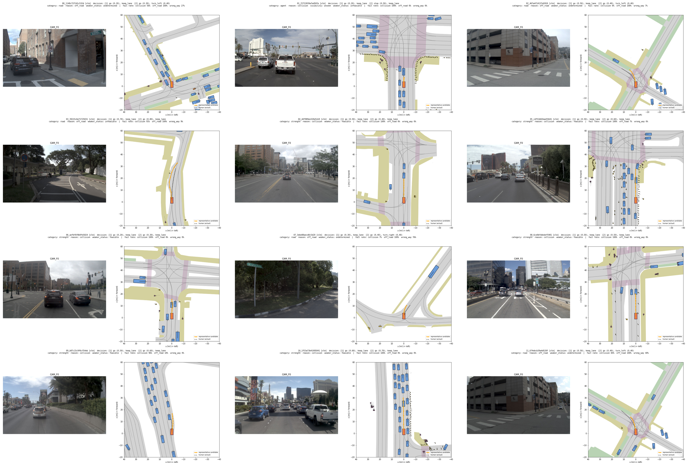
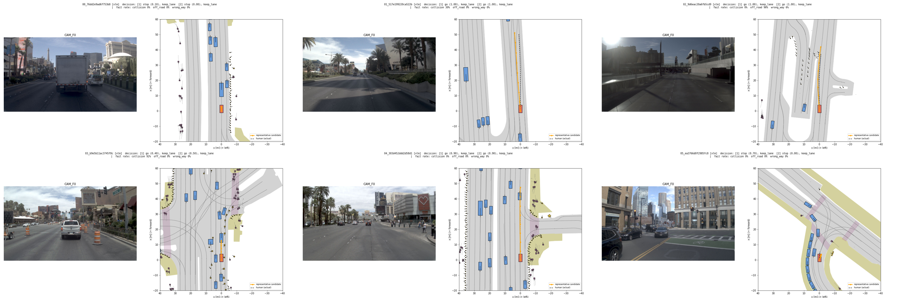

# 7단계. 특징 미리 계산과 VLM 결정 수집 (D3) (2026-10-07)

yesman.md 11절 7단계의 결과와 계획서와 달라진 점을 정리한 것이다. GPU pod(RTX 5090 32 GB, 32 vCPU, 123 GB RAM)에서 수행하였다.

## 먼저 확인한 것: GPU에서 torch 2.7.1

- 1단계에서 바꾼 `torch 2.7.1+cu128`이 RTX 5090(sm_120)에서 정상 동작한다. bf16 행렬곱 약 56 TFLOPS. LTF 추론도 문제없다.

## 끝났다는 기준 확인

| 기준 | 결과 |
| --- | --- |
| 학습과 평가에 쓰는 모든 장면의 특징이 있다 | 통과. navtrain 센서 장면 23,388개(학습 묶음에 필요한 22,700개 포함), navtest 12,146개(D0~D3에 필요한 11,751개 포함). 빠진 장면 0, 유한하지 않은 값 0 |
| 특징을 불러오는 속도가 학습에 충분하다 | 통과. navtrain 특징 전체(1.94 GB)를 메모리에 올리는 데 3.1초. 무작위 batch 256개를 GPU로 옮기는 속도는 초당 약 16만 샘플이다(학습 묶음 61,032행을 1초 안에 한 번 돈다) |
| 장면 번호와 특징의 짝이 맞는지 무작위로 확인하였다 | 통과. 아래 "짝 확인" |
| D3의 파싱 실패 비율과 L2 판정 분포를 보고하였다 | 통과. 파싱 실패 0/1,000. 가능 728 / 불가능 31 / 판정 불가 241 |

## 1. 특징 (`scripts/ltf_features.py`)

### 저장한 것

1단계에서 "어떤 특징을 저장할지는 8단계의 디코더 설계와 함께 정한다"고 미뤄 두었다. 이미지를 다시 읽는 것이 가장 비싸므로(10만 장 이상), 디코더 설계가 바뀌어도 다시 계산하지 않도록 아래를 모두 저장하였다. 위치: `exp/features/ltf/{navtrain,navtest}/<이름>.npy`, 장면 순서는 같은 폴더의 `tokens.txt`이다. 합계 2.8 GB.

| 이름 | 모양 (장면 하나) | dtype | 용도 |
| --- | --- | --- | --- |
| keyval | 65 × 256 | fp16 | LTF 트랜스포머 디코더가 보는 토큰. BEV 8×8 = 64개 + 차량 상태 1개, 위치 임베딩 포함. **디코더의 기본 입력 후보** |
| query_out | 31 × 256 | fp16 | LTF 디코더 출력 (경로 쿼리 1개 + 물체 쿼리 30개) |
| status | 8 | fp32 | 입력 차량 상태 (내비게이션 명령 4 + 속도 2 + 가속도 2) |
| ltf_traj | 8 × 3 | fp32 | LTF가 예측한 경로 (짝 확인용, 참고 비교용) |
| agent_states, agent_logits | 30 × 5, 30 | fp32 | LTF가 예측한 BEV 박스와 존재 logit. 9.4 "인식과 판단의 분리" 실험용 |
| bev_sem | 128 × 256 | uint8 | LTF가 예측한 BEV 지도 분할 (argmax). 9.4 실험용 |
| cam_sum | – | fp64 | 입력 이미지 텐서의 합 (짝 확인용) |

- 백본의 원래 BEV 특징(512 × 8 × 8)은 저장하지 않았다. keyval이 그것을 1×1 합성곱으로 256차원으로 줄인 것이고, LTF 자신의 디코더도 keyval만 본다.
- 계산 시간: navtest 3분, navtrain 5.6분 (초당 약 75장면, DataLoader worker 28개. 병목은 볼륨에서 이미지 읽기).

### 짝 확인 (`scripts/ltf_features_check.py`, `logs/step07/ltf_features_check.log`)

- **전체 장면**: LTF가 예측한 경로와 사람 경로의 평균 오차(ADE)는 navtest 0.67 m, navtrain 0.29 m이다. 장면 순서를 섞어 짝을 틀리게 하면 8.1~8.3 m가 된다. 1단계(navtest 20장면) 0.59 m와도 비슷하다. navtrain이 더 낮은 것은 LTF가 navtrain으로 학습되었기 때문이다(모든 비교 방법이 같은 특징을 쓰므로 공정성에는 영향이 없다).
- **무작위 50장면씩 다시 계산**: DataLoader 없이 장면 하나씩 다시 계산하였다. 입력(이미지 합, 차량 상태)은 저장된 값과 정확히 같다. 특징의 상대 오차는 최대 0.4~1.0%이고, 다른 장면과의 차이(최소 43~83%)보다 50배 이상 작다. BEV 지도 분할은 99.9% 픽셀이 같다.
- 이 작은 차이는 cuDNN 합성곱의 TF32(PyTorch 기본값 켜짐) 때문에 batch 크기에 따라 계산 결과가 달라져서 생긴다. TF32를 끄면 batch 32와 batch 1의 차이가 0.6%에서 0.004%로 줄어드는 것을 확인하였다. 특징은 한 번 계산해 모든 방법이 같이 쓰므로 다시 계산하지 않았다.

### 불러오는 방법 (8단계부터)

```python
tokens = open("exp/features/ltf/navtrain/tokens.txt").read().split()
keyval = np.load("exp/features/ltf/navtrain/keyval.npy")  # (23388, 65, 256) fp16, 메모리에 통째로 올린다
row = {t: i for i, t in enumerate(tokens)}                  # 학습 묶음의 token → 행 번호
```

## 2. VLM 결정 수집 (D3)

### 설정

| 항목 | 값 |
| --- | --- |
| 모델 | `google/gemma-4-12B-it` (Apache-2.0, gated 아님). bf16 그대로 RTX 5090 한 장에 올라간다(가중치 24 GB). 계획서 14절의 "8비트 양자화"는 필요 없었다 |
| 실행 | vLLM 0.31.0, greedy(temperature 0), seed 0, thinking 끔 |
| 입력 이미지 | L0, F0, R0 세 장을 따로 넣는다. LTF와 같은 범위로 자른다(L0·R0는 가운데 1088열, 모두 위아래 28행). 이미지 하나당 시각 토큰 560개 |
| 입력 글 | 카메라 이름, 지금 속도와 가속도, 내비게이션 명령(좌회전 / 직진 / 우회전) |
| 출력 | 장면 설명, 핵심 이슈, 두 구간의 결정을 JSON 하나로 강제(vLLM structured outputs, 행동은 enum, 세기는 0~1) |
| 프롬프트 | `data_lists/eval/D3_vlm_meta.json`(시스템 프롬프트, JSON 스키마 전문). 세기의 정의는 L1과 같다(go = 구간 끝 속도 / 10.5 m/s, stop = 평균 감속도 / 1.4 m/s², turn = 방향 변화 / 45°, lane change = 최대 옆 속도 / 2.0 m/s, offset = 옆 이동 / 1.7 m). 각 행동의 판정 기준(예: lane change는 구간 끝에 옆 차선에 있음)도 L1의 정의대로 적었다 |
| 장면 | D0(11,751장면)에서 무작위 1,000개(시드 0, 130개 로그). 내비게이션 명령: 직진 682, 좌 208, 우 110 |
| 시간 | 1,000장면 825초 (장면당 입력 약 2,300토큰, 출력 약 220토큰) |

- 시범 실행(20장면, `exp/d3/pilot*.parquet`): 형식은 20개 모두 맞았다. 두 장면의 이미지를 직접 보았을 때 서술이 실제와 맞았다(공사 드럼통, 이동식 신호기, 앞의 픽업트럭 / 경찰차와 경찰관, "BIKE LANE ENDS" 표지, 우회전이 필요한 T자 교차로). **프롬프트는 시범 실행 뒤 고치지 않았다.** 결과(L2 판정)를 보고 프롬프트를 고치면 RQ2가 재는 "VLM 오류 분포"가 바뀌기 때문이다.

### L2 판정 (`scripts/d3_judge.py`)

6단계 CF와 같은 판정 함수를 쓴다(`scripts/l3_run.py`의 `judge`). VLM 결정은 사람이 실제로 한 결정이 아니므로 "교차로 밖 turn의 가능 → 판정 불가" 규칙도 적용한다. 불가능이면 CF⁻와 같은 방법으로 불가능 기준과 보이지 않는 원인을 붙인다.

| 결과 | 개수 |
| --- | --- |
| 파싱 실패 | 0 (JSON 강제, 1,000개 모두 정상 종료) |
| 가능 | 728 |
| 불가능 | 31 (도로 모양 18, 세기 9, 다른 차·보행자 4. 이 중 보이지 않는 원인 2, 원인 차량 못 찾음 1) |
| 판정 불가 | 241 (후보 부족 178, 교차로 밖 회전 63) |
| 사람 결정과 같음 (6.2의 ≈, 이웃 라벨 허용) | 259 (엄격 기준 220) |

| VLM 결정의 좌우 행동 | 가능 | 불가능 | 판정 불가 | 합 |
| --- | --- | --- | --- | --- |
| keep lane | 659 | 16 | 71 | 746 |
| 좌회전 | 51 | 10 | 93 | 154 |
| 우회전 | 12 | 5 | 71 | 88 |
| offset / 차선 변경 | 6 | 0 | 6 | 12 |

| VLM 결정의 앞뒤 행동 | 가능 | 불가능 | 판정 불가 | 합 | (사람) |
| --- | --- | --- | --- | --- | --- |
| go, go | 561 | 28 | 129 | 718 | 872 |
| stop, stop | 103 | 2 | 37 | 142 | 53 |
| stop, go | 61 | 0 | 71 | 132 | 5 |
| go, stop | 3 | 1 | 4 | 8 | 70 |

- 판정 불가 비율(24%)은 6단계 CF(약 45%)보다 낮고 D0(1.5%)보다 높다. 회전 결정과 "stop, go"(2초 안에 멈췄다가 다시 출발) 결정이 많이 판정 불가가 된다. 이런 사람 경로는 경로 모음에 드물다.
- 불가능 12개를 그려 확인하였다(아래 그림). 세기 기준은 앞차가 가까운데 "go 0.5~0.6"이라고 해서 추돌하는 경우이고, 도로 모양 기준은 대부분 교차로에서 회전을 늦게(2구간에서) 시작해 길을 벗어나는 경우이다. 1개(`39215c6e71725031`)는 VLM 결정이 사람 결정과 같은데 불가능으로 판정되었다. 이 장면은 D0에서도 사람 결정이 "판정 불가"였던 장면이다(L2 잡음). 사람과 같으면서 불가능인 것은 2개이다.
- 눈에 띄는 경향(분석은 11단계): 사람이 1구간에 이미 회전하는 장면에서 VLM은 거의 1구간을 keep lane으로 두고 2구간에만 회전을 넣는다(좌 119개 중 1구간 회전 2개, 우 53개 중 4개). go 세기 차이의 중앙값은 1구간 0.07, 2구간 0.15이다.



가능하지만 사람과 다른 결정 6개: 

### 저장 (고정)

- `data_lists/eval/D3.parquet` (1,000행): VLM 원문 출력, 장면 설명, 핵심 이슈, 결정(`d_seg*`), 사람 결정과 같은지, L2 판정(상태, 판단 근거, 불가능 기준, 시야, 통과 후보 중 최고 점수 `best_score`, 그 경로 `best_poses`). D0~D2처럼 `cf_name` 열이 있다(값은 `vlm`).
- `data_lists/eval/D3_vlm_meta.json`: 모델, 프롬프트, 스키마, 디코딩 설정.
- 체크섬을 `data_lists/eval/SHA256SUMS`에 더했다. `sha256sum -c data_lists/eval/SHA256SUMS`로 D0~D3를 함께 확인한다.

## 계획서와 달라진 점

1. **VLM은 특징 계산과 같은 이미지 읽기 루프에서 돌리지 않았다.** vLLM 0.31이 torch 2.13을 요구해 navsim 환경(torch 2.7.1)과 함께 쓸 수 없으므로 따로 돌렸다. VLM 장면은 1,000개(이미지 3,000장)뿐이라 이미지를 두 번 읽는 비용은 작다. 입력 이미지의 범위는 LTF와 같게 맞추었다(12절 "세 카메라 입력" 점검 항목).
2. **VLM 환경과 가중치는 컨테이너 디스크(`/root`)에 두었다.** 볼륨 용량(150 GB)을 아끼기 위해서이다(환경 약 10 GB + 가중치 24 GB). pod를 끄면 지워지지만, D3는 고정되었으므로 다시 돌릴 일은 없다. 다시 필요하면 `scripts/setup/install_vlm.sh`를 실행한다. 실행할 때 `VLLM_USE_FLASHINFER_SAMPLER=0`이 필요하다(FlashInfer 샘플러는 nvcc로 JIT 컴파일하는데 pod에 CUDA 툴킷이 없다).
3. **VLM에 차량 상태와 내비게이션 명령을 글로 주었다.** 계획서 8.3 M0은 "planner와 같은 세 카메라 이미지"만 명시한다. planner도 같은 정보(status_feature)를 받으므로 정보 차이를 없앴다. 이것이 없으면 교차로에서 어느 쪽으로 갈지 알 수 없고, 세기(속도 기준)도 정할 수 없다.
4. **D3 장면 수는 계획서 범위의 최대값인 1,000개로 하였다.** VLM 시간(14분)과 L2 판정 시간(2분)이 짧았다.
5. **특징은 필요한 장면보다 넓게 계산하였다.** 구조적 애매함으로 빠진 장면까지 navtest 전체 12,146개, navtrain 센서 장면 전체 23,388개이다.

## 사용자 확인이 필요한 것

- **"가능하지만 위험"의 점수 기준(14절, 9.5)을 11단계에서 D3 결과를 나누기 전에 정해야 한다.** D3에 `best_score`(L2 통과 후보 중 최고 점수, EC를 뺀 EPDMS)를 저장해 두었고, 아직 그 분포는 보지 않았다. 기준값은 결과를 보기 전에 정한다는 계획서 원칙에 따라, 8~10단계 중에 정해 주시면 된다.

## 시간과 자원

| 작업 | 시간 |
| --- | --- |
| LTF 특징 (navtest 12,146 + navtrain 23,388) | 9분 |
| 특징 검증 | 약 3분 |
| VLM 환경 설치 + 가중치 받기 | 약 5분 |
| VLM 1,000장면 | 14분 (+ 엔진 시작 약 2분) |
| L2 판정 1,000개 (24 worker) | 2분 |
