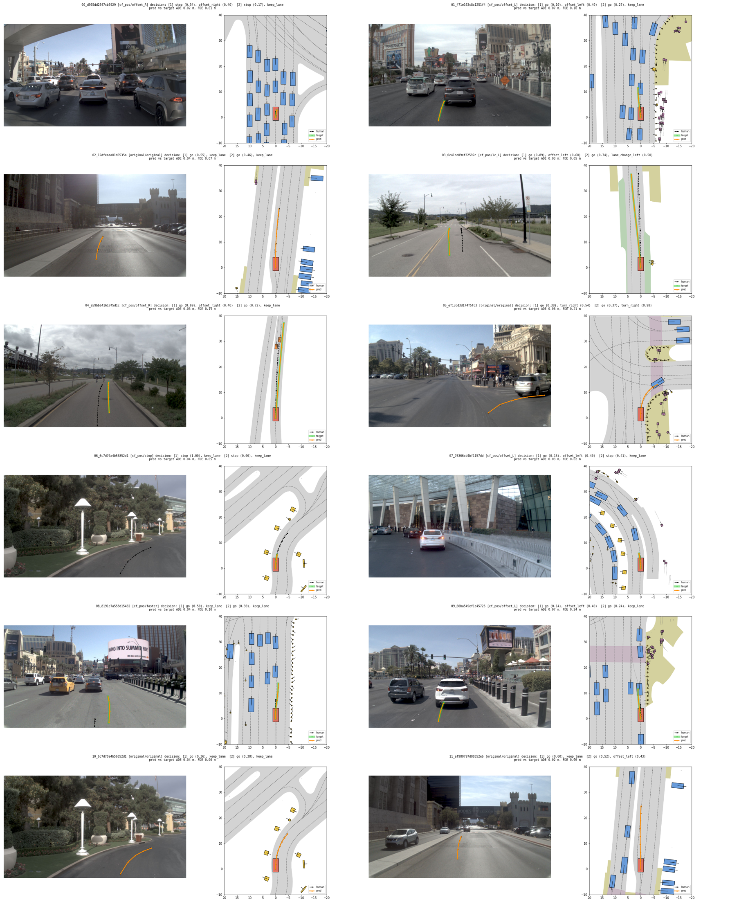

# 8단계. 디코더 구현과 동작 확인 (2026-10-07)

yesman.md 11절 8단계의 결과와 계획서와 달라진 점을 정리한 것이다. GPU pod(RTX 5090)에서 수행하였다.

## 끝났다는 기준 확인

| 기준 | 결과 |
| --- | --- |
| 장면 100개 정도로 과적합시키면 디코더가 사람 경로를 거의 그대로 그린다 | 통과. 사람 경로와의 평균 오차(ADE) 0.053 m, 4초 끝점 오차(FDE) 0.16 m (결정 입력 모델). B1은 ADE 0.043 m |
| 그린 경로를 영상과 BEV 위에 겹쳐 보았을 때 이상한 점이 없다 | 통과. 12개를 그려 확인하였다(아래 그림) |
| 판단 지점: 과적합이 되는가 | 된다. 다음 단계로 넘어간다. 회귀 방식(B6)으로 바꿀 필요는 없다 |

## 정한 것 (14절의 미정 사항, "작게 시작")

| 항목 | 정한 값 |
| --- | --- |
| 장면 입력 | 7단계의 LTF 토큰 96개: keyval 65개(BEV 64 + 차량 상태 1) + query_out 31개. LayerNorm + 선형층 + 위치 임베딩 |
| M2 결정 인코더 | 구간마다 [앞뒤 행동 one-hot 2, 좌우 행동 one-hot 7, 앞뒤 세기, 좌우 세기, 구간 one-hot 2] → MLP → 토큰 1개. 2구간이므로 조건 c는 토큰 2개 |
| 조건을 넣는 방식 | cross-attention. 경로 토큰이 [장면 토큰 + 결정 토큰]을 본다. B1은 결정 토큰을 넣지 않는다 |
| M3 경로 생성 | waypoint 8개가 토큰 하나씩. 트랜스포머 디코더 4층, 256차원, head 8개 (pre-norm). 시간 임베딩은 토큰에 더한다 |
| diffusion | cosine schedule T = 1000, x0 예측, L1 손실. 샘플링은 DDIM(eta = 0) 10단계. 경로는 학습 세트 목표 경로의 (시점, 축)별 평균과 표준편차로 정규화한다 |
| 앵커 | 쓰지 않는다 |
| 판단 토큰 (구조만, 학습은 10단계) | 학습되는 쿼리 하나가 [장면 토큰 + 결정 토큰]만 보는 따로 된 디코더 2층. 경로 토큰을 보지 않으므로 시작 노이즈가 달라도 flag가 바뀌지 않는다(12절 점검 항목). flag head(logit 1개, p = sigmoid), 근거 head(충돌 / 도로 이탈 / 역주행 logit, 여러 개 가능, REJECT 샘플에서만 학습) |
| 크기 | 4.5 M 파라미터 (판단 토큰 포함 시 조금 더) |
| 학습 설정 (과적합) | AdamW lr 2e-4, weight decay 1e-4, batch 256, warmup 200, cosine decay, grad clip 1.0, 4,000 step |

모델별 차이는 `scripts/train_planner.py`의 `MODELS`에 모았다(9.3의 공정성 규칙: 차이는 결정 입력, 학습 샘플 종류, 판단 head뿐이다).

| 모델 | 결정 입력 | 학습 샘플 | 판단 head |
| --- | --- | --- | --- |
| B1 | ✕ | 원래 결정 | ✕ |
| B2 | ○ | 원래 결정 | ✕ |
| Bcomply (B-순응) | ○ | 원래 결정 + CF⁺ | ✕ |
| Ours | ○ | 원래 결정 + CF⁺ + CF⁻ | ○ |

## 과적합 시험

- 장면: 학습 묶음(학습 로그)에서 무작위 100장면(시드 0). 같은 100장면으로 평가한다.
- **결정 입력이 실제로 쓰이는지도 함께 확인하였다.** 계획서는 "사람 경로"만 요구하지만, 같은 장면의 CF⁺(목표 경로가 다름)를 함께 넣어 Bcomply로 과적합시켰다. 결정 입력을 무시하는 버그가 있으면 한 장면의 서로 다른 두 목표를 동시에 맞출 수 없다.
- 평가: 시작 노이즈 시드 3개로 DDIM 10단계 샘플링.

| 실행 | 샘플 | ADE (m) | FDE (m) | ADE p95 (m) | 시드끼리 퍼짐 (m) |
| --- | --- | --- | --- | --- | --- |
| Bcomply | 원래 결정 100 (목표 = 사람 경로) | 0.053 | 0.157 | 0.095 | 0.001 |
| Bcomply | CF⁺ 136 (목표 = L2 경로) | 0.061 | 0.142 | 0.123 | 0.001 |
| B1 | 원래 결정 100 | 0.043 | 0.115 | 0.089 | 0.001 |

- 같은 장면에서 원래 결정과 CF⁺ 결정을 넣었을 때 두 예측 경로의 거리(평균 2.96 m)가 두 목표 경로의 거리(평균 2.96 m)와 같다(상관 0.999, 136쌍). 결정에 따라 경로가 바뀐다.
- 손실은 0.093(1,000 step) → 0.012(4,000 step)로 안정적으로 줄었다. 4,000 step에 44초(초당 약 90 step, batch 256)이므로 9단계의 전체 학습(예: 5만 step)은 모델 하나에 10분 정도로 예상한다.
- 단위 테스트(`tests/test_model.py`, 5개 통과): 결정 인코딩, 판단 토큰이 노이즈에 무관함, 결정을 바꾸면 경로가 바뀌고 B1은 결정과 무관함, DDIM이 완벽한 denoiser에서 x0를 돌려줌, 손실의 역전파.

## 그림 (`scripts/viz_pred.py`)

왼쪽은 CAM_F0에 투영한 경로, 오른쪽은 BEV이다. 검은 점선 = 사람 경로, 굵은 연두 = 목표 경로(CF⁺), 주황 = 모델이 그린 경로.

- 영상 투영은 NAVSIM의 어노테이션 투영과 같은 방식이다(ego 좌표 → sensor2lidar → 카메라). 땅 높이는 주변 차량 박스 바닥 높이의 중앙값으로 잡았다. 투영한 경로가 차로와 회전 곡선을 따라가므로 좌표계가 맞다.
- 확인한 것: offset_R/L은 사람 경로의 오른쪽/왼쪽으로 비켜 가고, stop은 짧게 서며, 차선 변경은 옆 차로로 넘어가고, 우회전과 굽은 길은 차로 모양을 따라간다. 목표 경로와 예측 경로가 겹쳐 보인다. 이상한 점은 없었다.

## 계획서와 달라진 점

1. 과적합 시험에 CF⁺를 함께 넣었다(위). 결정 경로(M2)의 버그를 9단계 전에 잡기 위해서이다.
2. 판단 head는 구조와 손실까지만 넣고 단위 테스트로 확인하였다. 학습은 10단계에서 한다(계획서대로 "이 단계에서는 경로만 확인").
3. 특징의 TF32 차이(7단계)와 같은 이유로, 학습도 PyTorch 기본 설정(cuDNN TF32 켬, matmul TF32 끔)을 그대로 쓴다.

## 9단계로 넘길 것

- 전체 학습 설정(step 수, EMA 사용 여부, 검증 기준)은 9단계에서 검증 세트 손실을 보고 정하고, B1, B2, B-순응에 같은 값을 쓴다.
- CF⁺와 원래 결정의 비율(B-순응)은 6단계 결정대로 9단계에서 정한다. 지금은 묶음의 비율 그대로이다(원래 20,238 : CF⁺ 32,439).
