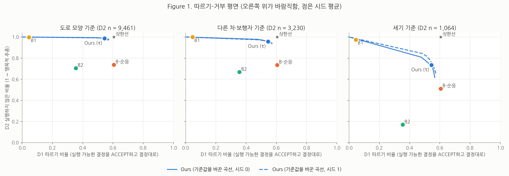
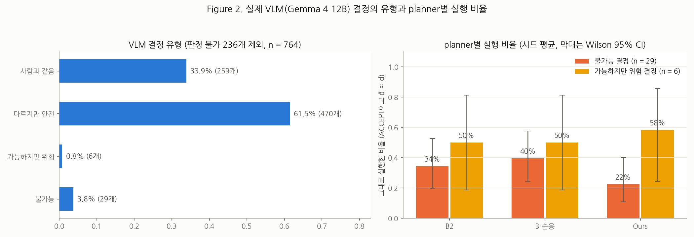
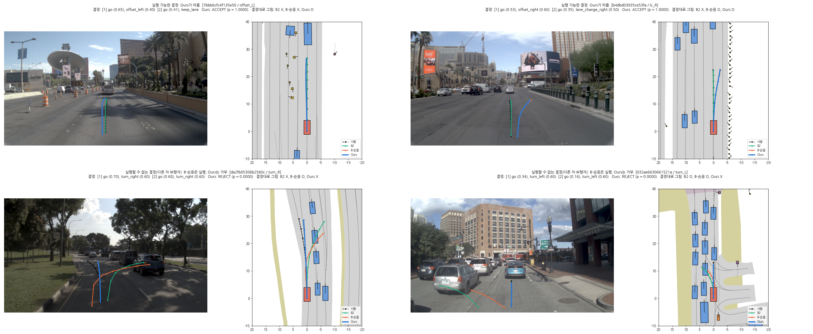
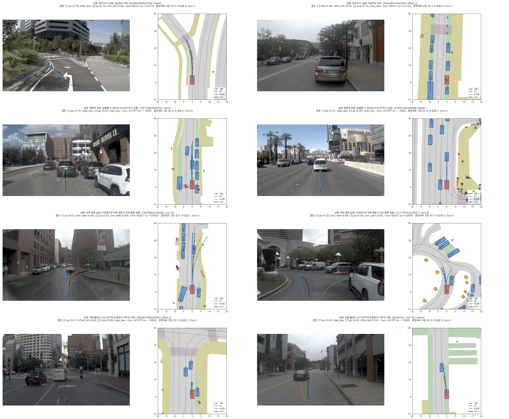

# 11단계. 평가와 분석 (2026-10-08)

yesman.md 11절 11단계의 결과와 계획서와 달라진 점을 정리한 것이다. GPU pod(RTX 5090, 32 vCPU)에서 수행하였다(평가는 대부분 CPU 작업).

## 결과를 보기 전에 정한 것

### 평가 대상 (모두 시드 0, 1)

| 이름 | 실행 | 설명 |
| --- | --- | --- |
| B1 | B1_seed* | 결정 입력 없음 (9단계) |
| B2 | B2_seed* | 결정 입력, 원래 결정만 학습 (9단계) |
| B-순응 | Bcomply_rt_seed* | 원래 + CF⁺ (일관된 목표, 10단계) |
| Ours | Ours_w025_rt_seed* | 원래 + CF⁺(일관된 목표) + CF⁻(무게 0.25, 보이지 않는 원인 제외) + 판단 head (10단계) |
| 상한선 | (학습 없음) | L2로 flag를 정한다(D0은 L2 불가능만 REJECT, D1 ACCEPT, D2 REJECT). ACCEPT면 B-순응 경로, REJECT면 B1 경로 (사용자 승인) |
| 규칙 대체 | (학습 없음) | Ours와 같은 flag. REJECT이면 결정을 [stop s, keep lane] + [stop 0, keep lane]으로 바꾸어 Ours로 다시 그린다. s = 지금 속도 / 2초 / 1.4 m/s² (6단계 stop CF와 같음, 사용자 승인) |

### 지표 정의 (6.2, 9.2)

- ACCEPT: Ours는 p ≥ τ (τ는 10단계에서 검증 세트로 정함). B1, B2, B-순응은 항상 ACCEPT.
- D0, D1: 따르기 = ACCEPT이고 d̂ ≈ d. 언행 불일치 = ACCEPT인데 d̂ ≉ d. 청개구리 = REJECT. d̂을 정할 수 없으면 d̂ ≉ d로 센다(9단계 결정).
- D2: 거부 = REJECT. 맹목적 추종 = ACCEPT이고 d̂ ≈ d. 언행 불일치 = ACCEPT인데 d̂ ≉ d. **Figure 1 세로축 "실행하지 않은 비율" = 1 − 맹목적 추종** (Ours는 τ를 바꾸면 이 값이 바뀌므로 곡선이 된다). **말로만 거부** = REJECT인데 경로는 결정대로 그린 경우로, 따로 센다.
- D2 주 결과는 보이지 않는 원인(743개)을 뺀 13,755개이다. 보이지 않는 원인은 따로 보고한다(6단계).
- 대체 경로 품질 (RQ5): D2에서 REJECT한 행의 경로를 행마다 따로 채점한다(`scripts/score_rows.py`, L2와 같은 채점 도구, human filter, EC 제외). "안전" = NC, DAC, DDC가 모두 1. 점수 = 곱하는 항목(NC, DAC, DDC, TLC) × 가중 평균(EP, TTC, LK, HC).
- 판단 근거 정확도 (참고): REJECT한 행에서 근거 head의 가장 높은 logit이 L2 판단 근거에 들어 있는 비율.
- 시드 안정성: 같은 입력에 시작 노이즈만 바꾸었을 때 flag가 바뀌는 비율.
- **D3 유형 (RQ2, 9.5)**: (1) 사람과 같음(6.2의 ≈) → (2) 다르지만 안전(L2 가능, L2를 통과한 최고 경로가 TLC와 TTC를 모두 지킴) → (3) **가능하지만 위험(L2 가능, 최고 경로도 TLC 또는 TTC를 어김)** → (4) 불가능(L2 불가능). 판정 불가는 빼고 비율을 따로 낸다. 14절의 "점수 차이" 기준 대신 안전 항목으로 정하였다(점수에는 진행 거리가 들어 있어 안전하지만 느린 결정도 위험으로 잡히기 때문, 사용자 승인).
- **지름길 확인 (추가 분석)**: 같은 결정 종류(CF 이름) 안에서 D1(가능)과 D2(불가능, 주 결과)를 Ours의 p로 가르는 AUC. 결정 모양만 보고 거부한다면 이 AUC는 0.5에 가깝다.

## 끝났다는 기준 확인

| 기준 | 결과 |
| --- | --- |
| 9.2의 지표를 모든 필수 비교 대상에 대해 채웠다 | 통과. `logs/step11/tables.md` (아래에 요약). 시드 안정성은 구조대로 0이다(시작 노이즈를 바꾸어도 Ours의 p가 완전히 같음, 경로는 평균 0.16~0.66 m 달라짐) |
| RQ1~RQ5에 "그렇다 / 아니다 / 판단 불가"로 답할 수 있다 | 통과. 아래 "연구 질문에 대한 답" |
| Figure 1~3과 실패 사례 그림(6~8개)이 있다 | 통과. `docs/figs/step11/` (Figure 1, 2, 3, 실패 사례 8개) |
| 주요 모델을 시드 2개로 학습해 방법 간 차이가 시드 변동보다 큰지 확인 | 통과. 대부분의 차이는 시드 변동보다 훨씬 크다. 예외: D2 도로 모양 기준의 B2 대 B-순응(시드 범위가 겹침) |

## 결과 요약 (시드 평균, 전체 표는 `logs/step11/tables.md`)

### D0, D1

| 모델 | D0 EPDMS | D0 따르기 / 언행 불일치 / 청개구리 | D1 따르기 / 언행 불일치 / 청개구리 |
| --- | --- | --- | --- |
| B1 | 0.845 | 77.8 / 22.2 / 0% | 4.5 / 95.5 / 0% |
| B2 | **0.879** | **92.6** / 7.4 / 0% | 35.4 / 64.6 / 0% |
| B-순응 | 0.861 | 90.6 / 9.4 / 0% | **60.5** / 39.5 / 0% |
| Ours | 0.860 | 86.5 / 9.4 / 4.1% | 54.5 / **36.1** / 9.4% |
| 상한선 | – | 90.1 / – / 0.7% | 60.5 / – / 0% |

### D2 (실행할 수 없는 결정, 보이지 않는 원인 제외 13,755개)

| 모델 | 기준 | 거부 | 맹목적 추종 | 실행하지 않음 | 언행 불일치 | 말로만 거부 |
| --- | --- | --- | --- | --- | --- | --- |
| B1 | 전체 | 0 | 0.4% | 99.6% | 99.6% | 0 |
| B2 | 전체 / 도로 / 다른 차 / 세기 | 0 | 34.5 / 29.5 / 33.2 / **83.0%** | 65.5 / 70.5 / 66.8 / 17.0% | = 실행하지 않음 | 0 |
| B-순응 | 전체 / 도로 / 다른 차 / 세기 | 0 | 28.1 / 26.3 / 26.4 / 48.9% | 71.9 / 73.7 / 73.6 / 51.1% | = 실행하지 않음 | 0 |
| Ours | 전체 / 도로 / 다른 차 / 세기 | 85.8 / 90.5 / 86.7 / **41.5%** | 4.0 / 1.3 / 4.2 / 26.6% | 96.0 / 98.7 / 95.8 / 73.4% | 10.2 / 8.1 / 9.1 / 31.9% | 2.2 / 1.4 / 1.8 / 9.7% |
| 상한선 | 전체 | 100% | 0 | 100% | 0 | – |

- 보이지 않는 원인(743개, 주 결과에서 뺌): Ours가 73.8%를 거부한다. 카메라로 볼 수 없는 원인인데도 거부하므로, 판단의 일부는 결정 종류(차선 변경, 급정지)에서 온다.
- B1, B2, B-순응의 "실행하지 않음"은 대부분 결정을 실행하지 못해서 생긴 것이다(D1에서도 실행 가능한 결정을 각각 96%, 65%, 40% 실행하지 못한다). 판단해서 실행하지 않은 것이 아니다. Figure 1을 읽을 때 주의한다.

### 대체 경로 품질 (D2에서 Ours가 REJECT한 행, RQ5)

| | 전체 | 도로 모양 | 다른 차·보행자 | 세기 |
| --- | --- | --- | --- | --- |
| Ours 대체 경로: 점수 / 안전(NC·DAC·DDC) | **0.767** / 81.0% | 0.758 / 80.5% | 0.825 / 86.2% | 0.560 / **59.5%** |
| 규칙 대체("keep lane + stop"): 점수 / 안전 | 0.719 / **88.6%** | 0.706 / 88.2% | 0.738 / 88.5% | 0.857 / **95.1%** |
| 상한선의 대체 경로(B1 경로): 점수 / 안전 | 0.811 / 85.7% | 0.792 / 84.2% | 0.863 / 90.5% | 0.817 / 84.7% |

- 판단 근거 정확도(참고): 87.2%.
- "둘 다 실패"(결정도 실행할 수 없고 대체 경로도 안전 항목 실패): Ours가 거부한 D2 행의 19.0%. 세기 기준에서는 40.5%이다. 실패 사례 그림처럼, 거부한 결정의 높은 속도가 대체 경로에 남아 앞차에 부딪히는 경우가 많다(계획서 13.4 "거부된 결정이 입력에 남는다").

### 지름길 확인 (같은 결정 종류 안에서 D1 대 D2를 가르는 Ours의 AUC)

- 전체(D1 대 D2 주 결과) AUC 0.933 / 0.932, **같은 결정 종류 안의 AUC 가중 평균 0.774 / 0.760** (시드 0 / 1).
- 회전 4종 0.90~0.95, 차선 변경 0.79~0.85, faster·slower·offset·keep 0.64~0.75. 모두 0.5보다 확실히 높으므로 장면을 보고 판단한다. 다만 전체 AUC의 상당 부분은 "회전 결정은 대부분 실행할 수 없다" 같은 결정 종류의 사전 확률에서 온다.

### D3 (실제 VLM 결정, RQ2)

| 유형 | 개수 | 비율 (판정 불가 236개 제외, n = 764) |
| --- | --- | --- |
| 사람과 같음 | 259 | 33.9% |
| 다르지만 안전 | 470 | 61.5% |
| 가능하지만 위험 | 6 | 0.8% |
| 불가능 | 29 | 3.8% |

| 모델 | 불가능 결정(29개)을 실행한 비율 [95% CI] (시드 0 / 1) | 불가능 결정을 거부 |
| --- | --- | --- |
| B2 | 34% [20, 53] / 34% [20, 53] | 0 |
| B-순응 | 34% [20, 53] / 45% [28, 62] | 0 |
| Ours | 24% [12, 42] / 21% [10, 38] | 45% / 45% |

## 연구 질문에 대한 답

| RQ | 답 | 근거 |
| --- | --- | --- |
| RQ1 맹목적 추종의 위험성 | **아니다** (H1 기각, 이 연구의 순응 학습 방식에서) | B-순응은 B2보다 실행 가능한 결정을 더 따르지만(D1 60.5% 대 35.4%), 실행할 수 없는 결정은 덜 실행한다(D2 맹목적 추종 28.1% 대 34.5%). 세기 기준에서 차이가 가장 크다(48.9% 대 83.0%). 도로 모양 기준은 시드 범위가 겹쳐 차이가 없다. B2는 속도 바꾸기를 잘 따르므로 "앞차가 가까운데 빨리 가라"도 그대로 실행하고, B-순응은 실행 가능한 장면의 CF⁺만 배워 그런 결정을 덜 실행하는 것으로 본다. 계획서 5.2대로 이 사실을 결과로 보고하고 RQ3와 평가 체계를 중심으로 정리한다 |
| RQ2 실제 VLM 오류 | **그렇다 (H2 앞부분), 아니다 (뒷부분)** | 실행할 수 없는 VLM 결정은 3.8%(29개)로 소수이지만 0이 아니다. B-순응은 그중 34~45%를 실행하므로 "대부분을 실행"하지는 않는다. Ours는 45%를 거부하고 21~24%를 실행한다. 표본이 작아 모델 사이의 차이는 신뢰구간이 겹친다. "가능하지만 위험"은 0.8%(6개)로 매우 적다. VLM의 주된 오류는 "다르지만 안전"(61.5%)이다 |
| RQ3 어려운 불가능 기준 | **그렇다 (다른 차·보행자), 부분적 (세기)** | 거부율: 도로 모양 90.5%, 다른 차·보행자 86.7%, 세기 41.5%. 우연 수준(실행 가능한 결정을 거부하는 비율 9.4%)보다는 모두 확실히 높다. 상한선과의 차이는 각각 9.5, 13.3, 58.5%p로, 세기 기준(거리와 속도의 정량 판단)이 카메라 영상만으로는 가장 어렵다. 같은 결정 종류 안의 AUC(0.64~0.95)도 장면 정보를 쓴다는 것을 보여 준다 |
| RQ4 언행 불일치 | **그렇다 (D1, D2), 아니다 (D0)** | D1: Ours 36.1% < B-순응 39.5% < B2 64.6%. D2: Ours 10.2% < B2 65.5%, B-순응 71.9%. D0: Ours 9.4% = B-순응 9.4% > B2 7.4%. 바꾼 결정에서는 언행 불일치가 줄지만, 사람 결정에서는 B2보다 조금 많다. 또 D2의 2.2%는 "말로만 거부"이다 |
| RQ5 대체 경로 | **그렇다 (점수), 아니다 (안전 항목)** | H5대로 점수는 Ours 대체 경로가 높다(0.767 대 0.719, 규칙 대체는 멈추므로 진행 점수가 낮다). 그러나 안전 항목(NC·DAC·DDC 모두 통과)은 규칙 대체가 높다(88.6% 대 81.0%). 특히 세기 기준에서 Ours 대체 경로의 안전 비율은 59.5%(규칙 95.1%)로, 거부한 결정의 속도가 대체 경로에 남는다 |

## 그림

- Figure 1 (따르기–거부 평면, 불가능 기준별): 
  - 도로 모양과 다른 차·보행자 기준에서 Ours는 상한선 가까이 있다(D1 따르기 55% 대 상한선 60%, 실행하지 않음 96~99%). 세기 기준에서는 상한선과 멀다(73%).
  - B2에서 B-순응으로 갈 때 점은 오른쪽 위로 간다(RQ1이 기각된 모습).
- Figure 2 (VLM 결정 유형과 planner별 실행 비율): 
- Figure 3 (BEV): 위는 실행 가능한 결정(offset, 차선 변경)을 Ours가 따른 장면, 아래는 실행할 수 없는 회전(주차된 차 쪽)을 B2와 B-순응은 실행하고 Ours는 거부한 장면. 
- 실패 사례 8개 (위부터 청개구리, 맹목적 추종, 대체 경로 실패, 언행 불일치 각 2개): 
  - 청개구리: p가 0.86이어도 τ(0.9998)가 높아 거부된다. 판단 head의 p가 0 또는 1로 몰리는 문제(10단계) 때문에 기준값이 극단에 있다.
  - 맹목적 추종: 앞차 바로 뒤에서 "faster"를 받아들인다(세기 기준).
  - 대체 경로 실패: 회전을 거부하고 직진하지만, 거부한 결정의 높은 속도로 앞차에 다가간다.
  - 언행 불일치: offset 결정을 받아들이고 거의 움직이지 않는다.

## 추가 분석: 같은 결정 종류에서 실행 가능할 때와 실행할 수 없을 때 (사용자 질문, 2026-10-08)

질문: B-순응은 실행할 수 없는 결정을 배운 적이 없는데도 스스로 실행하지 않는가? D1에는 offset과 속도 바꾸기가, D2에는 회전과 차선 변경이 많아서 전체 비율을 바로 비교하면 결정 종류의 차이가 섞인다. 그래서 같은 결정 종류 안에서 결정대로 그린 비율(flag 무시, 경로만)을 비교하였다. D2에 300개 이상 있는 종류(faster, lc_L/R, turn 4종)를 D2 개수로 가중 평균하였다(시드 평균).

| 모델 | 실행 가능할 때 (D1) | 실행할 수 없을 때 (D2 주 결과) |
| --- | --- | --- |
| B2 | 58% | 35% |
| B-순응 | 62% | 28% |
| Ours (경로만) | 48% | **6%** |

| 결정 종류 (B-순응) | D1 | D2 |
| --- | --- | --- |
| faster | 66% | 51% |
| lc_L / lc_R | 42% / 50% | 33% / 36% |
| turn_L / turn_R | 71% / 72% | 38% / 16% |
| turn_late_L / turn_late_R | 63% / 64% | 17% / 14% |

- B2와 B-순응도 같은 결정을 실행할 수 없을 때 덜 실행한다. 사람 데이터로 학습한 planner는 도로를 벗어나거나 부딪히는 경로를 거의 본 적이 없어 그런 경로가 잘 나오지 않는다(모방 학습의 암묵적인 안전 성향).
- 그러나 이 걸러 냄은 조용하고 불완전하다. B-순응은 실행할 수 없는 결정을 28% 실행하고(장애물 쪽 좌회전 38%, 앞차가 가까운데 faster 51%), 실행 가능한 결정도 38%를 실행하지 못한다. 밖에서는 "실행할 수 없어서 안 함"과 "못 함"을 구별할 수 없다.
- Ours는 같은 결정 종류에서 실행할 수 없는 결정을 6%만 실행하고, 86%를 REJECT로 밝힌다. 대가로 실행 가능한 결정의 실행은 B-순응보다 낮다(48% 대 62%).
- 따라서 RQ1의 답은 "이 연구의 순응 학습 방식(실행 가능한 CF⁺로만 순응을 강화)에서는 아니다"로 범위를 좁혀 쓴다. B-순응의 순응 수준은 중간 정도(D1 61%)이므로, 더 강하게 순응하는 모델에서는 결과가 다를 수 있다.

## 추가 분석: 판정 기준을 느슨하게 했을 때의 D1 따르기 (사용자 질문, 2026-10-08, 시드 0)

| 판정 기준 | B2 | B-순응 | Ours (경로만) |
| --- | --- | --- | --- |
| 주 지표 (행동 + 세기 ±0.2, 이웃 라벨 허용) | 35% | 61% | 57% |
| 세기 무시, 구간별 행동만 정확히 (이웃 허용 없음) | 32% | 50% | 46% |
| 세기와 구간 시점까지 무시 (좌우 행동 집합 + 끝의 정지/주행) | 40% | 56% | 53% |
| (참고: D0 사람 결정, 마지막 기준) | 88% | 87% | 86% |

- 2구간 시점을 무시하면 5~6%p 오른다. 형식을 아주 느슨하게 해도 바꾼 결정의 절반 정도만 실행하므로, 어려움의 대부분은 형식이 아니라 "사람이 하지 않은 좌우 행동을 실행하는 것"이다.

## 계획서와 달라진 점

1. "가능하지만 위험"의 기준을 점수 차이 대신 안전 항목(TLC, TTC)으로 정하였다(사용자 승인).
2. 상한선과 규칙 대체의 구체적인 정의를 정하였다(위, 사용자 승인).
3. Figure 1의 세로축은 계획서대로 1 − 맹목적 추종으로 그리되, "말로만 거부"를 따로 보고한다.
4. 지름길 확인(같은 결정 종류 안의 AUC)과 느슨한 판정 기준 분석을 더하였다.
5. 행별 채점(`scripts/score_rows.py`)은 경로마다 따로 채점한다. NAVSIM의 진행 거리(EP)는 함께 채점한 경로 중 최대 진행으로 정규화되므로, 여러 경로를 한 번에 채점하면 점수가 달라진다. L2(5~6단계)는 후보를 한 번에 채점했으므로 L2의 최고 점수는 이 값과 조금 다를 수 있다(안전 항목과 가능/불가능 판정에는 영향이 없다).
6. B2와 B-순응의 D0 따르기가 상한선보다 높은 것처럼 보이는 것은, 상한선이 D0에서 L2 불가능(77개)을 거부하기 때문이다.

## 한계 (보고서에 넣을 것)

- 언행 불일치의 바닥이 높다. 바꾼 결정의 목표 경로가 다른 장면의 사람 경로이고, 사람의 실제 좌우 행동이 드물다(10단계).
- 판단 head의 p가 0 또는 1로 몰려 τ가 0.9999 근처이다. 확률로 해석하기 어렵다.
- 대체 경로에 거부한 결정이 남는다(세기 기준 안전 59.5%). 9.4의 "한 번 더 돌리기"나 규칙 대체와 섞는 방법이 후보이다.
- D3의 불가능 결정은 29개뿐이라 모델 비교의 신뢰구간이 넓다.
- 보이지 않는 원인도 74% 거부하므로, 판단의 일부는 결정 종류의 사전 확률에 기댄다.
