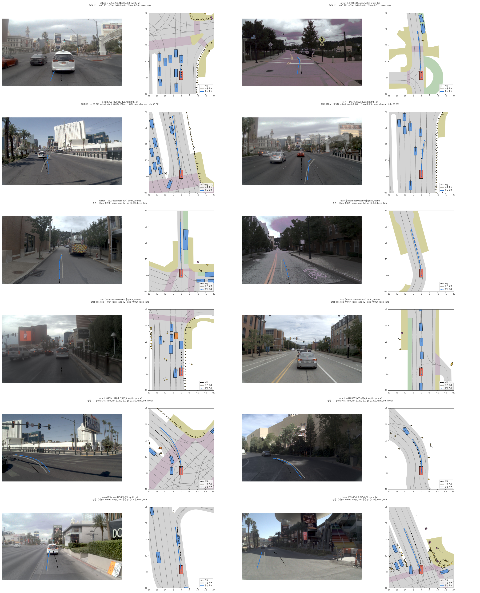

# 12단계. 추가 실험 (2026-10-08)

yesman.md 11절 12단계(선택)의 결과이다. 사용자와 정한 두 실험: (1) B3 (계획서 9.3 선택 비교군), (2) D3 확장 (VLM 3개 × 3,000장면). 결과를 보기 전에 정한 정의는 11단계와 같다(docs/step11_eval.md, `scripts/analyze_step12.py`).

## (1) B3: 판단 head 없이 CF⁻까지 학습

- B3 = Ours에서 판단 head만 뺀 모델이다. 나머지는 Ours와 같다(같은 디코더, 일관된 CF⁺ 목표, CF⁻ 무게 0.25, 보이지 않는 원인 제외, 2만 step, 시드 0과 1). 항상 ACCEPT로 본다.
- 묻는 것: 11단계의 결과 안전성 향상(E1, B-순응 23% → Ours 76%)이 CF⁻ 학습에서 오는가, 판단 head에서 오는가.

| 모델 (시드 평균) | D0 EPDMS | D1 따르기 | D2 결정대로 실행 | **D2 결과 안전 (E1)** | 안전: 도로 / 다른 차 / 세기 |
| --- | --- | --- | --- | --- | --- |
| B1 (결정을 보지 않음) | 0.845 | 4.5% | 0.4% | 85.7% | 84 / 90 / 85% |
| B2 | 0.879 | 35.4% | 34.5% | 22.1% | 24 / 20 / 10% |
| B-순응 (CF⁺) | 0.861 | **60.5%** | 28.1% | 22.5% | 23 / 20 / 29% |
| **B3 (CF⁺ + CF⁻, 판단 head 없음)** | 0.863 | **57.0%** | 6.3% | **75.8%** | 78 / 80 / 47% |
| Ours (CF⁺ + CF⁻ + 판단 head) | 0.860 | 54.5% | 4.0% | **76.2%** | 78 / 80 / 47% |

- **결과 안전은 판단 head가 아니라 CF⁻ 학습에서 온다.** B3와 Ours의 결과 안전이 같다(75.8% 대 76.2%). B3는 실행 가능한 결정을 오히려 더 따른다(57.0% 대 54.5%, 판단 head의 청개구리 9.4%가 없으므로).
- 판단 head가 더하는 것은 "거부했다"는 표시와 판단 근거이다. B3는 실행할 수 없는 결정을 조용히 무시하므로, 밖에서는 실행 가능한 결정을 무시한 경우(D1의 43%)와 구별되지 않는다.
- B1은 결정을 보지 않으므로 장면 하나에 경로 하나를 낸다. 같은 경로를 그 장면의 D1, D2 결정마다 판정하고 채점한 값이다(결정을 완전히 무시하는 planner의 기준점).

## 보고서의 주장 구성 (사용자와 정함, 2026-10-08)

"CF⁻가 필요하다"는 누구나 예상할 수 있으므로 결론으로 내세우지 않는다. 결과를 보기 전에는 반대로 나올 수도 있었던 세 가지를 앞에 두고, CF⁻의 효과는 그 맥락의 숫자로 보여 준다.

1. **좋은 예(CF⁺)만으로는 안전이 전혀 늘지 않는다** (D2 결과 안전 B2 22% → B-순응 23%). B-순응은 실행할 수 없는 결정을 덜 실행하지만(35% → 28%), 결정을 반만 실행해 그대로 사고가 난다.
2. **판단 head는 안전과 무관하다** (B3 75.8% ≈ Ours 76.2%). 안전은 학습 데이터(CF⁻)에서 오고, head는 설명(거부 표시, 근거)을 더한다.
3. **원래 가설과 반대로, 순응을 강화해도 맹목적 추종은 늘지 않았다** (RQ1 기각, 이 연구의 순응 학습 방식에서).
- 크기: CF⁻는 결과 안전을 약 3배로 올리고(23% → 76%), 대가는 실행 가능한 결정 따르기 3.5%p(60.5% → 57.0%, B3)이며 D0 주행 점수는 같다. 가장 위험한 세기 기준에서는 효과가 가장 작다(안전 47%, B1 85%, B2는 세기 기준 불가능 결정을 83% 실행).
- 범위: VLM 결정을 받는 planner가 VLM이 틀렸을 때 어떻게 하는가. "VLM이 필요한가"에는 답하지 않는다(NAVSIM 결정에는 영상 이상의 정보가 거의 없으므로 이 벤치마크에서는 결정을 무시하는 B1이 가장 안전하다).

## (2) D3 확장: VLM 3개 × 3,000장면

- 장면: 기존 D3 1,000장면 + D0에서 새로 고른 2,000장면(시드 1, 기존과 겹치지 않음) = 3,000장면. `exp/d3/scenes_3k.parquet`
- VLM: Gemma 4 12B-it(기존, 새 2,000장면만 추가 실행), Gemma 4 31B-it(QAT 4비트, `google/gemma-4-31B-it-qat-w4a16-ct`, 최대 문맥 4,096), Qwen3-VL-8B-Instruct. 프롬프트, JSON 스키마, greedy 디코딩, L2 판정은 7단계와 같다. 이미지 하나당 시각 토큰 수를 맞추었다(Gemma 560, Qwen 같은 픽셀 수).
- 평가 세트로 고정: `data_lists/eval/D3x_{gemma12b,gemma31b,qwen8b}.parquet`, `D3x_vlm_meta.json`, 체크섬은 SHA256SUMS. `D3x_gemma12b`는 기존 D3 1,000행을 그대로 포함한다.
- 시간: Gemma 12B 2,000장면 28분, Qwen 8B 3,000장면 21분, Gemma 31B 3,000장면 83분(GPU 메모리 때문에 한 번에 2개 정도만 처리).
- 실행 중 실수 두 가지: 31B 다운로드 로그를 상대 경로로 적어 다운로드가 건너뛰어졌고, 최대 문맥 8,192에서 KV 캐시가 모자랐다. 고친 뒤 다시 돌렸다. 31B 없이 먼저 돈 판정 단계의 중간 파일과 체크섬 줄은 지우고 다시 만들었다.

### VLM 결정 유형 (판정 불가, 파싱 실패 제외 비율 [95% CI])

| VLM | 파싱 실패 | 판정 불가 | 사람과 같음 | 다르지만 안전 | 가능하지만 위험 | 불가능 |
| --- | --- | --- | --- | --- | --- | --- |
| Gemma 4 12B | 0 | 721 | 34.6% [32.7, 36.6] | 59.2% [57.2, 61.2] | 0.7% [0.4, 1.1] | **5.6%** [4.7, 6.6] (127개) |
| Gemma 4 31B | 0 | 514 | 38.3% [36.4, 40.2] | 57.5% [55.5, 59.4] | 0.4% [0.2, 0.8] | **3.8%** [3.1, 4.6] (94개) |
| Qwen3-VL 8B | 0 | 1,486 | 25.8% [23.6, 28.0] | 60.6% [58.1, 63.1] | 0.8% [0.5, 1.4] | **12.8%** [11.2, 14.6] (194개) |

- 실행할 수 없는 VLM 결정은 3.8~12.8%로 소수이지만 0이 아니다(H2 앞부분, 세 VLM 모두). 큰 Gemma(31B)가 가장 적고, Qwen 8B가 가장 많다. Qwen은 판정 불가도 절반에 이른다(경로 모음에 드문 결정 조합을 많이 낸다).
- VLM 오류의 대부분은 "다르지만 안전"(58~61%)이다. 계획서 A.2 5번의 지적대로 이 연구의 범위(실행할 수 없는 결정)는 VLM 오류의 일부이다.
- 기존 D3(1,000장면, Gemma 12B)의 불가능 3.8%는 3,000장면에서 5.6%가 되었다(표본 변동).

### 실제 VLM의 "불가능" 결정을 받았을 때 (시드 평균, `logs/step12/d3x_safety.md`)

| 모델 | 결정대로 실행: Gemma 12B / 31B / Qwen 8B | 결과 안전: Gemma 12B / 31B / Qwen 8B | (참고: 합성 CF⁻ D2의 결과 안전) |
| --- | --- | --- | --- |
| B1 | 2 / 3 / 1% | 80 / 76 / 78% | 86% |
| B2 | 50 / 52 / 33% | 12 / 13 / 14% | 22% |
| B-순응 | 49 / 55 / 27% | 18 / 12 / 22% | 23% |
| B3 | 40 / 50 / 13% | 34 / 31 / 39% | 76% |
| Ours | 34 / 44 / 11% (거부 43 / 31 / 66%) | 34 / 30 / 42% | 76% |

- **결론의 방향은 실제 VLM 결정에서도 같다.** CF⁺만으로는 안전이 거의 늘지 않고(B2 → B-순응: +6, −1, +8%p), CF⁻ 학습으로 2~3배가 되며(B-순응 → B3: +16~19%p), 판단 head는 차이를 만들지 않는다(B3 ≈ Ours).
- **그러나 효과의 크기는 합성 CF⁻에서 잰 것의 절반 이하이다.** 결과 안전 76%(D2) → 30~42%(실제 VLM). Ours의 거부율도 86%(D2) → 31~66%. 합성한 counterfactual로 잰 거부 성능은 실제 VLM 오류에서의 성능을 과대평가한다. 학습과 D2의 CF⁻는 같은 규칙(정해진 메뉴, 정해진 세기)으로 만들었고, 실제 VLM의 틀린 결정은 모양이 다르다(예: 회전을 2구간에만 넣기, 멈췄다가 바로 출발).
- **세기 기준은 거의 막지 못한다.** 결정을 받는 모든 모델에서 세기 기준 불가능 결정의 결과 안전은 0~12%이다. Gemma의 불가능 결정 중 세기 기준이 31~41%를 차지한다.

## (3) CF⁺ 목표 경로 합성 (사용자 요청)

10단계 진단의 결론("CF⁺ 정답이 장면과 상관없이 우연히 골려 일관되지 않다")을 직접 고친다. 다른 장면의 경로를 옮겨 오는 대신, 그 장면 사람의 실제 경로를 결정에 맞게 고친다(`yesman/synth.py`, `scripts/l3_synth.py`). 판정(CF⁺/CF⁻)과 평가 세트는 바꾸지 않는다.

| 결정 | 고치는 것 | 그대로 두는 것 |
| --- | --- | --- |
| faster, slower, stop | 속도(구간 끝 속도를 세기에 맞추고 구간 안 등가속). 사람이 거의 서 있었으면 기준 차선을 따라 | 사람이 간 길 |
| keep, offset, 차선 변경 | 기준 차선 위의 옆 거리(smoothstep, offset은 세기 × 1.7 m, 차선 변경은 최대 옆 속도 세기 × 2 m/s) | 사람의 속도 |
| 회전 | 그 교차로의 회전 차선열 위에 그림 | 사람의 속도 |

- 크기와 시점을 조금씩 바꾼 변형을 만들고, L1이 결정과 맞다고 판정한 것(세기 ±0.1, 이웃 라벨 허용 없음, 구조적 애매함 없음)을 사람 경로에 가까운 순서로 최대 3개까지 NAVSIM으로 채점해, NC·DAC·DDC를 모두 통과한 첫 경로를 목표로 쓴다. 없으면 10단계의 일관화된 목표를 그대로 둔다(두 규칙 모두 "결정을 만족하는 가장 작은 변경").
- 합성률(검증 묶음): 전체 61%. stop 94%, slower 72%, offset 69~71%, 차선 변경 61~64%, keep 51%, faster 43%, 회전 7~18%. faster는 사람이 회전하던 장면에서 같은 곡선을 더 빨리 지나면 구간별 방향 변화가 결정과 달라지고, 회전은 느린 장면에서 2초 안에 회전 구간에 닿지 못한다.
- 결정 종류마다 2개씩 그려 확인하였다(합성 경로는 사람이 간 길을 따르며 결정대로 바뀐다). 
- B-순응, B3, Ours를 같은 설정(2만 step, CF⁻ 무게 0.25)으로 시드 2개씩 다시 학습하였다(`*_syn_seed*`).

| 모델 (시드 평균) | D0 EPDMS | D1 따르기 | 검증 CF⁺ 따르기 | D2 결과 안전 | D2 거부 | D1 청개구리 |
| --- | --- | --- | --- | --- | --- | --- |
| B-순응: 기존 → 합성 | 0.861 → 0.862 | 60.5% → **69.5%** | 67.3% → 75.3% | 22.5% → 24.0% | – | – |
| B3: 기존 → 합성 | 0.863 → 0.862 | 57.0% → **65.7%** | 63.5% → 72.6% | 75.8% → 76.9% | – | – |
| Ours: 기존 → 합성 | 0.860 → 0.862 | 54.5% → **63.2%** | 64.3% → 72.6% | 76.2% → 77.2% | 85.8% → 85.5% | 9.4% → 9.8% |

- 실행 가능한 결정 따르기가 세 모델 모두 약 9%p 오른다. D0 주행 점수, 결과 안전, 거부율은 그대로이다. 정답 경로의 일관성이 따르기 능력을 좌우한다는 진단이 확인되었다.
- B-순응의 결정 종류별 D1 따르기: stop 73% → 98%, offset 49~56% → 64~66%, faster 66% → 73%, slower 83% → 88%. 합성률이 낮은 차선 변경과 회전은 거의 그대로이다.
- 연구의 세 주장은 합성 목표 모델에서도 같다. 같은 안전에 따르기가 더 좋으므로, 최종 비교 모델은 합성 목표 모델로 한다(B1, B2는 CF⁺를 쓰지 않으므로 그대로).

## (4) 실제 VLM 오답과 넓힌 CF로 학습 (A안, 2026-10-08~09)

11~12단계에서 합성한 틀린 결정에서 잰 효과가 실제 VLM 결정에서 절반 이하로 줄었다. 그 원인(학습한 CF⁻의 모양이 실제 VLM의 틀린 결정과 다름)을 고치는 두 방법을 비교하였다.

### 결과를 보기 전에 정한 것

- 변형: **W** = 넓힌 규칙 CF(`yesman/l3.py` `cf_menu_wide`, 장면마다 4개: 앞뒤와 좌우를 동시에 바꾸기 2개, 좌우 세기 무작위 1개, 속도 무작위 1개), **V** = 학습 장면(navtrain 22,700개)에서 Gemma 4 12B와 Qwen3-VL 8B가 실제로 낸 결정(사람과 같은 것 제외), **WV** = 둘 다. 판정, 불가능 기준, 시야, CF⁺ 목표 합성은 기존과 같다. 지금의 최종 학습 묶음(합성 목표)에 더한다.
- 모델: 변형마다 Ours, 시드 0과 1, 2만 step, CF⁻ 무게 0.25 (B3 ≈ Ours였으므로 거부율까지 볼 수 있는 Ours만).
- 주 지표: 학습에 쓰지 않은 VLM(Gemma 4 31B)의 실행할 수 없는 결정(94개)에서 결과 안전. 신뢰구간이 ±9%p 정도이므로 그보다 작은 차이는 차이로 보지 않는다.
- 보조 지표: 학습에 쓴 VLM(Gemma 4 12B, Qwen3-VL 8B)의 결정에서 결과 안전(평가 장면은 navtest이므로 학습 장면과 겹치지 않음), 합성 CF⁻(D2) 결과 안전, 대가(D1 따르기, D0 주행 점수).

### 새로 만든 CF (학습 묶음, 검증 로그 제외)

| 출처 | CF⁺ | CF⁻ |
| --- | --- | --- |
| 넓힌 규칙 (W) | 20,979 | 7,670 |
| Qwen3-VL 8B (V) | 7,634 | 1,013 |
| Gemma 4 12B (V) | 10,404 | 719 |

- 학습 장면에서 VLM 결정 판정: Qwen 22,700개 중 가능 10,565, 불가능 1,122; Gemma 12B 가능 17,254, 불가능 808, 판정 불가 4,638.

### 실제 VLM의 실행할 수 없는 결정에서 결과 안전 (시드 평균, [95% CI])

| 모델 | **Gemma 4 31B (학습에 안 씀, 94개)** | Gemma 4 12B (127개) | Qwen3-VL 8B (194개) |
| --- | --- | --- | --- |
| B-순응 | 13.8% [9.6, 19.5] | 16.5% | 21.4% |
| Ours (기존) | 35.6% [29.1, 42.7] | 37.0% [31.3, 43.1] | 43.0% [38.2, 48.0] |
| Ours + W | 39.4% [32.7, 46.5] | 44.9% [38.9, 51.0] | 60.3% [55.4, 65.1] |
| Ours + V | 35.1% [28.6, 42.2] | 42.1% [36.2, 48.3] | 63.4% [58.5, 68.0] |
| Ours + WV | 38.3% [31.6, 45.4] | 42.5% [36.6, 48.7] | 65.7% [60.9, 70.3] |

| 세기 기준 안전 (실제 VLM) | Gemma 31B | Gemma 12B | Qwen 8B |
| --- | --- | --- | --- |
| Ours (기존) | 17% | 6% | 10% |
| Ours + W / V / WV | 28 / 24 / 26% | 26 / 22 / 21% | 20 / 23 / 33% |

### 대가 (navtest, 시드 평균)

| 모델 | D0 EPDMS | D1 따르기 | D1 청개구리 | D2 거부 | D2 결과 안전 (도로 / 다른 차 / 세기) |
| --- | --- | --- | --- | --- | --- |
| Ours (기존) | 0.862 | 63.2% | 9.8% | 85.5% | 77.2% (79 / 80 / 52%) |
| Ours + W | 0.856 | 61.1% | 11.7% | 87.7% | 77.1% (79 / 79 / 56%) |
| Ours + V | 0.854 | 62.2% | 10.3% | 85.8% | 78.0% (79 / 82 / 55%) |
| Ours + WV | 0.850 | 60.9% | 11.1% | 87.2% | 77.6% (79 / 81 / 56%) |

### 해석

- **주 지표(학습에 쓰지 않은 Gemma 31B)에서는 의미 있는 개선이 없다** (35.6% → 35~39%, 신뢰구간 안).
- 학습에 쓴 VLM에서는 오른다. Qwen은 크게(43% → 60~66%), Gemma 12B는 조금(37% → 42~45%). 평가 장면은 학습 장면과 다르므로, 같은 VLM의 오류 모양을 배운 효과이다. 그러나 다른 VLM으로는 거의 옮겨 가지 않는다.
- **넓힌 규칙(W)만으로도 실제 VLM 결정(V)과 비슷한 효과가 난다.** Qwen 60%(W) 대 63%(V), Gemma 12B 45%(W) 대 42%(V). VLM을 돌려 오답을 모을 필요 없이 규칙을 넓히는 것만으로 같은 만큼 얻는다.
- 세기 기준 안전은 6~17% → 20~33%로 오르지만 여전히 낮다. 학습에 쓰지 않은 Gemma 31B의 실행할 수 없는 결정은 41%가 세기 기준이라 주 지표가 거의 움직이지 않는다.
- 대가: D0 주행 점수 −0.006~−0.012, D1 따르기 −1~2%p, 청개구리 +0.5~2%p.
- 결론: 학습용 틀린 결정을 넓히면(규칙이든 실제 VLM이든) 그 분포와 닮은 오류에는 효과가 크지만, 다른 VLM의 오류, 특히 거리와 속도를 판단해야 하는 세기 기준 오류는 여전히 막지 못한다. 남는 병목은 데이터의 모양보다 정량적인 장면 판단(앞차까지의 거리 × 속도)이다.

### 버전 2 형식 시범 3 (같은 기간)

숫자가 든 예시를 빼고(`--prompt c`) Gemma 4 31B와 Qwen3-VL 8B로 40장면을 돌렸다. 형식은 지키지만(JSON 39/39), 여러 조각의 시간 조합이 모델마다 굳어 있다(Gemma 31/36이 2.5초 → 1.5초, Qwen 18/38이 1.5초 × 3으로 합 4.5초). 사람이 좌우 행동을 한 장면에서 같은 종류를 낸 것은 11/25, 9/25. 지금 공개 VLM은 추가 학습 없이 걸리는 시간을 장면에 맞게 정하지 못하므로, 버전 2 형식의 이점은 작다고 보고 진행하지 않는다(`scripts/v2_pilot_summary.py`).

### 사후 탐색 분석: 세기 기준 실패는 앞차가 서 있는지 달리는지 몰라서인가 (2026-10-09)

질문(사용자): planner의 입력은 현재 영상 한 장과 ego 상태뿐이라 앞차의 속도를 알 수 없다. 이것이 세기 기준 실패의 원인인가.
방법(결과를 보기 전에 정함): 현재 시점에 ego 앞 0~50 m, 옆 2 m 안의 가장 가까운 차량을 앞차로 보고, 정답 어노테이션의 속도로 서 있음(< 0.5 m/s), 달림, 앞차 없음으로 나눴다. 실패 종류와 AUC 시험은 결과를 본 뒤 더했다. 최종 모델(합성 목표), 시드 평균. `scripts/analyze_lead_vehicle.py` → `logs/step12a/lead_vehicle.md`.

D2 세기 기준(faster가 87%):

| 앞차 | 행 | Ours 거부 | Ours 결과 안전 | Ours 실패: 충돌 / 도로 이탈 | B1 결과 안전 |
| --- | --- | --- | --- | --- | --- |
| 달림 | 273 | 32.8% | 45.4% | 49% / 6% | 85.9% |
| 서 있음 | 546 | 40.1% | 59.2% | 39% / 3% | 92.3% |
| 없음 | 245 | 40.6% | 43.1% | 17% / 39% | 66.3% |

앞차가 있는 faster 결정에서 불가능(D2, 764행)과 가능(D1, 3,897행)을 가르는 정도(AUC, 정답 정보로 학습한 분류기, 로그 단위 5겹 교차검증):

| 쓴 정보 | AUC |
| --- | --- |
| 앞차 거리 + ego 속도 | 0.771 |
| + 앞차 속도 | 0.802 |
| Ours 판단 head (시드 0 / 1) | 0.649 / 0.690 |

해석:
- 앞차 속도는 일부만 설명한다. 앞차가 달릴 때 서 있을 때보다 거부가 7%p 낮고 충돌이 10%p 많다. 정답 정보로도 앞차 속도를 더하면 AUC가 0.03 오를 뿐이다.
- 더 큰 차이는 거리에서 난다. 한 장의 영상으로도 볼 수 있는 앞차 거리와 ego 속도만으로 AUC 0.77이 나오는데, Ours head는 0.65~0.69이다. 모델은 이미 가진 정보도 다 쓰지 못한다. 단, 분류기는 정답 거리를 쓰고 모델은 영상에서 거리를 추정해야 하므로 차이의 일부는 인식 오차이다.
- 앞차가 없는 세기 기준 실패는 대부분 도로 이탈이다(굽은 길이나 회전에서 너무 빠름). 앞차와는 상관이 없고, B1도 이 장면에서는 결과 안전이 66%로 낮다.
- 결론: 과거 프레임(앞차 속도)을 넣으면 조금 나아지겠지만 주 원인은 아니다. 주 원인은 '결정한 속도가 지금 장면의 거리와 도로 모양에 맞는가'를 판단하는 정량 판단이 약한 것이다.
